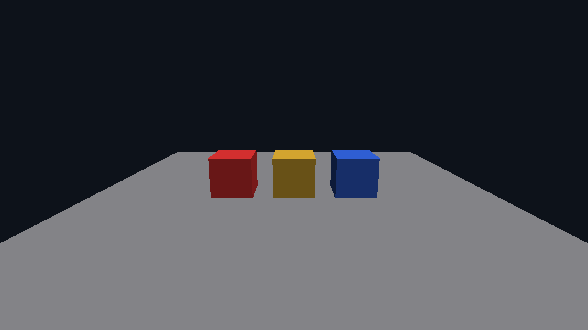

# Luminex

A Metal 4-native rendering playground and portfolio piece, built around a thin, honest RHI
(`lmx::rhi`) that grows real backends — Vulkan and D3D12 — one feature at a time. Successor to
"lumine", a college-era DX12 renderer.

Metal 4 · C++23 · Slang · xmake

[](https://github.com/AmanThuL/Luminex/actions/workflows/ci.yml)

**Status**: M2 complete — depth-tested procedural scene, fly camera, and a docked ImGui editor
shell rendering through an offscreen viewport (2026-08-07).



## Requirements

- macOS 26+, Apple Silicon
- Xcode 26 (Metal Toolchain component optional — enables offline shader precompile; a
  runtime-shader-compile fallback works without it)
- [Homebrew](https://brew.sh)
- [xmake](https://xmake.io) 3.x

## Quick start

```bash
brew install xmake
xmake setup
xmake
xmake run App
xmake test
xmake format
```

`xmake run App --screenshot /tmp/m2-scene.bmp` renders one frame of the default scene offscreen —
no window, no swapchain — and writes it out as a BMP; the image above was produced this way, then
converted to PNG by hand with `sips -s format png /tmp/m2-scene.bmp --out docs/images/m2-scene.png`
(no automated conversion step exists — re-run this manually when refreshing the screenshot). The
windowed run instead opens the docked editor: a central Viewport (the same scene, rendered to an
offscreen target and sampled into an ImGui image) and a right-side Inspector for live camera/object
edits. Hold right-mouse in the Viewport to fly the camera (WASD + Q/E while held). Pressing `c`
writes a one-frame `luminex-frame.gputrace` next to the binary for Xcode's GPU debugger, which
requires launching with `MTL_CAPTURE_ENABLED=1` in the environment.

## Architecture

Luminex is organized as `Source/Core` (logging, assertions) → `Source/RHI` (`lmx::rhi`, the
API-agnostic interface layer — no Metal types leak through public headers) → `Source/RHI/Metal4`
(currently the only backend, built on Apple's official metal-cpp: 3 frames in flight, MTL4 argument
tables, a per-frame transient uniform ring, a single residency set, `MTLSharedEvent` pacing, and the
native Metal 4 ImGui backend glue) → `Source/Render` (`lmx::render`: `Camera`, procedural `Mesh`
factories, and `Renderer`, which owns the offscreen scene color+depth targets and draws the
depth-tested scene) → `Source/App` (SDL3 window, docked ImGui editor shell, frame loop). Each frame
renders the scene into an offscreen render target, encodes an explicit barrier, then renders the UI
pass onto the swapchain — the Viewport window samples the scene target as an image. The RHI itself
is deliberately **thin, explicit, and honest**: it models the shared conceptual core of Metal 4,
Vulkan, and D3D12, exposes only what the current milestone needs, and grows per real feature demand
rather than speculatively. Shaders are authored once in Slang (`Shaders/*.slang`) and compiled to
MSL today, keeping the door open for SPIR-V/DXIL once Vulkan and D3D12 backends return.

## Features

- Depth-tested procedural scene: a ground plane and three lambert-lit cubes (one rotating), drawn
  through indexed vertex-pulling with per-draw transient uniforms.
- Fly camera: right-mouse-drag to look, WASD + Q/E to move, while the Viewport is hovered.
- Docked ImGui editor shell: a central Viewport and a right-side Inspector (stats, camera, live
  per-object transform/color edits), re-dockable at runtime and persisted via `imgui.ini`.
- Offscreen viewport rendering: the scene renders to a color+depth render target, sampled into the
  UI pass through an explicit `RenderTarget → ShaderRead` barrier — the same machinery M3's shadow
  mapping will reuse.
- Metal 4 backend: one argument table per frame in flight, a per-frame uniform ring, indexed draws,
  depth attachments, and stage-scoped barriers, all behind the same thin `lmx::rhi`.

## Roadmap

- **M1 — Foundation + triangle through RHI** *(complete)*: SDL3 window, Metal 4 device/swapchain,
  `lmx::rhi`, a Slang-authored triangle, tests, formatting, docs, CI.
- **M2 — Renderer skeleton** *(complete)*: `lmx::render` became real — mesh/camera/uniform
  plumbing, a depth buffer, and a docked ImGui (Metal 4 + SDL3 backends) editor shell with an
  offscreen viewport.
- **M3 — lumine content returns**: Sponza + DDS/asset loading, shadow mapping (PCF), then PCSS, sky.
- **M4+ — modern features playground**: candidates include MetalFX upscaling/frame interpolation,
  Metal ray tracing, mesh shaders, GPU-driven culling — chosen per interest at the time.
- **M-future — backend #2 (Vulkan)**: once a Windows/Linux machine exists; validates the RHI, and
  the same Slang sources emit SPIR-V.

## Credits

- lumine — the college-era DX12 predecessor this project succeeds
- Apple's Metal 4 samples and documentation (*Drawing a triangle with Metal 4*, WWDC25 205/254/211)
- [WickedEngine](https://github.com/turanszkij/WickedEngine) — reference for a production Metal
  RHI backend
- [metal-cpp](https://github.com/apple/metal-cpp) — Apple's official C++ Metal bindings
- [Slang](https://shader-slang.org) — the Khronos-hosted shading language this project builds on

## License

Apache License 2.0 — see [LICENSE](LICENSE).
