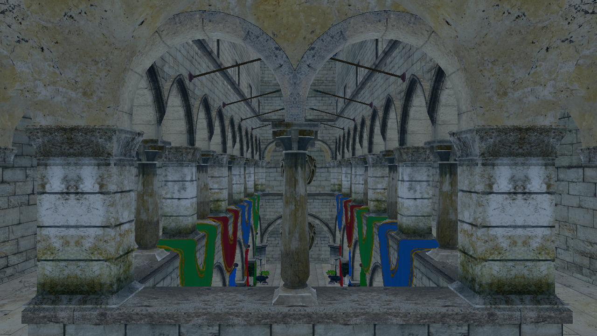
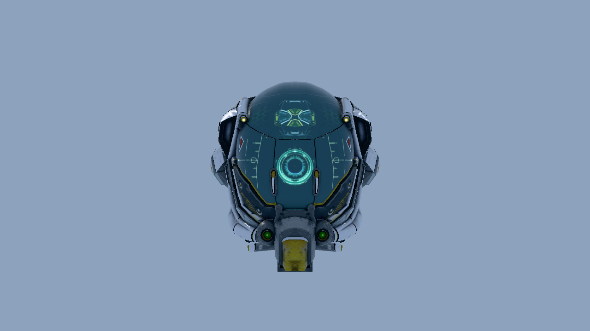
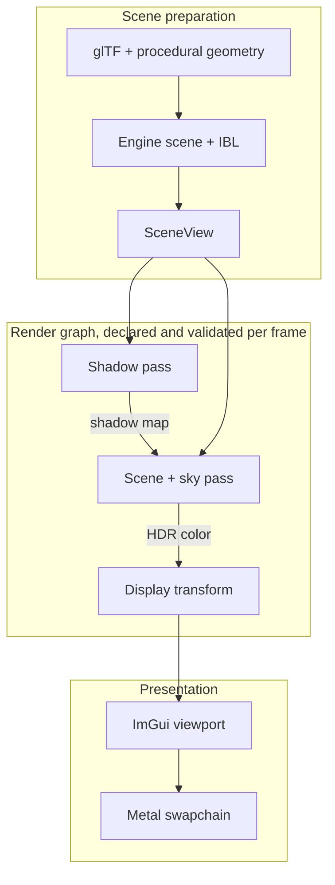
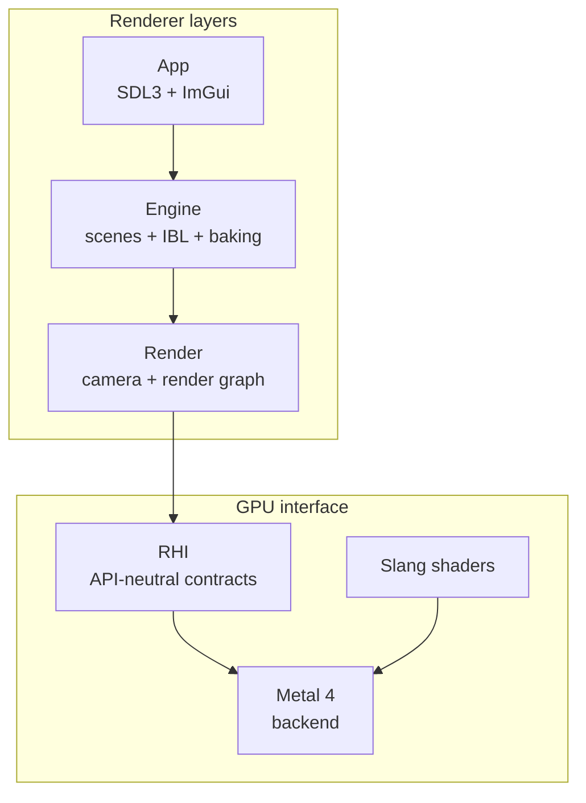

# Luminex

[](#requirements)
[](#architecture)
[](#build-and-run)
[](LICENSE)

A compact C++23 renderer built directly on Metal 4. Luminex combines an explicit RHI, a validating
render graph, Slang shaders, real glTF content, GPU validation tests, and a docked editor in one
inspectable codebase.

[Rendering today](#rendering-today) · [Frame flow](#frame-flow) · [Build and run](#build-and-run) ·
[Architecture](#architecture) · [What's next](#whats-next)



<p align="center"><sub>Crytek Sponza · physically based materials, image-based lighting, scene-linear HDR · captured by the offscreen renderer</sub></p>

## Rendering today

| Area | Current implementation |
|---|---|
| GPU backend | Native Metal 4 through metal-cpp; three frames in flight, argument tables, explicit residency, shared-event pacing, and per-pass GPU timing |
| Frame | A validating render graph schedules depth-only shadow → scene and sky → a neutral display transform → docked ImGui viewport, deriving its own barriers from declared resource uses |
| Materials | Full glTF metallic-roughness inputs (base color, metallic-roughness, occlusion, emissive, normal) shaded with a GGX BRDF and diffuse/specular image-based lighting |
| Image formation | Scene-linear FP16 color with manual exposure, a Khronos PBR Neutral display transform, and reversed infinite-far depth |
| Shadows | 2048² directional shadow map with selectable 25-tap Poisson PCF or PCSS |
| Content | Deterministically converted Crytek Sponza and Khronos Damaged Helmet through a focused glTF loader, plus deterministic offline mip baking |
| Editor | Scene selection, fly camera, light and object transforms, exposure, wireframe and shadow-filter controls, per-pass GPU timings |
| Diagnostics | A code-generated material lab scene, object/pass labels, Metal validation, deterministic GPU smoke tests, capture sidecars and profiling tools |

<p align="center">
  
  <br>
  <sub>Damaged Helmet · full metallic-roughness material, image-based lighting, tangent-space normal mapping</sub>
</p>

## Frame flow



The renderer keeps scene ownership above the rendering layer: Engine produces a plain per-frame
`SceneView`, Render declares the frame's passes into a `RenderGraph` that validates every
declared read and write before compiling a schedule, and the RHI records the Metal 4 work without
leaking Metal types through public interfaces. The complete resource and synchronization
walkthrough is in [docs/frame-pipeline.md](docs/frame-pipeline.md).

## Build and run

### Requirements

- Apple Silicon running macOS 26 or newer
- Xcode 26
- [Homebrew](https://brew.sh) and [xmake](https://xmake.io) 3.x

```bash
brew install xmake
xmake setup
xmake
xmake run App
```

`xmake setup` fetches pinned dependencies and sample assets, verifies their hashes, converts the
official Crytek Sponza OBJ distribution into the core glTF subset used at runtime, and bakes every
base-color and normal image into a deterministic offline mip chain. Generated content remains
under the gitignored `Assets/Fetched/` directory.

The editor opens on Sponza. Hold right mouse in the viewport and use WASD + Q/E to fly. Select
Damaged Helmet or the diagnostic material lab scene from the Inspector, or render any scene
without a window:

```bash
xmake run App --scene damaged-helmet --screenshot helmet.bmp
```

<details>
<summary><strong>Testing, validation and GPU capture</strong></summary>

```bash
xmake test Tests/unit
MTL_DEBUG_LAYER=1 xmake test Tests/gpu
xmake format --check
xmake policy
```

Press `c` in a windowed run launched with `MTL_CAPTURE_ENABLED=1` to write a `.gputrace` for Xcode.
Automated capture and profiling workflows are documented in
[docs/guides/gpu-debugging.md](docs/guides/gpu-debugging.md).

GitHub-hosted macOS runners compile and inventory the GPU suite but cannot execute Metal 4 on their
paravirtual GPU. Renderer changes therefore require the local Metal-validation command above.

</details>

## Architecture



The RHI is intentionally thin and currently has one backend: Metal 4. It owns resource creation,
command recording, synchronization, residency and swapchain contracts; rendering policy stays in
`Source/Render`, while scene and asset policy stays in `Source/Engine`.

| Path | Responsibility |
|---|---|
| `Source/RHI` | Backend-neutral interfaces and validation |
| `Source/RHI/Metal4` | Metal objects, frame lifetime, command encoding and ImGui integration |
| `Source/Render` | Camera, meshes, the validating render graph, shadow/scene/sky/display passes |
| `Source/Engine` | Scene catalog, glTF/DDS loading, geometry, color handling, IBL generation, mip baking |
| `Source/App` | SDL3 window, editor shell, CLI and offscreen screenshots |
| `Shaders` | Slang modules and render/test entry points |
| `Tools/GpuDebug` | Capture inspection, schema validation and profiling |

## What's next

- A compute and storage execution substrate with transient resource pooling and inspection
- Automatic exposure, bloom and a temporal reconstruction path
- Cascaded shadows, atmosphere and transparent surfaces on the shared lighting model
- GPU scene data, visibility culling and indirect submission after the frame contract is stable
- A second RHI backend once the render graph's semantics are frozen for portability

The dependency order and exit gates live in the [engineering roadmap](docs/roadmap.md).

## Current boundaries

- Metal 4 on Apple Silicon is the only runtime backend.
- The render graph encodes render passes only; compute execution, transient pooling and automatic
  exposure are not present yet.
- Large sample scenes load synchronously and require `xmake setup` before first use.
- Sample assets and derived gallery images keep their upstream licenses; see
  [THIRD_PARTY_NOTICES.md](THIRD_PARTY_NOTICES.md).

## Documentation

- [Architecture overview](docs/architecture/overview.md)
- [One frame end to end](docs/frame-pipeline.md)
- [GPU debugging guide](docs/guides/gpu-debugging.md)
- [Engineering roadmap](docs/roadmap.md)
- [Engineering conventions](docs/conventions/engineering.md)

## Credits and license

Crytek Sponza is © 2010 Frank Meinl/Crytek and distributed under CC BY 3.0 through Morgan
McGuire's [Computer Graphics Archive](https://casual-effects.com/data). Luminex also builds on
Apple's Metal 4 documentation and samples, [metal-cpp](https://github.com/apple/metal-cpp),
[Slang](https://shader-slang.org), and the open-source graphics community.

Luminex source code is licensed under the [Apache License 2.0](LICENSE). Fetched sample assets are
not covered by the source license; their attribution and terms are recorded in
[THIRD_PARTY_NOTICES.md](THIRD_PARTY_NOTICES.md).
