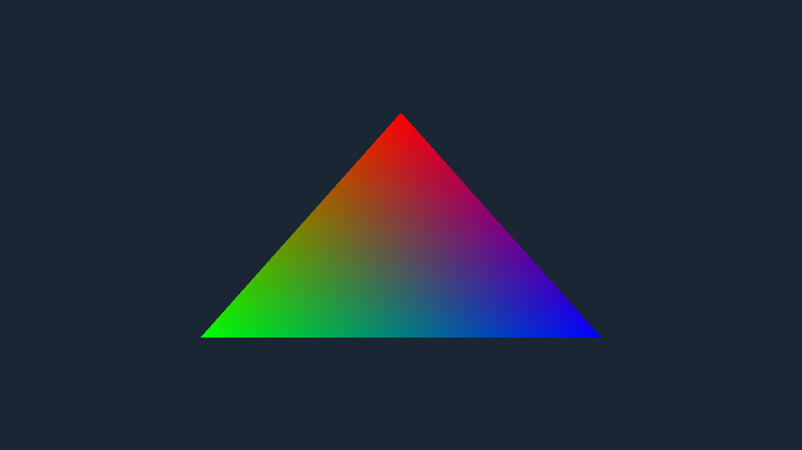

# Luminex

A Metal 4-native rendering playground and portfolio piece, built around a thin, honest RHI
(`lmx::rhi`) that grows real backends — Vulkan and D3D12 — one feature at a time. Successor to
"lumine", a college-era DX12 renderer.

Metal 4 · C++23 · Slang · xmake

[](https://github.com/AmanThuL/Luminex/actions/workflows/ci.yml)

**Status**: M1 complete — foundation + Metal 4 triangle rendered through the RHI (2026-08-07).



## Requirements

- macOS 26+, Apple Silicon
- Xcode 26 (Metal Toolchain component optional — enables offline shader precompile; a
  runtime-shader-compile fallback works without it)
- [Homebrew](https://brew.sh)
- [xmake](https://xmake.io) 3.x

## Quick start

```bash
brew install xmake
xmake setup
xmake
xmake run App
xmake test
xmake format
```

`xmake run App --screenshot /tmp/triangle.bmp` renders one frame offscreen — no window, no
swapchain — and writes it out as a BMP; that is how the image above is produced. In the windowed
run, pressing `c` writes a one-frame `luminex-frame.gputrace` next to the binary for Xcode's GPU
debugger, which requires launching with `MTL_CAPTURE_ENABLED=1` in the environment.

## Architecture

Luminex is organized as `Source/Core` (logging, assertions) → `Source/RHI` (`lmx::rhi`, the
API-agnostic interface layer — no Metal types leak through public headers) → `Source/RHI/Metal4`
(currently the only backend, built on Apple's official metal-cpp: 3 frames in flight, MTL4 argument
tables, a single residency set, `MTLSharedEvent` pacing) → `Source/App` (SDL3 window + frame loop).
The RHI itself is deliberately **thin, explicit, and honest**: it models the shared conceptual core
of Metal 4, Vulkan, and D3D12, exposes only what the current milestone needs, and grows per real
feature demand rather than speculatively. Shaders are authored once in Slang (`Shaders/*.slang`) and
compiled to MSL today, keeping the door open for SPIR-V/DXIL once Vulkan and D3D12 backends return.

## Roadmap

- **M1 — Foundation + triangle through RHI** *(complete)*: SDL3 window, Metal 4 device/swapchain,
  `lmx::rhi`, a Slang-authored triangle, tests, formatting, docs, CI.
- **M2 — Renderer skeleton**: `lmx::render` becomes real — mesh/camera/uniform plumbing, depth
  buffer, ImGui (Metal 4 + SDL3 backends) overlay.
- **M3 — lumine content returns**: Sponza + DDS/asset loading, shadow mapping (PCF), then PCSS, sky.
- **M4+ — modern features playground**: candidates include MetalFX upscaling/frame interpolation,
  Metal ray tracing, mesh shaders, GPU-driven culling — chosen per interest at the time.
- **M-future — backend #2 (Vulkan)**: once a Windows/Linux machine exists; validates the RHI, and
  the same Slang sources emit SPIR-V.

## Credits

- lumine — the college-era DX12 predecessor this project succeeds
- Apple's Metal 4 samples and documentation (*Drawing a triangle with Metal 4*, WWDC25 205/254/211)
- [WickedEngine](https://github.com/turanszkij/WickedEngine) — reference for a production Metal
  RHI backend
- [metal-cpp](https://github.com/apple/metal-cpp) — Apple's official C++ Metal bindings
- [Slang](https://shader-slang.org) — the Khronos-hosted shading language this project builds on

## License

Apache License 2.0 — see [LICENSE](LICENSE).
