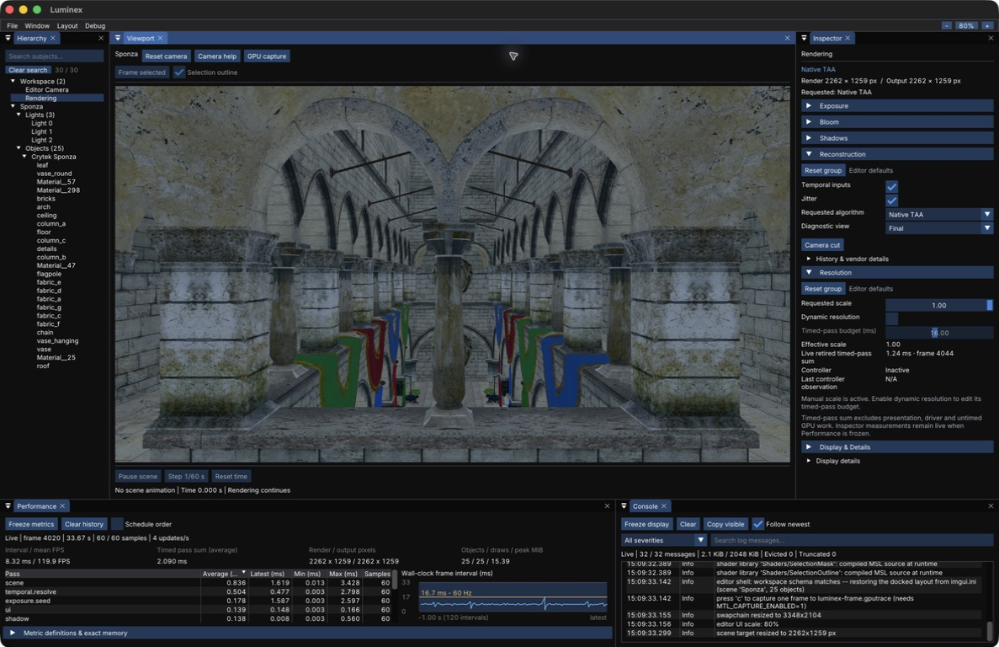
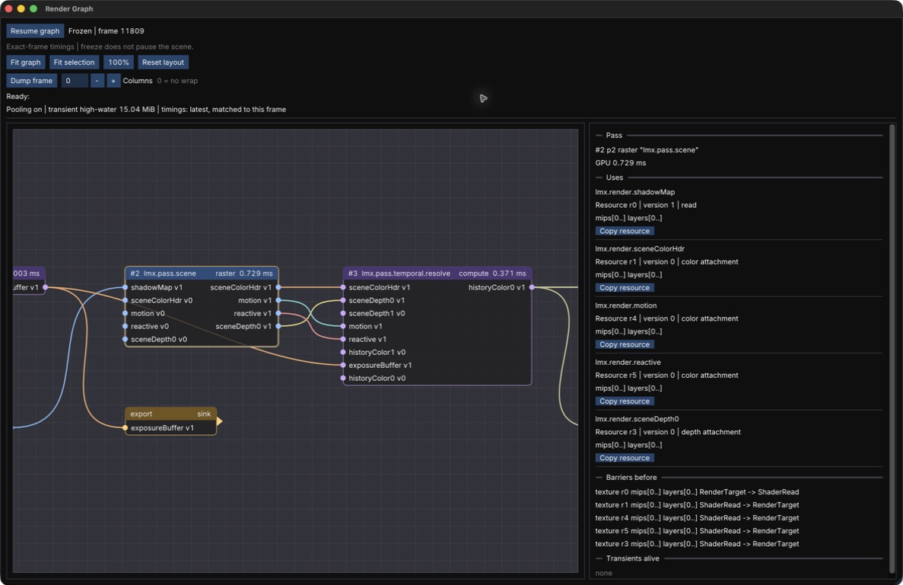

# Luminex

[](https://github.com/AmanThuL/Luminex/actions/workflows/ci.yml) [](#quick-start) [](docs/architecture/overview.md) [](#quick-start) [](LICENSE)

Physically based rendering on Apple Silicon, built directly on Metal 4.
Explore detailed scenes, temporal reconstruction and the frame behind each image in an interactive editor.

[Quick start](#quick-start) · [Architecture](docs/architecture/overview.md) · [GPU debugging](docs/guides/gpu-debugging.md)



<p align="center"><sub>Crytek Sponza · native TAA, scene Hierarchy and live frame diagnostics</sub></p>

## Highlights

- **Lighting and materials.** Metallic-roughness PBR, image-based lighting, directional shadows,
  masked foliage, HDR exposure and bloom.
- **Temporal reconstruction.** Native TAA and temporal upscaling, dynamic resolution, and optional
  MetalFX reconstruction with native fallback.
- **An inspectable frame.** Coherent GPU timing snapshots, motion diagnostics and a detached
  render graph window with resource connections, frame freeze and export.
- **A practical editor.** Searchable scene Hierarchy, visible-object selection outlines, scoped
  resets, playback controls and a log Console. Inter typography and one-click UI zoom fit the workspace.
- **Built close to the GPU.** C++23, Slang shaders and a thin RHI, with explicit resource
  dependencies, transient pooling and Metal validation tests.



<p align="center"><sub>Render Graph · freeze a frame, follow its resources and inspect matched GPU timings</sub></p>

<p align="center">
  
  <br>
  <sub>Damaged Helmet · metallic-roughness materials and image-based lighting</sub>
</p>

## Quick start

Requires **Apple Silicon, macOS 26+, Xcode 26 and Homebrew**.

```bash
brew install xmake
git clone https://github.com/AmanThuL/Luminex.git
cd Luminex
xmake setup
xmake
xmake run App
```

Setup downloads pinned dependencies, the Inter font and sample assets. The editor opens maximized
on Sponza. Hold the right mouse button in the viewport and use WASD + Q/E to fly.

Use **File → Open Scene** to switch scenes and **Window → Render Graph** for the detached graph.
The top-right **− / percentage / +** controls adjust UI scale; click the percentage to reset it.
Layout and scale are saved automatically.

## Explore the project

[Architecture](docs/architecture/overview.md) ·
[Frame walkthrough](docs/frame-pipeline.md) ·
[GPU debugging](docs/guides/gpu-debugging.md) ·
[Temporal comparisons](docs/guides/temporal-comparison.md) ·
[Roadmap](docs/roadmap.md)

CI checks the build, CPU tests and repository policy; documentation-only changes run the policy checks alone. Metal 4 GPU tests run on supported hardware.

## License and credits

Source: [Apache 2.0](LICENSE).
Crytek Sponza © 2010 Frank Meinl/Crytek, CC BY 3.0. Images are rendered with Luminex.
Model credits and separate asset licenses are recorded in
[third-party notices](THIRD_PARTY_NOTICES.md).
