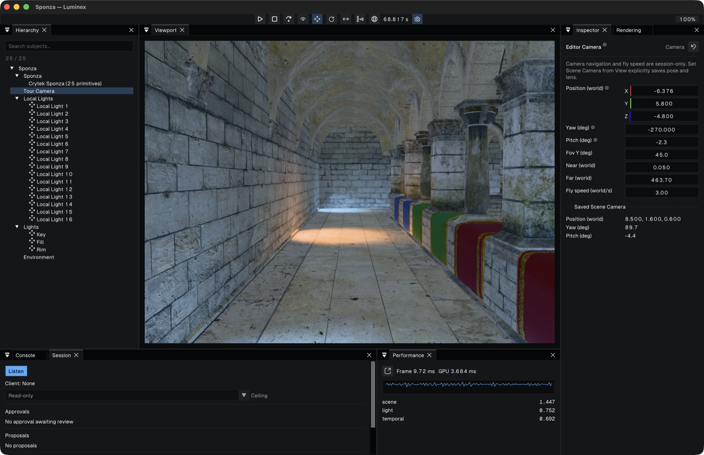
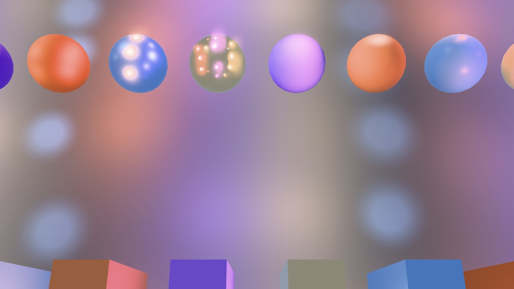
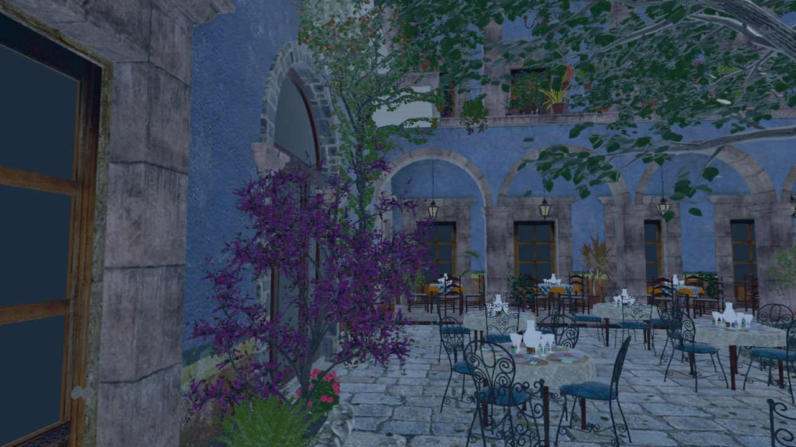
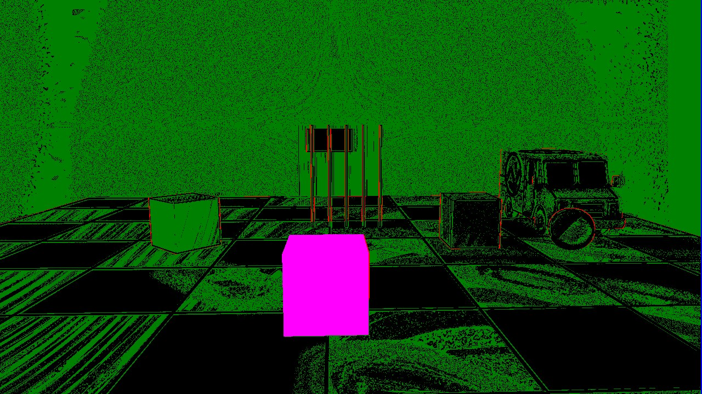
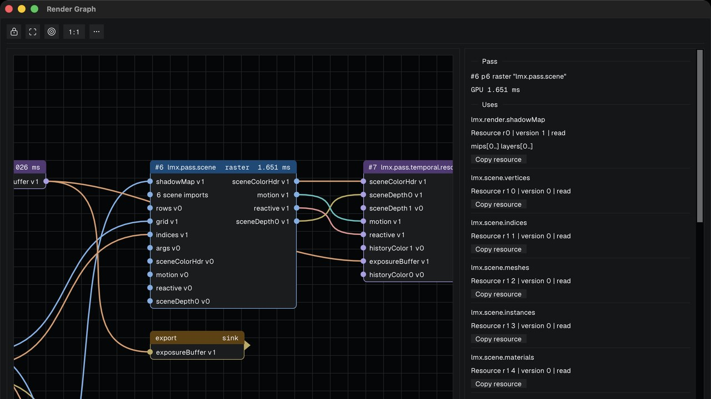
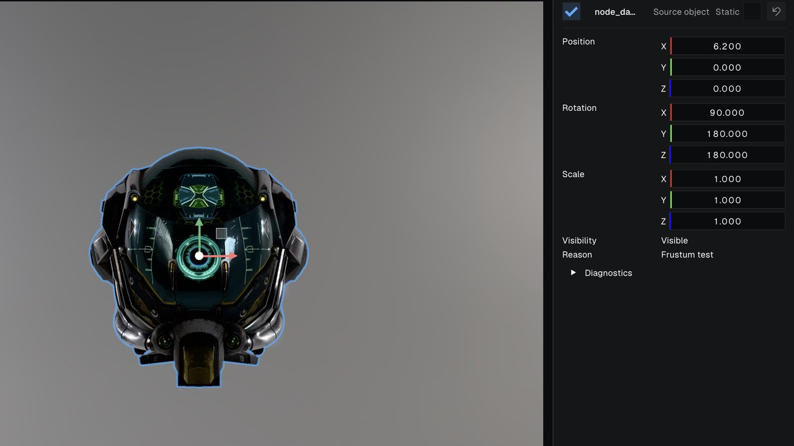
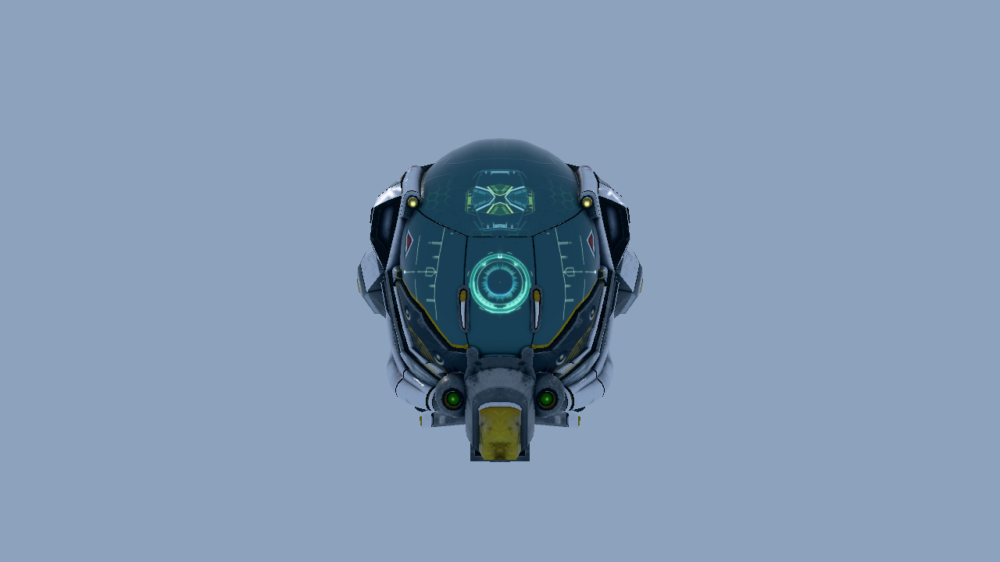

# Luminex

[](https://github.com/AmanThuL/Luminex/actions/workflows/ci.yml) [](#quick-start) [](docs/architecture/overview.md) [](#quick-start) [](LICENSE)

A physically based renderer written directly on Metal 4 for Apple Silicon, with an editor that lets you take apart any frame it draws.

[Quick start](#quick-start) · [Architecture](docs/architecture/overview.md) · [Frame walkthrough](docs/architecture/frame-pipeline.md) · [GPU debugging](docs/guides/gpu-debugging.md)



<p align="center"><sub>Crytek Sponza during its camera tour, lit by 16 authored point and spot lights</sub></p>

## Features

<table>
  <tr>
    <td width="50%" valign="top">
      
      <br><b>Clustered lighting</b><br>
      Point and spot lights binned into a 16×9×24 froxel grid. LightLab runs 256 of them by default and up to 4,096.
    </td>
    <td width="50%" valign="top">
      
      <br><b>Large scenes</b><br>
      San Miguel's courtyard with alpha-tested foliage and indirect draws. Culling can move to the GPU, with optional occlusion against the previous frame's depth.
    </td>
  </tr>
  <tr>
    <td width="50%" valign="top">
      
      <br><b>Temporal reconstruction</b><br>
      Native TAA and upscaling with dynamic resolution, optional MetalFX, and overlays for motion, rejection, history weight and age.
    </td>
    <td width="50%" valign="top">
      
      <br><b>Render graph</b><br>
      Each frame compiles into a graph with aliased transient memory. Freeze it, follow a resource and read matched GPU timings.
    </td>
  </tr>
  <tr>
    <td width="50%" valign="top">
      
      <br><b>Scene authoring</b><br>
      Scenes are glTF files. Drag movable objects and lights with a W/E/R/Y gizmo; objects the scene marks static stay put.
    </td>
    <td width="50%" valign="top">
      
      <br><b>Physically based materials</b><br>
      Metallic-roughness PBR with image-based lighting, directional shadows, HDR exposure and bloom.
    </td>
  </tr>
</table>

Also included:

- A local session bridge. Scripts and agents can query the editor and propose changes, which apply only after you approve them.
- Headless screenshots, frame sequences and GPU cost measurements from the command line.
- Light, Dark and Auto appearance, native macOS menus and a workspace layout that persists.

## Quick start

Needs Apple Silicon, macOS 26 and Xcode 26.

```bash
brew install xmake
git clone --recursive https://github.com/AmanThuL/Luminex.git && cd Luminex
xmake setup               # pinned dependencies and sample scenes; rerun when a pull adds one
xmake && xmake run App    # opens the editor on Sponza
```

`xmake setup --san-miguel` adds the optional courtyard (about 511 MiB). Render without the editor:

```bash
xmake run App --scene temporal-lab --frames 32 --temporal-view rejection --screenshot out.png
```

| In the editor | Keys |
|---|---|
| Fly | Hold the right mouse button, then WASD and Q/E |
| Gizmo tool | W move, E rotate, R scale, Y combined, Q none |
| Gizmo space | X toggles world and local |
| Frame selection, reset camera | F, Home |
| Open, save scene | Cmd+O, Cmd+S |

## Structure

Luminex is a set of static libraries whose dependencies point one way, from the GPU interface up to the editor.

- `RojoRHI` is a thin Metal 4 hardware interface for devices, resources, passes and GPU timing. It lives in its own [repository](https://github.com/AmanThuL/rojo-rhi), mounted as a submodule, and depends on nothing else here.
- `Core` holds math, containers, logging and file utilities, with no graphics code.
- `Engine` imports and bakes assets, reads and writes glTF scene documents, and keeps the GPU-resident scene with its animation. Depends on `Core` and `RojoRHI`.
- `Render` builds each frame as a render graph: shadows, clustered lighting, visibility, temporal reconstruction, exposure, bloom and display. Depends on `Engine`.
- `Scenes` catalogs the scene documents, generates parameter-sized populations and exports edits back to glTF. Depends on `Engine`.
- `App` is the SDL3 and Dear ImGui editor plus the headless runners. Its UI-free models live in `AppModel` and are tested on their own.

Shaders are Slang, in `Shaders/Common` and one `Shaders/Passes/<family>` folder per pass family. `Tests/` mirrors `Source/`. More in the [architecture overview](docs/architecture/overview.md), the [scene documents](docs/guides/scene-documents.md), [editor workspace](docs/guides/editor-workspace.md) and [agent session](docs/guides/agent-session.md) guides, and the [roadmap](docs/roadmap.md).

CI checks the build, CPU tests and repository policy. Metal 4 GPU tests run on supported hardware.

## License and credits

Source: [Apache 2.0](LICENSE).
Crytek Sponza © 2010 Frank Meinl/Crytek, CC BY 3.0. San Miguel by Guillermo M. Leal Llaguno, from Morgan McGuire's Computer Graphics Archive. Images are rendered with Luminex.
Model credits and separate asset licenses are recorded in
[third-party notices](THIRD_PARTY_NOTICES.md).
