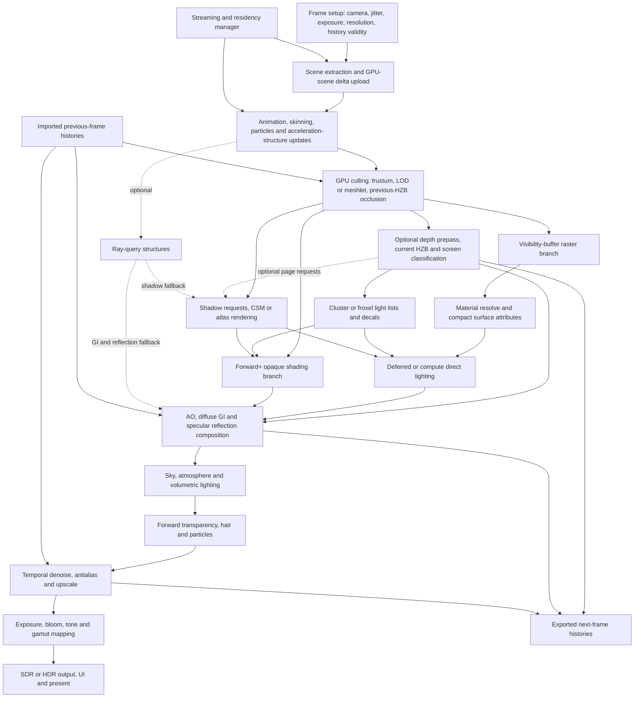
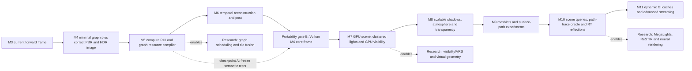

# Rendering Architecture Research Synthesis, 2026–2031

**Status**: Frozen — non-normative  
**Research date**: 2026-08-09  
**Scope**: Metal 4 on Apple silicon first; Vulkan and D3D12 on PC later  
**Baseline**: [the M3 frame pipeline](../frame-pipeline.md)  
**Accepted roadmap**: [roadmap.md](../roadmap.md)

This long-form report preserves the evidence and tradeoff analysis behind the compact accepted
roadmap. It does not set milestone scope or override ADRs, conventions, or the active plan.

## Executive recommendation

Luminex should become a **graph-scheduled, GPU-driven hybrid renderer with a shared GPU scene,
first-class temporal data, and capability-selected raster/ray paths**. The important word is not
"hybrid" but "shared": rasterization, screen-space tracing, hardware ray queries, denoisers,
upscalers, and a future reference path tracer should consume the same instances, materials, lights,
resource IDs, depth convention, and history rules.

The next milestone should not start with Lumen, ReSTIR, virtualized geometry, or a large G-buffer.
The shortest credible path to a state-of-the-art playground is:

1. Put the existing frame into a minimal validating render graph with pass timing, then make image
   formation correct inside it: filtered mip chains, glTF metallic-roughness PBR, image-based
   lighting, reversed-Z, scene-linear FP16 HDR, exposure, a replaceable display transform, and
   correct normal transforms.
2. Complete the missing execution substrate: compute, storage resources, indirect work, general
   resource views and synchronization, then add transient pooling and richer graph compilation.
3. Establish a temporal contract: jitter, previous transforms, motion vectors, disocclusion and
   reactive masks, history invalidation, dynamic resolution, a reference TAA/TAAU, and MetalFX as an
   adapter rather than a hard-coded pipeline.
4. Move scene and visibility work onto the GPU: stable bindless IDs, GPU scene buffers, HZB,
   frustum/LOD/occlusion culling, indirect submission, and clustered light lists.
5. Keep a measured **Forward+ reference path**, then evaluate compact/tile-local deferred and
   visibility-buffer/deferred-texturing paths for opaque geometry. Choose the default per platform
   and workload rather than maintaining three equal production paths; keep Forward+ for exceptions
   and transparent materials.
6. Use exact clustered direct lighting and conventional shadow maps as the dependable baseline.
   Add screen traces, probes/radiance caches, and ray queries as a hierarchy of fallbacks. Keep
   stochastic many-light sampling, ReSTIR, full path tracing, frame generation, and neural methods
   in explicit research or high-end tiers until their prerequisites and stability gates are met.
7. Validate the abstraction with Vulkan before Metal-specific assumptions spread into the GPU
   scene, visibility, and ray-tracing layers. D3D12 can follow once the same contracts are stable.

This ordering is deliberately forward-looking. The production renderers surveyed do not converge on
one effect implementation, but they do converge on reusable infrastructure: explicit dependency
graphs, bindless/GPU-resident scene data, temporal reconstruction, demand-driven caches, hierarchical
fallbacks, aggressive instrumentation, and quality tiers. Those are the investments most likely to
survive the next five years.

## Evidence standard

This report uses three evidence classes:

- **Shipped** — publicly described in a released game or production application. This is the
  strongest evidence for cost, failure modes, and content workflow.
- **Mature engine** — documented and inspectable in a widely used commercial or open-source engine.
  This is strong evidence for integration structure, but not automatically for Luminex's workload.
- **Research lane** — a paper, SDK, experimental engine feature, or early deployment with useful
  ideas but insufficient cross-platform or production evidence for the default path.

No paper is promoted into the core roadmap solely because its images are impressive. For example,
ReSTIR is discussed through NVIDIA's maintained [RTXDI implementation](https://github.com/NVIDIA-RTX/RTXDI),
and radiance caching is discussed through shipped idTech, Frostbite, Ubisoft, and Unreal systems.
Numbers quoted from talks describe those exact scenes, settings, and machines; they are evidence of
feasibility, not transferable Luminex budgets.

The local copy of Akenine-Moller et al., *Real-Time Rendering, Fourth Edition* was used as a
fundamentals cross-check, particularly Chapter 9 for physically based shading, Section 12.2 for
temporal antialiasing and reprojection, and Sections 18.2–18.4 for profiling and bottleneck-driven
optimization. It reinforces two rules that remain current: temporal reuse needs explicit
reprojection and validity, and optimization must begin with a measured bottleneck on representative
content and hardware.

## 1. Where Luminex is now

M3 is a clean, unusually useful starting point. It already has three checked frames in flight,
Metal 4 argument tables and residency, a thin explicit RHI, Slang shaders, bindless vertex pulling,
offscreen presentation, deterministic screenshot scenes, and enough real content to expose texture,
material, shadow, and lifetime bugs. These are better foundations than an effect-heavy renderer with
implicit ownership.

Its current image and execution model, however, is still a teaching-scale forward renderer:

| Area | M3 state | Consequence | First architectural response |
|---|---|---|---|
| Surface model | Blinn-Phong; glTF metal/rough data collapses to scalars | Imported assets cannot express their authored response | Full metallic-roughness GGX plus IBL and texture-backed material records |
| Color | `BGRA8Unorm`; every fragment manually encodes sRGB | No highlight headroom, exposure, bloom, HDR output, or robust composition | Scene-linear `RGBA16Float`, one display transform at the end |
| Geometry submission | CPU iterates each draw twice; no indirect work | CPU and pass cost scale with object count | GPU scene, HZB/LOD culling, compact indirect lists |
| Lighting | Three directional lights in a forward loop | No scalable local lights or physical units | Clustered/Forward+ baseline with a shared light table |
| Shadows | One fixed 2048-square directional map | Poor range allocation; no local-light policy; PCSS unit error | Stable CSM plus a local-light atlas; virtual/ray options later |
| Antialiasing | None; texture mips are visibly under-filtered | Geometry and texture shimmer; stochastic effects have no temporal base | Correct mip pipeline first, then motion vectors and TAA/TAAU |
| Pass scheduling | Three passes manually sequenced | Each new effect multiplies barrier, lifetime, and resize complexity | Validating render graph above the RHI |
| RHI | Graphics only; one narrow texture barrier | Compute/post/GPU culling/RT require ad hoc escape hatches | Explicit usages, views, compute/copy, indirect work, general barriers |
| Memory | Device-lifetime scene cache; one residency set | Safe but non-scalable; no budget, eviction, or transient reuse | Budgeted resource registry, transient heaps, streaming residency groups |
| Observability | Screenshot liveness and GPU debugging, no timestamps | Quality changes cannot be governed by a frame budget | Per-pass timestamps, memory telemetry, graph inspection, image metrics |

Two implications matter immediately.

First, a post-process pass would be the fourth conceptual pass, but it is not the real complexity
threshold. PBR precomputation, mip generation, exposure, HZB, culling, light binning, temporal
reconstruction, and denoising all need compute and general read/write dependencies. The render graph
and RHI growth should therefore be treated as one foundation, not postponed until the pass list is
already tangled.

Second, M3's manual gamma arrangement is locally correct but structurally fragile. The renderer
must adopt a single rule: color textures decode at sampling, all lighting and post effects operate in
a documented scene-linear working space, and only the output transform converts for SDR or HDR
display. Clears, sky, UI, screenshots, and debug views must enter that pipeline intentionally.

## 2. North-star frame architecture

The target is a dataflow, not a permanent serial list. A render graph compiles the enabled branches
for the current view, feature tier, and device. Dashed branches below are optional; histories and
streaming resources are persistent imports rather than transient aliases.



Only the selected opaque branch is compiled for a view. `R1` resources become `R0` imports in the
next frame; that cross-frame relationship is not an edge in the current frame's acyclic graph.

The architecture has four deliberately independent axes:

- **Surface production:** Forward+, compact/tile-local deferred, visibility-buffer, and eventually
  ray hits all map to the same material and geometry records.
- **Light transport:** screen-space, cached world-space, raster shadow, and ray-query techniques form
  a hierarchy rather than mutually exclusive renderer modes.
- **Reconstruction:** native resolution, Luminex TAA/TAAU, MetalFX, FSR, and future vendor adapters
  consume one temporal input contract.
- **Execution:** one logical graphics queue is always valid; measured passes may migrate to async
  compute or transfer queues without changing effect ownership.

This separation avoids a common playground failure mode: every new experiment becoming a second
renderer with its own scene representation, motion vectors, material decoding, and resize logic.

## 3. Non-negotiable frame contracts

State-of-the-art effects are unusually sensitive to convention mismatches. These contracts should
be named types or shared Slang modules, validated in debug builds, and visualizable in the editor.

| Contract | Recommended representation | Invariants and consumers |
|---|---|---|
| Depth | `D32Float`, reversed-Z (`near = 1`, far approaches `0`), preferably infinite far plane | One projection/reconstruction module for HZB, clustering, SSR, GI, fog, motion and picking. Clear to `0`; use greater/greater-equal tests. Reversed-Z with float depth greatly improves usable precision, as explained in NVIDIA's [depth precision analysis](https://developer.nvidia.com/blog/visualizing-depth-precision/). |
| Scene color | `RGBA16Float`, scene-linear, pre-exposed | No fragment writes display gamma. All effects document whether values are pre-exposed; alpha has a declared meaning rather than spare storage. |
| Motion | `RG16Float`, current output UV minus previous output UV, excluding jitter | Generated for camera, rigid, skinned, morph, particle and vertex-deformed motion. Invalid motion is marked, not silently zeroed. Keep the convention adapter-friendly. |
| Visibility identity | Stable instance, geometry/meshlet, primitive and material IDs | IDs survive compaction during a frame and map through backend-independent GPU-scene tables. Never store native Metal/Vulkan/D3D handles in scene records. |
| Surface geometry | World/view position reconstructed from depth; octahedral geometric and shading normal; tangent sign; UV and derivatives when needed | Geometric normal is preserved separately for bias, disocclusion and denoising. Normal-map evaluation never destroys the topology signal. |
| Material | glTF-compatible base color, metallic, perceptual roughness, emissive, normal, occlusion, alpha mode; optional extension lobes | Scalar factors multiply texture values. Color and data textures have different decode rules. A material version identifies layout changes. |
| Temporal history | Persistent resource plus extent, format, producer version, camera/view ID and validity reason | Camera cut, projection/FOV change, teleport, scale jump, shader/layout change, exposure discontinuity and device loss invalidate or rescale histories explicitly. |
| Reconstruction masks | At minimum disocclusion confidence and reactive/transparency mask; composition mask when an adapter requires it | Produced by geometry/transparency/effect passes, inspected alongside velocity. Vendor-specific packing is an adapter concern. |
| Exposure | Previous and current pre-exposure plus physical camera or auto-exposure state | Lighting, emissive thresholds, bloom and history rescaling use the same values. Avoid hidden exposure inside a tone mapper. |
| Output | Explicit display primaries, transfer function, reference white and peak target | SDR sRGB and macOS EDR/HDR are output views of the same scene-linear image; screenshots name which view they capture. |

Epic's production [TSR documentation](https://dev.epicgames.com/documentation/en-us/unreal-engine/temporal-super-resolution-in-unreal-engine)
is useful evidence for why these contracts need editor visualizations: motion, reprojected history,
disocclusion, translucency, animated vertex deformation, and history rejection fail independently.
MetalFX or another SDK cannot repair incorrect engine inputs.

## 4. The reference frame, pass by pass

### 4.1 Frame setup and history policy

At `beginFrame`, select the output extent, internal render extent, jitter sample, quality tier, and
exposure state before allocating graph resources. Dynamic resolution changes the internal extent;
window or viewport resizing changes the output extent. They are not the same event.

Use a deterministic low-discrepancy jitter sequence with a reproducible frame index. Store both
jittered and unjittered current/previous matrices. A central history registry decides whether each
history is reused, resampled, or cleared and records the reason in the debug UI. A camera cut should
be one event consumed by TAA, SSR, GI, volumetrics, exposure, and occlusion—not six unrelated
heuristics.

Frame pacing remains three frames in flight, but simulation-frame identity, rendered-frame identity,
and presented-frame identity must become distinct before frame interpolation is considered. UI and
input latency instrumentation must also exist first.

### 4.2 GPU scene, animation and uploads

Replace per-draw ownership with stable arrays of `Instance`, `Geometry`, `Material`, `Texture`,
`Light`, and `View` records. CPU scene changes append compact deltas to the current upload arena;
compute applies them to device-local tables. Each instance carries current and previous transforms,
bounds, geometry/material IDs, flags, LOD state, and an optional ray-tracing instance ID.

Keep resource identity logical. Metal 4 argument tables and residency sets, Vulkan descriptor
indexing, and D3D12 descriptor heaps all permit bindless access, but they impose different update and
lifetime rules. A backend-owned indirection table can map a stable texture ID to a live descriptor,
fallback texture, or nonresident marker without rewriting every material.

Skinning, morph targets, and particle simulation should eventually run as graph passes and produce
both current and previous positions. Static and deforming geometry must be classified so future BLAS
work can choose build, refit, or reuse. Background upload is a copy/compute branch with an explicit
timeline value; graphics waits only for resources first used this frame.

### 4.3 Culling, LOD and indirect work

The dependable sequence is:

1. CPU broad-phase visibility only for coarse world/streaming cells.
2. GPU instance frustum culling and projected-error LOD choice.
3. Optional meshlet/cluster culling, cone or backface rejection, and small-triangle rejection.
4. Previous-frame HZB occlusion with conservative bounds and a visible-last-frame fast path.
5. Compaction into opaque, alpha-tested, transparent, shadow-caster, and ray-instance lists.
6. Indirect draw/dispatch generation; the CPU submits a bounded number of bins rather than objects.

The current HZB is built after opaque visibility and feeds screen-space effects immediately and
culling in the next frame. Fast camera motion, newly spawned objects, bounds changes, and invalid
history bypass previous-HZB rejection. Every rejection stage needs counters and a visualization;
otherwise missing geometry becomes nondeterministic folklore.

Meshlets are recommended as an offline content representation before mesh shaders are required.
They improve culling, streaming, visibility-buffer addressing, and ray fallback meshes even when
drawn with ordinary indexed indirect commands. Mesh shaders become a capability-selected execution
path, not the asset format. Unreal's shipped
[Nanite documentation](https://dev.epicgames.com/documentation/en-us/unreal-engine/nanite-virtualized-geometry-in-unreal-engine)
confirms the value of hierarchical clusters and demand streaming, but also exposes the large system
surface—custom rasterization, material restrictions, derivative issues, deformation, fallback
geometry, and cache budgets. Luminex should learn the reusable cluster/LOD pieces before attempting a
Nanite analogue.

### 4.4 Opaque visibility: preserve a reference and evaluate two advanced paths

#### Forward+ reference path

Forward+ remains the bring-up, low-complexity, and transparency reference path. A depth prepass is
optional: enable it when HZB, heavy overdraw, alpha classification, or downstream depth consumers
repay the extra geometry; on Apple tile GPUs, benchmark a single opaque pass because retaining depth
and color on-chip can beat a desktop-style prepass. The pass reads the GPU scene and clustered light
lists, evaluates PBR, and writes HDR color, depth, motion, normal/roughness if downstream effects need
it, and reconstruction masks.

This path is easy to validate, supports MSAA if Luminex later needs it, and handles unusual material
derivatives naturally. Its cost grows with overdraw, material complexity, and lights per cluster.

#### Compact or tile-local deferred path

The first advanced comparison rasterizes a compact semantic `SurfaceData`: sampled depth, octahedral
normal, base color/material flags, roughness/metallic/AO, optional emissive and dedicated motion. Do
not store reconstructible world position. On an immediate-mode PC GPU these can be materialized
attachments consumed by compute or fullscreen lighting; on Apple TBDR hardware the backend may keep
them tile-local and perform lighting in the same render pass. The logical surface contract remains
identical even when no physical G-buffer texture exists.

This path gives predictable one-time opaque material evaluation and straightforward screen-space
consumers, but attachment bandwidth and memory can lose to Forward+ on simple scenes. It is an M9
A/B experiment after the graph can express load/store and tile fusion—not an excuse to put a wide
desktop G-buffer into M4.

#### Visibility-buffer and deferred-texturing path

The long-term opaque experiment rasterizes compact identity plus depth and motion, then a compute
pass reconstructs/interpolates attributes and evaluates materials only for visible samples. A useful
starting layout is `R32G32Uint` identity, optional `RG16Unorm` barycentrics when hardware barycentrics
are unavailable or inconvenient, `RG16Float` motion, and `D32Float` depth. Exact bit allocation is a
measured design task; do not freeze it into the RHI.

This decouples visibility from shading rate, avoids repeatedly shading hidden fragments, groups or
sorts material work, and gives ray hits and raster hits a common identity vocabulary. It also creates
real costs: texture-gradient reconstruction, helper-lane behavior, alpha-tested material evaluation,
MSAA incompatibility, divergent material kernels, extra full-screen traffic, and more complex
transparency. Apple feature tables expose barycentrics and primitive identity on relevant families,
but Luminex must query them rather than infer support from Metal 4 alone.

Do not turn visibility resolve into a second permanent eight-attachment G-buffer. Prefer one of two
measured variants:

- shade directly from visibility into HDR color while emitting only the compact normal/roughness or
  classification data required by later screen-space effects; or
- produce a transient compact surface cache when decoupled direct/indirect lighting demonstrably
  saves work.

The graph can select Forward+, compact/tile-local deferred, or visibility per view and platform. The
same material conformance tests must produce near-identical images in all paths. Alpha-tested
geometry can begin in Forward+ and migrate only after derivative and coverage behavior is solid.

### 4.5 HZB and screen-space classification

Build a full mip pyramid from reversed depth with the reduction operator that preserves conservative
occluders under the chosen convention. Record the projection parameters next to it. Consumers include
next-frame culling, SSR/SSGI ray marching, contact shadows, shadow-page requests, particle collision,
and debug picking.

The HZB pass is also the first good stress test for compute dispatch, storage textures, per-mip
subresource views, and generated barriers. Verify each mip against a CPU or simple GPU oracle and
visualize rejected bounds. A wrong reduction can appear faster for months while silently deleting
objects.

### 4.6 Materials and image-based lighting

The baseline BRDF should be a glTF-aligned metallic-roughness model:

- GGX/Trowbridge-Reitz normal distribution;
- height-correlated Smith masking-shadowing;
- Schlick Fresnel with dielectric F0 derived from IOR and colored F0 for metals;
- energy-conserving diffuse, beginning with Lambert or Burley diffuse;
- multiple-scattering/energy compensation where it produces a measurable rough-metal improvement;
- normal mapping with orthonormalized TBN and inverse-transpose normal transforms;
- base-color, metal-rough, normal, occlusion, emissive and alpha textures with correct color/data
  decode; and
- a split-sum specular IBL path with a prefiltered environment and BRDF LUT plus diffuse irradiance
  or low-order SH.

Google's mature [Filament material model](https://google.github.io/filament/Materials.md.html) is a
particularly useful open implementation reference, while RTR4 chapters 8–10 provide the underlying
light, BRDF, and environment-lighting reasoning. Match the Khronos glTF equations and reference assets
before adding artistic lobes. Then add clearcoat, sheen, transmission/volume, anisotropy, and hair as
versioned extensions rather than multiplying base shader variants.

Use physical or physically interpretable light units at the authoring boundary—illuminance for
directional sources, intensity for point/spot lights, and luminance/radiance for emitting surfaces—
with explicit conversions to the renderer's radiometric working values. Pre-exposure protects FP16
range but must not alter the physical scene definition.

### 4.7 Light classification and exact direct lighting

Build screen tiles with logarithmic depth slices (clusters/froxels), then assign directional, point,
spot, rect/area, reflection-probe, decal, and volumetric-light records. The first implementation can
use a fixed-capacity index list plus overflow counters; the mature version uses count, prefix-sum,
and compact fill passes. Large lights need a separate global list so they do not explode every cell.

Clustered lighting is the default because its quality is deterministic, it works without ray
tracing, and its cost/failure modes are observable. Filament's open
[froxel implementation and design notes](https://google.github.io/filament/Filament.md.html) are a
mature compact reference. A world-space cascaded light grid can later serve ray-hit shading; the
shipped idTech 8 system reports a 16-cubed, eight-cascade grid shared by lights, reflection probes,
decals, particles and glass in its
[SIGGRAPH 2025 presentation](https://www.advances.realtimerendering.com/s2025/content/SOUSA_SIGGRAPH_2025_Final.pdf).

Stochastic direct lighting is not the baseline. Epic's
[MegaLights presentation](https://www.advances.realtimerendering.com/s2025/content/MegaLights_Stochastic_Direct_Lighting_2025.pdf)
demonstrates the compelling direction—sample a bounded subset of many lights, trace visibility,
shade, temporally/spatially reuse and denoise—but the talk also identifies ongoing production work.
It belongs after Luminex has stable motion, ray queries, denoisers, light importance data, and a
clustered ground truth. A research gate should require a scene where exact clustered lighting misses
budget because many tens of shadowed lights overlap each pixel, not merely a desire to use a newer
algorithm.

### 4.8 Shadows

Build shadows in three tiers:

1. **Baseline raster:** three or four stable cascades for the primary directional light, selected by
   the quality profile;
   texel-snapped projections; practical split control; per-cascade culling; receiver-aware normal and
   slope bias; PCF first and dimensionally correct PCSS as an optional filter. Add a budgeted atlas or
   array for selected spot and point lights with cached static pages and explicit update priorities.
2. **Demand-driven raster:** virtual shadow pages/clipmaps only when high-detail geometry and many
   dynamic shadow casters prove atlas allocation inadequate. Unreal's mature
   [Virtual Shadow Map documentation](https://dev.epicgames.com/documentation/en-us/unreal-engine/virtual-shadow-maps-in-unreal-engine)
   shows both the benefit and the governing complexity: page marking, cache invalidation, clipmaps,
   physical-pool pressure, moving/WPO geometry, and fallback behavior.
3. **Ray-query shadows:** contact or area-light shadows on capable tiers, using screen-space
   visibility first where appropriate and raster maps as a robust distant/alpha fallback. Denoise
   only after correct motion and geometric normals exist.

Fix the current PCSS coordinate/unit mismatch as part of the baseline rather than tuning around it.
Shadow cache hit rate, pages rendered, caster triangles, atlas occupancy, rays, and denoiser cost must
all be visible. A shadow system without invalidation telemetry will look cheap only in static tests.

### 4.9 Ambient occlusion, diffuse GI and reflections

Indirect lighting should be a set of replaceable queries with an explicit coverage hierarchy, not a
single renderer-wide on/off mode.

#### Portable floor

Every quality tier gets:

1. diffuse environment irradiance and prefiltered specular IBL;
2. local reflection probes with priority, blending, and box/parallax correction;
3. a temporally stabilized GTAO-class ambient-occlusion pass;
4. SSR for eligible specular surfaces, returning color, hit distance, and confidence; and
5. probe or sky fallback for every invalid screen trace.

This floor matters even on a ray-capable GPU. Off-screen rays can miss unsupported or nonresident
geometry; rough reflections may be cheaper and more stable from filtered probes; transparent and
volumetric surfaces need a low-frequency lighting representation; and a fallback is indispensable
when debugging the higher tier.

AO must describe missing visibility, not multiply every indirect term until corners turn black.
Make its energy/composition rule explicit and validate it under a uniform environment. SSR should
select trace resolution, step budget, and environment mip from roughness and projected footprint.
Expose a per-pixel source view: screen, ray, local probe, global environment, or invalid.

#### Dynamic diffuse GI research architecture

Four recent production systems point to a durable pattern while differing in representation:

| Production evidence | Architecture and status | Reusable lesson, not a prescription |
|---|---|---|
| [Frostbite GIBS, SIGGRAPH 2024](https://www.advances.realtimerendering.com/s2024/content/EA-GIBS2/Apers_Advances-s2024_Shipping-Dynamic-GI.pdf) | Visible surfaces seed persistent surfels; ray-traced updates feed irradiance probes; a bounded, partially updated cache is applied at reduced resolution. It shipped in *EA Sports College Football 25*. | Budget updates explicitly; preserve probes for coverage; simplified ray materials and omitted geometry are normal engineering choices that need error views. |
| [Snowdrop ray tracing in *Avatar: Frontiers of Pandora* (GDC 2024)](https://media.gdcvault.com/gdc2024/Slides/GDC+slide+presentations/Kuenlib_Quentin_Raytracing_In_Snowdrop.pdf) | Snowdrop combines screen-space results, simplified world-space rays, cascaded probes, adaptive resolution, and recurrent filtering in a large cross-platform open world. | Cheap coherent information should win first; the ray scene can be deliberately simpler than raster if mismatch is measurable. |
| [idTech 8 GI, SIGGRAPH 2025](https://www.advances.realtimerendering.com/s2025/content/SOUSA_SIGGRAPH_2025_Final.pdf) | A world-space light grid shades a spatially hashed radiance cache; staggered cascaded irradiance volumes provide fallback; a half/quarter-resolution one-ray final gather checks screen, world cache, then probes. The talk reports shipped ≥60 Hz use in *DOOM: The Dark Ages* and an earlier iteration in *Indiana Jones and the Great Circle*. | Cache visibility/hits separately from relightable radiance; use multiple spatial frequencies; keep transparent/froxel irradiance and reflection fallbacks. |
| [Unreal Lumen documentation](https://dev.epicgames.com/documentation/en-us/unreal-engine/lumen-technical-details-in-unreal-engine) and [SIGGRAPH 2022 talk](https://advances.realtimerendering.com/s2022/SIGGRAPH2022-Advances-Lumen-Wright%20et%20al.pdf) | Mature-engine architecture: screen traces feed software- or hardware-traced fallbacks, a Surface Cache, and radiance caches. Epic's [performance guide](https://dev.epicgames.com/documentation/en-us/unreal-engine/lumen-performance-guide-for-unreal-engine) documents 30/60 Hz scalability targets. | A complete dynamic GI system is a representation, update scheduler, tracer, cache, denoiser, content contract, and fallback—not one shader. |

Luminex should use a common GI boundary:

```text
GI inputs
  depth, geometric/shading normal, albedo, roughness, emissive, motion,
  direct-light data, scene-query interface, exposure, update/time/memory budget

GI outputs
  diffuse indirect radiance + confidence + history age
  optional specular radiance + hit distance + confidence
```

Behind it, keep scene query, hit/material reconstruction, cache representation, sample scheduling,
denoising, and composition separate. The recommended first dynamic prototype is a cascaded probe
volume updated through the scene-query interface. Then compare a sparse world radiance cache or
surfel cache with identical camera tracks and test scenes. Do not combine DDGI, surfels, ReSTIR and
a neural cache in the first experiment; the resulting error would be impossible to attribute.

Each GI experiment must report persistent memory, transient peak, rays/updates per frame, cache
occupancy, age distribution, coverage source, invalidation, light leaks, rejected history, and total
time including denoising/upscale. The idTech and Frostbite talks are valuable precisely because they
report these non-glamorous constraints.

#### Ray tracing as a scene-query service

Add hardware RT only after stable GPU-scene IDs and graph lifetimes exist. Begin with:

- backend capability queries for acceleration structures and inline ray queries;
- explicit BLAS build/refit/compaction policy and scratch allocation;
- a TLAS instance format containing stable instance/geometry/material IDs and masks;
- distinct classes for static opaque, rigid dynamic, skinned/deformed, alpha-tested and procedural
  geometry;
- a configurable simplified ray proxy plus a raster-versus-ray mismatch visualization;
- hit reconstruction through the same vertex/index/material tables as visibility shading; and
- screen/probe/raster fallback for every user-facing ray effect.

Apple's [Metal ray-tracing session](https://developer.apple.com/videos/play/wwdc2023/10128/) and the
Khronos [Vulkan ray-tracing guide](https://docs.vulkan.org/guide/latest/extensions/ray_tracing.html)
support this incremental model. Inline queries cover coherent shadow, AO, probe and reflection work
without requiring a universal shader-binding-table abstraction. Add full ray pipelines only when a
path tracer or divergent effect demonstrates the need.

Ray texture LOD is not optional. Store or estimate cone/footprint information, choose mip levels
deliberately, and compare against raster derivatives. Alpha-tested geometry, displacement,
deformation and virtualized detail need explicit ray fallbacks rather than silent disagreement.

#### Denoising and a reference path tracer

Implement a small native signal denoiser before adopting a vendor one: temporal accumulation with
exposure correction, depth/normal/material/motion rejection, variance estimation, and an edge-aware
spatial filter. Its purpose is inspectability, not winning a quality contest. Then place vendor
reference implementations such as [NVIDIA NRD](https://github.com/NVIDIA-RTX/NRD)—whose repository
documents production integrations—or the SDK-level
[AMD FidelityFX Denoiser](https://gpuopen.com/manuals/fidelityfx_sdk/techniques/denoiser/) behind a
signal-oriented adapter. Always capture noisy input, guides, history weight, variance, and final
output separately.

A progressive, low-rate path tracer should start as soon as the canonical BSDF, light sampler,
graph, and deterministic capture path are ready. It becomes the oracle for furnace tests, IBL,
multiple lights, probe/cache error, ray-proxy mismatch and denoisers. It may later become an ultra
mode. The current RTXDI repository contains maintained reference code for its ReSTIR DI, GI and PT
variants plus D3D12/Vulkan samples; this is SDK/reference evidence, not proof that every variant is a
portable production baseline. Reservoir identity, target PDFs, visibility, spatial/temporal validity
and bias remain research work. ReSTIR enters only after the brute-force light sampler and path tracer
can disprove it.

### 4.10 Sky, atmosphere and volumetrics

Replace the sky sphere in layers:

1. keep an environment-map sky/IBL path as the deterministic reference;
2. add analytic height fog with a physically correct transmittance composition;
3. add a physically parameterized atmosphere with transmittance, multiple-scattering, sky-view and
   aerial-perspective LUTs;
4. add camera froxels for heterogeneous fog and local volumetric lights; and
5. treat clouds, weather, cloud shadows and fly-through volumes as a separate research milestone.

Unreal's mature [Sky Atmosphere](https://dev.epicgames.com/documentation/en-us/unreal-engine/sky-atmosphere-component-in-unreal-engine)
uses low-resolution LUTs for an otherwise expensive scattering problem and feeds aerial perspective
to opaque and transparent surfaces. Its architecture is a good-sized model for Luminex. The froxel
volume should reuse light records and shadow policies but have its own logarithmic Z distribution,
integration resolution, history validity and transmittance-aware filtering. Do not alpha-blend a
"fog color" after transparency; compose extinction and in-scattering in a defined order.

Volumetric budgets include froxel dimensions, active lights, shadow samples, ray-march steps, cache
age and history rejection. Guerrilla's shipped
[Nubis Evolved](https://www.advances.realtimerendering.com/s2022/SIGGRAPH2022-Advances-NubisEvolved-NoVideos.pdf)
demonstrates how much larger a production cloud system is than ordinary fog, so clouds should not
block the foundational atmosphere/froxel work.

### 4.11 Transparency and specialist surfaces

Transparency remains Forward+ even when opaque geometry uses a visibility buffer. Establish the
ordinary path first:

- alpha-tested materials use exactly the same cutoff/dither rule in depth, shadow, motion,
  visibility, RT proxy and color passes;
- alpha-blended surfaces use premultiplied alpha, appropriate back-to-front sorting, clustered
  lighting and volumetric transmittance;
- emissive/additive particles have an explicit blend model;
- refraction samples a named pre-transparent scene color, writes a reactive mask, and has a
  distortion bound;
- transparent motion/depth is written only when the layer has a meaningful representation; and
- particles, hair, water and skin consume shared lighting but own specialist BRDF/storage paths.

Do not add an approximate OIT mode until the dense-particle fixture demonstrates that sorted
blending is inadequate and a named mature implementation can serve as an integration reference.
Per-pixel lists or Activision's adaptive visibility-buffer OIT are research systems with memory and
overflow policies. Apple's
[imageblock OIT sample](https://developer.apple.com/documentation/metal/implementing-order-independent-transparency-with-image-blocks)
is a valuable Metal-specific experiment, not the portable contract.

### 4.12 Temporal antialiasing, reconstruction and dynamic resolution

Implement native-resolution TAA before temporal upscaling. It should include deterministic jitter,
motion reprojection, exposure correction, depth/normal/material disocclusion, neighborhood clipping,
reactive weighting, optional sharpening, reset behavior, and debug views for every rejection reason.
Test static stability, camera cuts, animated transforms, emissive flicker, alpha foliage, thin
geometry, transparencies, resize, changing render scale, and switching algorithms.

Then expose one adapter input:

```text
TemporalInputs
  pre-exposed scene-linear color
  depth + projection reconstruction parameters
  motion + declared direction, units and jitter convention
  current and previous exposure
  jitter, render rectangle and output rectangle
  disocclusion/reactive/transparency/composition masks
  reset reason, sharpness and quality policy
```

The outputs are output-resolution scene-linear color and optional confidence/debug data. This lets
native TAAU, MetalFX, FSR, and future DLSS/XeSS or DirectSR adapters share the frame. Apple's
[MetalFX documentation](https://developer.apple.com/documentation/metalfx), AMD's open
[FSR integration guide](https://gpuopen.com/manuals/fidelityfx_sdk/techniques/super-resolution-upscaler/),
and Epic's [common temporal-upscaler documentation](https://dev.epicgames.com/documentation/en-us/unreal-engine/temporal-upscalers-in-unreal-engine)
all support a common engine-owned input contract.

Dynamic resolution is controlled by measured GPU time, with hysteresis, bounded step size and a
stable active rectangle. Do not resize every allocation on every tiny scale change; allocate against
a capacity policy and pass active extents. Histories must either support gradual scale change or
invalidate predictably.

Frame interpolation is a distinct presentation feature. Metal 4 now exposes it through MetalFX,
and FSR includes a frame-generation path, but it cannot repair slow real frames, simulation latency,
bad motion, unstable effects or UI composition. Only integrate it after real-frame timing, latency,
frame identity, UI separation and generated-frame pacing are instrumented. A sensible entry gate is
a stable high base frame rate, not a preset label.

### 4.13 Post-processing, color management and presentation

Use `RGBA16Float` as the conservative initial scene-color format. Measure packed or reduced formats
only for intermediates whose alpha, range and precision needs are proven. A defensible initial order
is:

```text
opaque + indirect + sky + fog + transparency in pre-exposed scene-linear HDR
  -> temporal denoise / antialias / upscale
  -> measure exposure and update adaptation state for the next frame
  -> bloom
  -> optional motion blur and depth of field
  -> tone/look transform and color grade
  -> gamut mapping and SDR/HDR output transform
  -> display-referred UI at a defined paper white
  -> present
```

Exact ordering of reconstruction, bloom, DoF, motion blur and sharpening remains an experiment, but
the graph must label resolution and color domains so a pass cannot silently consume display-encoded
data as scene-linear. Bloom is a thresholded/scattered HDR phenomenon, not a substitute for correct
light intensity. Exposure has manual and histogram modes, percentile clipping, independent adapt-up
and adapt-down speeds, and a freeze/debug control.

Ship a simple neutral reference tone mapper and one intentional artistic look. Filament's mature
renderer exposes several tone mappers and a full HDR/post stack; current ACES 2 provides an
output-transform reference through the [ACES documentation](https://docs.acescentral.com/system-components/output-transforms/)
and [OpenColorIO](https://opencolorio.org/), but Luminex should not label a fitted curve "ACES" and
consider working primaries, gamut mapping, display calibration and HDR solved.

First deliver an SDR sRGB view. Then add macOS EDR/HDR with a float drawable, explicit reference
white, current headroom and a separate UI policy using Apple's
[HDR Metal guidance](https://developer.apple.com/documentation/metal/hdr-content). Future Windows
can add scRGB and HDR10 output through the same display contract. Screenshot metadata must identify
whether a capture is linear EXR, SDR display output, or HDR output; regression comparison should
normally use scene-linear or a fixed reference display transform.

## 5. Render graph: the central enabling system

The render graph belongs above the thin RHI. It describes logical resources, pass dependencies,
resolution domains and allowed side effects. The RHI remains responsible for concrete resources,
pipelines, command encoding, barriers, queues and presentation. This is the same useful separation
demonstrated by Unreal's production
[Render Dependency Graph](https://dev.epicgames.com/documentation/en-us/unreal-engine/render-dependency-graph-in-unreal-engine),
[O3DE Atom's Frame Scheduler](https://www.docs.o3de.org/docs/atom-guide/dev-guide/rhi/frame-scheduler/),
[Filament's smaller public graph](https://google.github.io/filament/notes/framegraph.html), and
[Granite's compact Vulkan graph](https://themaister.net/blog/2017/08/15/render-graphs-and-vulkan-a-deep-dive/).

### 5.1 Minimum public model

| Concept | Required semantics |
|---|---|
| `GraphTexture` / `GraphBuffer` | Opaque logical/versioned handle; never an RHI pointer. |
| Transient declaration | Format, absolute or relative extent, mips/layers/samples, usage set, clear value and debug name. |
| Import | Binds a swapchain image, asset, shadow cache, history, streaming resource or externally owned RHI object. |
| Export/extract | Makes a result persistent or visible to screenshot/readback code; therefore roots pass liveness. |
| Resource use | Read/write/read-write, semantic usage, pipeline stages/domains and exact mip/layer/aspect range. |
| Raster attachment | Color/depth/stencil role, load/store/clear intent, resolve target and read-only depth option. |
| Pass | Setup declares every use; execute can access only declared handles. Flags name raster/compute/copy, side effects and async eligibility. |
| Blackboard | Typed frame handles such as depth, motion, scene color and exposure; avoids global RHI state or string keys. |
| Resolution domain | Shadow, render, output, display or custom; active extent is distinct from allocation capacity. |

An effect module should be able to register passes without knowing which Metal encoder, Vulkan image
layout, D3D12 barrier, physical heap or queue will execute them. Conversely, the graph should not
contain BRDF, TAA or GI policy.

### 5.2 Deterministic compile and execute


Version one should be conservative:

1. hard-fail read-before-write/import, undeclared use, cycles, incompatible extents/formats and an
   execute lambda accessing a resource it did not declare;
2. derive dependencies from resource versions plus explicit side-effect roots;
3. cull work that cannot reach a present/export/readback/side-effect result;
4. compute first/last use and reuse only exact or demonstrably compatible transient descriptors;
5. execute on one graphics-capable queue with explicit barriers; and
6. emit a stable textual and Mermaid/Graphviz dump.

Subresource versioning, dissimilar-format aliasing, async queues, parallel recording, automatic
raster-pass merging and cost-based scheduling are later compiler improvements, not reasons to delay
the initial graph.

Persistent histories, shadow caches, streamed textures and AS storage are imported. They never enter
the transient alias pool accidentally. Triple-buffered transient allocation can begin as one arena
per in-flight slot, retired by the existing checked shared-event invariant; later heaps can reuse
memory across compatible resources within that slot. Record the logical peak, physical peak, alias
savings and lifetime extension caused by capture or async scheduling.

### 5.3 Apple tile lowering and async policy

The logical graph must permit, not require, a desktop sequence of materialized attachments. On Apple
TBDR hardware the compiler/backend can merge compatible raster/subpass work, infer memoryless or
discardable intermediates, and consume tile data without a system-memory round trip. Apple's
[tile-deferred guidance](https://developer.apple.com/documentation/metal/tailor-your-apps-for-apple-gpus-and-tile-based-deferred-rendering),
[deferred-lighting sample](https://developer.apple.com/documentation/metal/rendering-a-scene-with-deferred-lighting-in-swift),
and [Forward+ tile-shader sample](https://developer.apple.com/documentation/metal/rendering-a-scene-with-forward-plus-lighting-using-tile-shaders)
show why attachment load/store and pass boundaries are performance data. A future PC backend can
lower the same logical graph to ordinary attachments and compute.

The graph marks compute passes as *eligible* for async; it never assumes a second queue is free.
Promote a pass only when captures show useful overlap after accounting for fence cost, bandwidth and
cache contention, occupancy, and longer transient lifetimes. idTech 8 reports meaningful but
platform-dependent async savings in its
[SIGGRAPH 2025 measurements](https://advances.realtimerendering.com/s2025/content/SOUSA_SIGGRAPH_2025_Final.pdf);
this supports measurement, not a blanket rule. A force-serial mode must always reproduce the image.

### 5.4 Debug controls

The editor needs controls to:

- disable pass culling, aliasing, merging, parallel encoding and async independently;
- keep a selected transient resource alive and display any mip/layer/aspect;
- show logical-to-physical allocation, lifetimes and transitions;
- name every GPU marker and physical resource after the graph declaration;
- compare serial and scheduled output hashes;
- report timestamp availability and uncertainty; and
- inject one intentional illegal read in tests to prove validation is live.

The graph is not complete when it renders; it is complete when a new experimental branch can be
added, removed, inspected and misdeclared without corrupting an unrelated frame.

## 6. Thin RHI evolution

The existing thin-RHI decision remains correct. The mistake would be keeping it graphics-only and
then leaking native Metal objects into every modern effect. Add the smallest semantic primitives in
dependency order.

### 6.1 Resource and view model

| Required addition | Initial scope | Why it is needed |
|---|---|---|
| Formats | `RGBA16Float`, `RG16Float`, `R16/32Float`, `R8/16/32Uint`, `RG32Uint`, packed HDR/normal candidates, sRGB/unorm view pairs, depth-stencil formats | HDR, motion, HZB, IDs, histories, light/probe caches, post and picking. |
| Dimensions | 1D where useful, 2D, 2D array, 3D, cube and cube array; sample count | Cascades, local shadows, froxels, LUTs, probes, IBL and MSAA experiments. |
| Views | Typed format plus mip/layer/aspect range, sampled/storage/attachment role | HZB and bloom mips, array slices, depth sampling, per-subresource graph hazards. |
| Buffer roles | Raw, structured, typed, uniform, vertex/index, indirect/count, upload/readback, AS scratch/input | GPU scene, compaction, clusters, readback and ray tracing. |
| Usage set | Sampled, storage read/write, color/depth attachment, copy source/destination, indirect, AS build/read | Creation-time validation and portable graph lowering. |
| Allocation | Dedicated, placed/transient, upload, readback, memoryless hint, sparse/placement-sparse capability | Transient reuse, tile locality, streaming and future virtualization. |

Do not expose effect-specific types such as `GBufferTexture` or `TAAHistory` in the RHI. Do expose
limits such as maximum attachments, array layers, texture dimensions, push/uniform size, descriptor
counts, alignment, timestamp period and sparse tile shape.

### 6.2 Commands and pipelines

Stage the required command and pipeline growth in this order:

1. timestamp/query pools and debug labels, with pipeline statistics when supported;
2. compute pipeline creation, `dispatch`/`dispatchIndirect`, and storage buffer/texture binding
   through the existing argument-table model;
3. copy, fill, clear, resolve and readback operations;
4. multiple color attachments and independent load/store/clear/resolve semantics;
6. indirect indexed drawing plus an emitted-count path or a safe fixed-capacity fallback;
7. logical graphics/compute/copy command contexts and timeline synchronization;
8. mesh/task dispatch as an optional capability; and
9. BLAS/TLAS build/update/compact and inline ray query, followed only later by ray pipelines.

Slang reflection should generate or validate shared CPU/GPU layouts and binding metadata. Pipeline
keys include shader module/version, specialization constants, vertex-pulling layout, attachment
formats, samples, depth/blend/raster state and backend feature set. Harvest and cache pipeline
configurations; compile asynchronously outside a frame and surface a visible fallback/error pipeline
instead of stalling unpredictably. Metal 4's
[compiler and flexible pipeline model](https://developer.apple.com/videos/play/wwdc2025/205/) makes
this especially worthwhile.

### 6.3 General synchronization

Replace `RenderTarget -> ShaderRead` with a backend-neutral use description containing:

```text
resource + mip/layer/aspect range
producer stages + producer access
consumer stages + consumer access
texture usage/layout class where required
source/destination logical queue where required
alias-before/after identity when memory is reused
```

The graph generates these records; the backend maps them. Vulkan
[Synchronization 2](https://docs.vulkan.org/guide/latest/extensions/VK_KHR_synchronization2.html)
demonstrates why stage and access belong together, while Metal 4's barrier API is also stage-to-stage.
Do not model synchronization as one global resource state: different subresources and simultaneous
read domains matter, and D3D12/Vulkan/Metal differ in exact layout/state rules.

### 6.4 Bindless identity, residency and lifetime

Keep a stable integer ID in `Material`/`Geometry`/`Instance`; map it through a backend table to the
current resource binding. Reserve IDs for white, black, flat-normal, error and nonresident fallbacks.
Update tables only at a documented safe point or with an explicitly supported update-after-bind
scheme. The current three-frame retirement invariant is the right seed for this rule.

Split the single global Metal residency set once streaming exists: always-resident engine/defaults,
per-frame/transient, scene zone, streaming textures/geometry, and RT structures are reasonable
policy groups. Updates can run off the render thread, as Apple's
[Metal 4 resource model](https://developer.apple.com/videos/play/wwdc2025/205/) permits. The graph
knows which logical resources a submitted batch uses; the residency manager decides which physical
groups satisfy them.

### 6.5 Capability model and quality tiers

Never branch on `isMetal4`, `isVulkan`, a marketing generation, or one `modernGPU` boolean. Query
semantic capabilities and limits in groups:

- binding: non-uniform indexing, table/descriptor capacity and update rules;
- execution: indirect draw/count/dispatch, indirect mesh dispatch and subgroup operations;
- shader: barycentrics, primitive ID, 16-bit arithmetic/storage, wave/subgroup width and function
  pointers where relevant;
- memory: unified/discrete, heaps, memoryless tile attachments, sparse mappings and budget query;
- synchronization: queues, timeline primitives, barrier features and parallel recording;
- display: drawable formats, extended/HDR color spaces and present modes;
- reconstruction: MetalFX or future vendor availability and required inputs;
- RT: AS build/update/compaction, inline queries, ray pipelines and procedural intersections;
- diagnostics: timestamps, counters, markers, captures and fault reporting.

A quality profile is a policy assembled from those facts plus measured performance. It can fall
back one feature at a time—for example, RT reflection to SSR/probe—without changing the rest of the
frame.

### 6.6 Platform mappings

| Semantic need | Metal 4 | Vulkan | D3D12 | Luminex policy |
|---|---|---|---|---|
| Bindless resources | Argument tables plus residency sets | Descriptor indexing/descriptor buffers according to capabilities | Shader-visible descriptor heaps | Stable logical IDs; backend table and safe update point. |
| Barriers | Stage-to-stage Metal 4 barriers | Synchronization 2 stage/access/layout and queue ownership | Enhanced barriers | Graph describes producer/consumer semantics and subresources. |
| Parallel encoding | Queue-independent Metal 4 command buffers and explicit allocators | Parallel command buffers/pools | Parallel command lists/allocators | Compiler may record ready DAG regions in parallel; serial debug mode remains. |
| Tile locality | Attachment maps, tile shaders/imageblocks, load/store and memoryless behavior | Render-pass/dynamic-rendering and tile extensions by device | Render-pass support, generally immediate-mode desktop assumptions | Logical attachment intent plus backend fusion; never expose tile APIs to effects. |
| Upscaling | MetalFX temporal/spatial/denoised paths | FSR or vendor extensions/SDKs | DirectSR or vendor SDKs | One temporal contract; built-in TAA/TAAU is reference. |
| Ray tracing | Metal AS and ray queries/pipelines by family | KHR acceleration structure, ray query and ray pipeline features | DXR | Scene-query interface and common hit IDs; capability-selected traversal. |
| Sparse resources | Metal placement sparse resources | Sparse binding/residency | Tiled resources | Streaming/page manager owns policy; ordinary streaming first. |

Vulkan is the recommended second backend because it exercises an explicit non-Metal synchronization,
descriptor and memory model while remaining available on the intended PC development path. That is
an abstraction test, not a claim that D3D12 is less important for Windows. D3D12 follows to validate
DXR, DirectSR, enhanced barriers and Windows driver diversity against contracts already exercised by
two APIs.

Apple's current [feature-set tables](https://developer.apple.com/metal/capabilities/) are the source
of truth for Metal-family limits. Use Khronos's
[descriptor-indexing sample](https://docs.vulkan.org/samples/latest/samples/extensions/descriptor_indexing/README.html)
and [synchronization examples](https://github.khronos.org/Vulkan-Site/guide/latest/synchronization_examples.html)
for the future Vulkan conformance suite, and Microsoft's
[DirectX specifications](https://microsoft.github.io/DirectX-Specs/) for D3D12 mappings. DirectX
work graphs are an optional GPU scheduling experiment, not a render-graph or baseline RHI primitive.

## 7. Content build, streaming and virtualized data

Modern geometry and lighting begin offline. Add a versioned derived-data pipeline alongside the
renderer rather than performing every conversion at scene load.

### 7.1 First content products

- Fully validate glTF buffers, materials, sampler modes, texture transforms, alpha modes, skinning,
  animation and the extensions Luminex explicitly supports.
- Generate deterministic, gamma-correct mip chains offline or through a verified compute path.
  Package textures in KTX2 or an equivalent container with platform payloads/transcoding; preserve
  normal/roughness-specific filtering and alpha coverage. The
  [KTX specification](https://github.khronos.org/KTX-Specification/) and Filament's mature glTF/KTX
  pipeline are useful references.
- Generate MikkTSpace-compatible tangents when absent, but retain authored tangents and handedness
  when valid.
- Optimize vertex/index locality, create ordinary LODs, meshlets, bounds, normal cones and a coarse
  RT/shadow proxy. [meshoptimizer](https://github.com/zeux/meshoptimizer) is a mature open-source
  reference for this stage.
- Precompute environment diffuse/specular data and BRDF LUTs with source, working-space and tool
  versions recorded.
- Store content hashes, source dependency hashes, build settings, schema versions and per-platform
  payload choices so any capture can reproduce its inputs.

The first mip fix should not wait for virtual texturing. It is an image-correctness bug visible in
Sponza today and a prerequisite for stable TAA, visibility shading and ray-hit material sampling.

### 7.2 Streaming progression

1. Background file I/O, decompression/transcode and batched uploads with priorities and cancellation.
2. Ordinary whole-resource loading with placeholders and explicit residency budgets.
3. Mip streaming with lowest/coarsest mips resident first, feedback from projected need, hysteresis
   and deterministic eviction.
4. Geometry LOD/meshlet chunk streaming with a permanently resident coarse fallback.
5. Sparse/placement-sparse texture or geometry pages only when telemetry shows whole-resource or
   mip granularity is the bottleneck.

Use Metal's
[fast resource loading](https://developer.apple.com/documentation/metal/loading-textures-and-models-using-metal-fast-resource-loading)
and [sparse texture guidance](https://developer.apple.com/documentation/metal/managing-sparse-texture-memory)
behind the same policy that will later map to Vulkan sparse resources or D3D12 tiled resources.
Track queued bytes, decoded bytes, uploaded bytes, residency, eviction, misses, time-to-visible,
fallback use and stalls. A virtual cache without these counters is not research-ready.

Full virtualized geometry is entered only after meshlets, projected-error LOD, GPU culling, ordinary
streaming and a visibility or cluster raster path are stable. Prototype a fully resident hierarchy
first; prove crack-free deterministic cuts and fallback proxies, then add requests, page tables,
decompression and eviction. Nanite is evidence that the integrated result can ship, not evidence
that skipping those stages is safe.

## 8. Performance, memory and quality governance

### 8.1 Pick explicit reference targets

"Mac" and "PC" are not performance tiers. Maintain at least:

- the oldest Apple-silicon/Metal-family configuration Luminex promises to run;
- a current midrange Mac used for the main 60 Hz quality target;
- a high-end Mac used to study RT, neural and high-resolution paths; and
- when the PC backend begins, one integrated/low-tier, one midrange and one high-end discrete GPU
  across the vendors Luminex intends to support.

Record OS, driver, display mode, thermal/power state, shader-cache state and exact content revision.
On laptops and unified-memory Macs, warm and sustained measurements matter more than one cold run.

Use 60 real frames per second as the primary architecture target, with 30 Hz quality and 120 Hz
performance profiles. Dynamic resolution targets a measured GPU envelope; reconstruction is not
permission to leave base rendering unbounded. A starting 60 Hz planning envelope—not a prediction
for current Sponza—is:

| GPU category | Initial envelope at 60 Hz | Scalable response |
|---|---:|---|
| GPU-scene update, animation, culling and optional AS work | 1.5 ms | Fewer animation/AS/cache updates; simpler proxies |
| Primary depth/visibility, HZB and material work | 2.0 ms | Internal resolution, LOD error, shading rate/path |
| Direct lighting and shadows | 3.0 ms | Light importance, shadow update/resolution/filter tier |
| AO, diffuse GI and reflections | 3.0 ms | Source hierarchy, ray/update count, resolution and cache age |
| Sky, volumetrics, transparency and particles | 1.5 ms | Froxel grid/steps, cloud tier, particle/light limits |
| Reconstruction, post, UI and output | 2.0 ms | Reconstruction quality, bloom pyramid, optional effects |
| Contingency inside a 15 ms GPU target | 2.0 ms | Absorbs content variance and avoids a 16.67 ms cliff |

The remaining display interval is scheduling/present headroom. Only measured overlap may reduce a
serial total; never count async twice. A no-GI raster profile reallocates that category rather than
running an empty feature just to match the table.

### 8.2 Instrumentation is part of each feature

Every graph pass and important substage records GPU timestamps. CPU timing covers scene update,
graph build/compile, culling, pipeline lookup/compile, command encoding, streaming, submission and
present wait. Report rolling p50, p95, p99 and a worst-frame capture; averages alone hide cache
invalidation, streaming and compilation spikes.

Required workload and memory counters include:

- candidate/visible/rejected instances, meshlets, primitives and indirect commands;
- HZB rejection reason and late/newly visible work;
- lights per cluster, global lights, list bytes and overflow;
- shadow atlas/page occupancy, invalidations, updates and caster work;
- AO/SSR/GI rays, steps, cache elements, age, source coverage and rejected history;
- volumetric grid, active froxels, steps and history confidence;
- persistent/transient/upload/readback/history/AS memory, physical high-water mark, alias savings,
  residency and streaming fallbacks;
- pipeline variants, cache hits/misses and compilation stalls; and
- output resolution, internal resolution, exposure and present latency.

Apple's [GPU counter analysis](https://developer.apple.com/videos/play/tech-talks/10001/) and
[Xcode GPU performance guidance](https://developer.apple.com/documentation/xcode/optimizing-gpu-performance/)
are the primary Metal references. Use Xcode captures to determine tile, bandwidth, occupancy and
encoder behavior; later use RenderDoc/vendor tools on Vulkan/D3D12. Instrumentation APIs differ, but
the editor's semantic metrics should not.

### 8.3 Visual and deterministic validation

Add an editor inspector for depth/HZB, motion, instance/material/primitive ID, normals, roughness,
metallic, light clusters, shadow cascades/bias/cache, overdraw, mip/LOD, HDR luminance/exposure,
history age/rejection, reactive masks, reflection/GI source and confidence, ray-proxy mismatch,
cache residency, transient lifetimes and NaN/Inf/out-of-gamut pixels.

The automated suite needs fixed timestep, deterministic random seeds and camera rails. Store raw
scene-linear captures plus a fixed SDR reference transform; compare exact buffers where possible and
perceptual/image metrics where sampling deliberately changes. Any temporal test warms a declared
number of frames and separately checks reset behavior. Never let a denoiser hide the noisy source in
the capture artifact.

### 8.4 Quality profiles are bounded policies

| Profile | Required path | Optional accelerations | Guaranteed fallbacks |
|---|---|---|---|
| Core raster | PBR/HDR, Forward+ or measured compact path, CSM/atlas, IBL/probes, GTAO, SSR, TAA/TAAU | Tile-local lowering, GPU culling, vendor upscale | CPU submission, unshadowed low-priority lights, probe/sky reflection, native-resolution output |
| GPU-driven quality | GPU scene, HZB/indirect, meshlets, richer shadows/volumetrics, dynamic resolution | Visibility-buffer shading, mesh shaders, sparse streaming | Forward+ opaque/reference path, ordinary LOD and mips |
| Hybrid RT | Simplified ray scene, inline queries, native denoiser, RT shadow/reflection or probe update | Vendor denoiser/upscale, higher ray counts | Raster shadow, SSR, probes, cached diffuse |
| Research/ultra | One or more independently enabled research techniques | Path tracer, ReSTIR, stochastic many-light, virtual geometry/shadows, neural methods or frame interpolation | Every experiment can be disabled without changing scene/material semantics |

Each resolved profile stores numeric budgets: shadow texels/updates, light-list entries, visible
meshlets, GI cache/rays, reflection rays, froxel dimensions, streaming bytes and transient-memory
cap. Overflow degrades deterministically and visibly instead of corrupting output or producing an
unbounded spike.

## 9. Milestone roadmap

Milestones are dependency and acceptance boundaries, not calendar promises. Preserve a working image
at every boundary and keep experimental branches runtime-selectable.



### M4 — correct image formation

**Deliver:** the format/view support needed for HDR plus deterministic offline-filtered mip and IBL
assets; reversed-Z; inverse-transpose normals; full glTF metallic-roughness textures; GGX direct
lighting; diffuse/specular IBL; FP16 scene color; pre-exposure; manual exposure; neutral tone map and
SDR output. Before adding the new output pass, introduce a minimal render graph with logical texture
and buffer handles, imported/exported resources, setup/execute use declarations, read-before-write
validation, a serial topological schedule, GPU pass labels and timestamps. Migrate the existing
shadow, scene and UI passes plus the new tone-map/output pass. General compute/storage execution,
pooling and graph optimization arrive in M5 rather than becoming M4 escape hatches.

**Exit gate:** Damaged Helmet and Sponza use authored metal/rough/normal data; a mip stress chart no
longer aliases like M3; dielectric/conductor spheres and a furnace test remain energy-bounded; no
scene fragment manually writes sRGB; depth reconstruction matches CPU reference across the frustum;
SDR gradients and known color patches pass. An injected undeclared use/read-before-write fails graph
validation, serial graph output matches the M3 reference where image semantics are unchanged, and
every pass has a visible GPU timestamp.

**Defer:** auto exposure polish, temporal AA, local-light scale, advanced material lobes and any RT.

### M5 — execution substrate and observability

**Deliver:** compute pipelines/dispatch, storage buffers/textures, general copies and barriers,
subresource uses, dead-pass culling, conservative transient pooling, graph dumps and resource
lifetime/transition inspection. Add a basic histogram exposure and bloom chain as graph clients.

**Exit gate:** compute-to-sample and per-mip hazards pass conformance tests; resize/feature toggle
does not leak or reuse a live resource; transient pooling on/off produces the same output; pass time,
logical/physical transient high-water marks and alias savings appear in the editor; any intermediate
mip/layer can be captured.

**Portability checkpoint A:** freeze RHI semantic tests for upload/layout, views, sRGB, reversed-Z,
storage hazards, load/store, indirect arguments and frame-slot retirement even though only Metal
runs them initially.

### M6 — temporal and display foundation

**Deliver:** previous camera/object transforms, jittered and unjittered matrices, motion vectors,
history registry/reset reasons, native TAA, render/output resolution separation, dynamic-resolution
controller, TAAU reference, MetalFX temporal adapter, exposure adaptation, reactive masks and macOS
EDR/HDR experiment.

**Exit gate:** scripted camera cuts, resize, render-scale changes and algorithm switching leave no
persistent ghosts; rigid and camera motion reproject correctly; animated/deformed objects are either
correct or explicitly invalid; raw/TAA/MetalFX outputs can be compared from one capture; exposure
changes do not pulse histories; UI is sharp and composed in the intended domain.

**Portability gate B — M6 exit / M7 entry:** bring up a minimal Vulkan backend on PC that passes the
semantic suite and renders the M6 PBR/HDR/TAA frame. M7 bindless, compute, HZB and indirect contracts
are then developed against Metal and Vulkan together, with explicit capability fallbacks. D3D12 may
follow Vulkan; it must not change the scene, graph or temporal semantics.

### M7 — scalable scene and direct lighting

**Deliver:** stable GPU-scene IDs and tables, bindless materials/textures, point/spot/area-light
records, clustered lists with overflow policy, Forward+ opaque PBR plus basic sorted premultiplied
transparency, previous/current HZB, GPU frustum/LOD/occlusion culling, indirect work generation and a
CPU visibility oracle.

**Exit gate:** CPU render submission grows mainly with passes/bins rather than object count; GPU
visibility matches the CPU oracle and any differences are reported; new/moving objects never remain
incorrectly occluded;
hundreds or thousands of synthetic local lights remain bounded and overflow visibly; opaque and
transparent instances share the same BRDF/light records; a simulated descriptor remap/nonresident-
fallback harness preserves stable GPU IDs across three frames in flight. Metal and Vulkan pass the
same M7 semantic tests or take a documented capability fallback.

### M8 — scalable shadows, atmosphere and transparency

**Deliver:** a stable three- or four-cascade sun-shadow scheme, per-cascade culling, local-light atlas/cache and update
budget, corrected PCSS option, environment and LUT atmosphere, analytic/froxel fog, transparent
fog integration, refraction/reactive masks and baseline particles on the M7 Forward+ transparent
path.

**Exit gate:** cascades remain stable during translation/rotation and bias components are
visualizable; local atlas allocation/eviction/invalidation is deterministic; atmosphere energy and
aerial perspective agree across opaque/transparent paths; froxel resolution/history can scale
without catastrophic trails; alpha-test rules match depth, shadow, color and motion passes.

### M9 — modern geometry and surface experiments

**Deliver:** offline LOD/meshlet data, cluster bounds/cones, instance-to-meshlet culling, optional
mesh-shader execution, compact deferred/tile-local prototype, opaque
visibility-buffer/deferred-texturing prototype, derivative reconstruction and material
classification. Add GTAO and the
SSR/probe reflection hierarchy as consumers of the shared surface/temporal data.

**Exit gate:** Forward+, compact deferred/tile-local and visibility-buffer paths render the same
material test within stated tolerance; bandwidth, tile spills, overdraw, occupancy, transient memory
and time are captured on at least the oldest and midrange target Mac plus Vulkan PC; alpha-tested and
derivative stress scenes define explicit limitations; ordinary indirect indexed raster remains a
correct fallback.

**Decision:** select a per-platform default from evidence. Do not delete the Forward+ oracle.

### M10 — hybrid scene query and reference transport

**M10a delivers the oracle first:** BLAS/TLAS resources and graph scheduling, inline ray query,
proxy classifications and mismatch views, canonical light/BSDF sampling, and a deterministic
progressive path tracer with next-event estimation and a controlled reference capture mode.

**M10b delivers the real-time signal:** RT reflection behind SSR with probe fallback, a native
temporal/spatial denoiser and the vendor-denoiser adapter boundary.

**Exit gate:** before M10b begins, AS build/refit/compact time and memory are bounded, unsupported
geometry has visible fallback, and raster and path-traced images agree on controlled direct/IBL
scenes. M10 completes when reflection source/confidence is inspectable, fast motion and disocclusion
do not retain invalid ray history, full trace+denoise+composite cost is budgeted, and turning RT off
does not change material or light semantics.

### M11 — dynamic GI and advanced residency

**Deliver:** a portable probe-volume floor, then one measured dynamic cache prototype—cascaded
probes, surfels, or sparse world radiance—using screen traces and scene query with temporal
reconstruction. In parallel, add background I/O, mip/geometry streaming and residency budgets;
sparse pages only after ordinary streaming data justifies them.

**Exit gate:** GI reports source coverage, age, updates, leaks, rays, memory and full composite cost;
transparent/froxel lighting has a defined fallback; the prototype beats probes/SSGI meaningfully on
dynamic-light/occluder tests; streaming under a forced budget degrades to resident coarse data with
no holes or use-after-free.

After M11, virtual shadow maps, virtualized geometry streaming, stochastic direct lighting and
neural methods are independent research programs, not one compulsory "M12" rewrite.

## 10. Technique decisions and graduation gates

### 10.1 Placement matrix

| Technique | Placement | Decision rationale | Evidence anchor and class |
|---|---|---|---|
| Correct filtered mips, tangent/normal transforms | Adopt in M4 | Existing visible correctness defects; every temporal/material path inherits them. | Current evidence: [M3 gaps](../frame-pipeline.md). |
| Reversed-Z `D32Float` | Adopt in M4 | High precision, simple modern convention, shared by HZB and screen-space work; changing it later invalidates many utilities. | Platform/reference: [depth-precision analysis](https://developer.nvidia.com/blog/visualizing-depth-precision/). |
| Metallic-roughness GGX, IBL, physical light/exposure convention | Adopt in M4 | Prerequisite for meaningful lighting research and imported-content fidelity. | Specification + mature engine: [glTF](https://registry.khronos.org/glTF/specs/2.0/glTF-2.0.html), [Filament](https://google.github.io/filament/Materials.md.html). |
| Scene-linear FP16 HDR and explicit SDR/HDR output | Adopt in M4 | Prerequisite for exposure, bloom, temporal stability, HDR display and physically interpretable lights. | Mature/platform: [Filament](https://github.com/google/filament), [Apple HDR](https://developer.apple.com/documentation/metal/hdr-content). |
| Minimal render graph, validation and timestamps | Adopt in M4 | Prevents the PBR/output expansion from extending manual ownership. | Mature engine: [Unreal RDG](https://dev.epicgames.com/documentation/en-us/unreal-engine/render-dependency-graph-in-unreal-engine); implementation: [Filament graph](https://google.github.io/filament/notes/framegraph.html). |
| Compute/storage RHI and graph resource compiler | Adopt in M5 | Shared dependency for temporal, culling, lighting and cache experiments. | Platform/mature engine: [Metal 4](https://developer.apple.com/videos/play/wwdc2025/205/), [O3DE scheduler](https://www.docs.o3de.org/docs/atom-guide/dev-guide/rhi/frame-scheduler/). |
| Native TAA/TAAU plus adapter interface | Adopt in M6 | Reference for motion/history correctness and required substrate for reduced-rate/stochastic work. | Mature engine + SDK: [Unreal TSR](https://dev.epicgames.com/documentation/en-us/unreal-engine/temporal-super-resolution-in-unreal-engine), [FSR](https://gpuopen.com/manuals/fidelityfx_sdk/techniques/super-resolution-upscaler/). |
| MetalFX | Adopt as M6 adapter | Platform implementation; never owns engine motion, exposure, reset or UI contracts. | Platform/reference: [MetalFX](https://developer.apple.com/documentation/metalfx). |
| GPU scene, HZB, indirect culling | Adopt in M7 | Reusable by raster, shadows, streaming and RT; CPU path remains oracle. | Shipped: [Decima visibility](https://www.guerrilla-games.com/read/decima-engine-visibility-in-horizon-zero-dawn), [RE Engine meshlets](https://enginearchitecture.org/downloads/REAC_2025_Capcom.pdf). |
| Clustered direct lighting and Forward+ | Adopt in M7 | Deterministic scalable baseline, suitable for Mac and transparency, and reusable by later paths. | Mature open engine: [Filament](https://google.github.io/filament/Filament.md.html). |
| CSM plus local shadow atlas/cache | Adopt in M8 | Portable, bounded and debuggable; remains fallback for virtual/ray shadows. | Mature open engine: [Filament feature/implementation](https://github.com/google/filament). |
| Physically based sky plus froxel fog | Adopt after temporal/cluster foundations | High visual value; shares lighting/history but needs its own integration and budgets. | Mature engine: [Unreal Sky Atmosphere](https://dev.epicgames.com/documentation/en-us/unreal-engine/sky-atmosphere-component-in-unreal-engine), [Volumetric Fog](https://dev.epicgames.com/documentation/unreal-engine/volumetric-fog-in-unreal-engine). |
| GTAO, SSR plus probe fallback | Adopt after HZB/temporal | Portable indirect/reflection floor and good confidence/history test bed. | Mature open engine: [Filament](https://github.com/google/filament). |
| Offline meshlets and cluster culling | Adopt in M9 | Useful representation independent of mesh shaders or virtual geometry. | Shipped: [RE Engine](https://enginearchitecture.org/downloads/REAC_2025_Capcom.pdf). |
| Compact deferred / Apple tile-local deferred | A/B in M9 | May beat Forward+ for some material/light workloads; graph must permit tile fusion and PC materialization. | Platform/reference: [Apple deferred sample](https://developer.apple.com/documentation/metal/rendering-a-scene-with-deferred-lighting-in-swift). |
| Visibility buffer / deferred texturing | Research in M9, then platform-select | Workload-dependent and complex for derivatives, alpha and weak GPUs. | Shipped/mature: [Decima deferred texturing](https://www.guerrilla-games.com/read/adventures-with-deferred-texturing-in-horizon-forbidden-west), [Nanite](https://dev.epicgames.com/documentation/en-us/unreal-engine/nanite-virtualized-geometry-in-unreal-engine). |
| Mesh shaders | Optional acceleration | Execution mechanism, not scene format; ordinary indexed indirect path is required. | Platform/reference: [Apple mesh shaders](https://developer.apple.com/videos/play/wwdc2022/10162/). |
| Hardware RT scene query | High-tier foundation in M10 | Useful for shadows/reflections/cache updates; must retain simplified proxies and fallbacks. | Shipped + platform: [Snowdrop](https://media.gdcvault.com/gdc2024/Slides/GDC+slide+presentations/Kuenlib_Quentin_Raytracing_In_Snowdrop.pdf), [Metal RT](https://developer.apple.com/videos/play/wwdc2023/10128/). |
| Native denoiser plus vendor adapters | Adopt with first stochastic/ray signal | Denoising cost and guides are part of an effect, not post polish. | Production/reference: [NRD](https://github.com/NVIDIA-RTX/NRD); SDK/reference: [FidelityFX Denoiser](https://gpuopen.com/manuals/fidelityfx_sdk/techniques/denoiser/). |
| Progressive path tracer | Research oracle from M10 | Validates material/light/GI/denoising and may become ultra tier; not the portable default. | Research implementation + production workflow: [Falcor](https://github.com/NVIDIAGameWorks/Falcor), [Capcom interview](https://developer.nvidia.com/blog/qa-how-capcom-brought-path-tracing-to-re-engine-across-pragmata-and-resident-evil-requiem/). |
| Probe/radiance/surfel cache GI | Research in M11 | Shipped pattern, but representation and content determine the winner; compare one architecture at a time. | Shipped: [Frostbite GIBS](https://www.advances.realtimerendering.com/s2024/content/EA-GIBS2/Apers_Advances-s2024_Shipping-Dynamic-GI.pdf), [idTech 8](https://advances.realtimerendering.com/s2025/content/SOUSA_SIGGRAPH_2025_Final.pdf). |
| Virtual shadow maps | Later research | Worthwhile only when atlas/CSM quality and invalidation data show demand; it is a residency system. | Mature engine: [Unreal VSM](https://dev.epicgames.com/documentation/en-us/unreal-engine/virtual-shadow-maps-in-unreal-engine). |
| Virtualized geometry streaming | Later research | Couples build hierarchy, LOD, streaming, visibility, shading and fallbacks. | Mature/shipped engine: [Nanite](https://dev.epicgames.com/documentation/en-us/unreal-engine/nanite-virtualized-geometry-in-unreal-engine); shipped geometry path: [RE Engine](https://enginearchitecture.org/downloads/REAC_2025_Capcom.pdf). |
| MegaLights / stochastic direct lighting | Research/ultra | Promising for extreme light overlap; requires RT/proxies, temporal reuse, denoising and exact-light oracle. | Mature-engine experiment: [MegaLights talk](https://advances.realtimerendering.com/s2025/content/MegaLights_Stochastic_Direct_Lighting_2025.pdf). |
| ReSTIR DI/GI/PT | Research/ultra | A maintained reference SDK exists, but reservoirs add identity, probability, validity, visibility and bias obligations. | SDK/reference: [RTXDI](https://github.com/NVIDIA-RTX/RTXDI). |
| Per-pixel/adaptive OIT | Research | Memory/overflow/composition and tile/backend differences are substantial. | Platform/research: [Apple imageblock OIT](https://developer.apple.com/documentation/metal/implementing-order-independent-transparency-with-image-blocks). |
| Frame interpolation | Optional presentation adapter | Only after stable high base rate, latency/pacing metrics, UI separation and temporal correctness. | Platform/SDK: [Metal 4](https://developer.apple.com/videos/play/wwdc2025/205/), [FSR](https://gpuopen.com/manuals/fidelityfx_sdk/techniques/super-resolution-interpolation/). |
| Neural materials, caches, denoisers or upscalers | Adapter-based research | APIs are increasingly accessible; models and cross-vendor behavior evolve faster than frame contracts. | Platform/research: [Metal 4 ML](https://developer.apple.com/videos/play/wwdc2025/205/). |
| Arbitrary Substrate-like closure graph | Defer | A correct small BSDF plus versioned lobes should precede closure compilation, simplification and storage. | Mature-engine experimental direction: [Substrate](https://advances.realtimerendering.com/s2023/2023%20Siggraph%20-%20Substrate.pdf). |
| DirectX Work Graphs as an RHI primitive | Do not adopt | GPU work scheduling is not the CPU render graph and lacks an equivalent universal contract. | Platform-specific API: [DirectX specifications](https://microsoft.github.io/DirectX-Specs/). |

### 10.2 Required experiment gates

Suggested graduation policy: pre-register the representative scenes, devices and metrics; require a
meaningful total-frame or quality benefit—not merely a faster isolated pass—without unacceptable p95
time, memory, artifact or fallback regression. A 10% improvement in the targeted subsystem is a
reasonable initial "worth maintaining" threshold, but the project should adjust it before, not after,
seeing results.

| Candidate | Enter only when | Graduate only when |
|---|---|---|
| Async compute | Graph dependencies/timestamps and serial path are correct | Repeated captures show real overlap and lower p95 frame time after accounting for fence costs, contention and longer resource lifetimes; output matches serial. |
| Compact/tile deferred | Shared PBR, clusters and effect auxiliaries exist | Beats or complements Forward+ on at least two representative material/light workloads; attachment bandwidth/tile spills and transparency cost are known. |
| Visibility buffer | Stable primitive IDs, meshlets, derivative/alpha tests and Forward+ oracle exist | Total visibility+resolve+shading improves target scenes and has an acceptable oldest-device path; motion, mip/anisotropy, decals and picking are correct. |
| Mesh shaders | Meshlet content and ordinary indirect raster are stable | End-to-end cull+raster benefit exceeds extra variants and preserves a fallback; no scene representation depends on the API. |
| Virtual shadow maps | Correct CSM/atlas, invalidation and residency telemetry exist | High-detail/many-shadow scene quality and cost beat the atlas; teleports, foliage and moving lights do not cause uncontrolled p95 spikes or pool failure. |
| RT reflections | Full temporal guides, AS telemetry, probe fallback and path-trace reference exist | Composite including AS, trace, hit shade, denoise and upscale fits high-tier budget and beats SSR/probe in motion/disocclusion tests. |
| Dynamic GI cache | Probe floor, scene query, denoiser, light/material correctness and test suite exist | Within its declared time/memory/update budget it materially improves dynamic emissive/occluder scenes, exposes leaks/age, and lights transparent/froxel paths through a fallback. |
| MegaLights/ReSTIR DI | Exact clustered/light-sampling oracle, RT scene and temporal denoiser exist | A deliberately many-light scene is meaningfully cheaper at stable quality; light motion, occlusion changes, tiny/bright lights and reservoir resets are robust. |
| Virtual geometry | Meshlet LOD and ordinary streaming already hit a demonstrated limit | Bounded on-screen work and memory with deterministic no-hole degradation; RT/shadow/picking/deformation proxies are acceptable. |
| Neural feature | Classical reference, representative held-out captures and portable fallback exist | Quality/performance generalizes across content and device tiers; model/runtime/versioning and capture reproducibility are manageable. |

## 11. Five-year outlook: durable bets versus volatile bets

The roadmap should prepare for likely industry direction without pretending to predict one winner.

### Durable bets for 2026–2031

1. **Temporal reconstruction remains central.** Native pixels are increasingly allocated where they
   carry information; expensive GI, reflections, fog and shadows already run at variable rates. Good
   motion, histories and confidence will outlive any one upscaler.
2. **GPU-owned visibility and stable scene data keep expanding.** Meshlets, indirect work,
   visibility buffers, ray instances and streaming all benefit from the same IDs and bounds even if
   mesh shaders are not universal.
3. **Hybrid light transport remains a hierarchy.** Production engines consistently use screen
   coherence, simplified world queries, spatial caches and low-frequency probes before falling back
   to an environment. Better RT hardware changes the balance, not the need for coverage and caches.
4. **Resource virtualization grows, but only where feedback and residency are observable.** Texture,
   geometry and shadow pages share scheduling ideas; their content/error models remain different.
5. **HDR and wide-gamut output become ordinary.** A scene-linear renderer with a replaceable output
   transform is safer than an SDR-authored core with an HDR patch.
6. **ML becomes a normal optional GPU workload.** Metal 4 integrates tensors, ML command encoding,
   shader tensor operations and MetalFX; PC APIs and vendors are moving similarly. The durable
   design is an adapter consuming named engine signals, not an ML-shaped RHI or material system.
7. **Pipeline compilation, memory residency and observability matter as much as shader math.** More
   permutations, bindless resources and asynchronous branches make reproducible scheduling and
   telemetry part of rendering quality.

Apple's [Metal 4 overview](https://developer.apple.com/videos/play/wwdc2025/205/) is particularly
clear evidence for parallel command encoding, explicit resource management, sparse placement,
pipeline harvesting, ML integration and expanded MetalFX in one platform generation. The correct
response is to expose those capabilities without making future Vulkan/D3D12 paths imitate Metal
objects.

### Volatile bets to isolate

- one universal opaque path for both tile and immediate GPUs;
- full real-time path tracing as the minimum tier;
- one vendor's neural denoiser/upscaler or frame-generation lifecycle;
- one general material-closure storage layout;
- work graphs or mesh shaders as the only submission model;
- virtual shadow or geometry caches without ordinary fallbacks; and
- a single GI cache representation for interiors, open worlds and highly dynamic scenes.

Isolation does not mean ignoring them. It means sharing inputs/outputs, preserving a reference path,
measuring full-system cost and allowing the experiment to be removed. That is precisely what makes
Luminex a useful research playground instead of a sequence of irreversible demos.

## 12. Validation laboratory

The existing three scenes remain regression assets, but they are not sufficient to decide modern
architecture. Add small, purpose-built scenes before each milestone needs them.

| Fixture | Required content | Questions it answers |
|---|---|---|
| `MaterialLab` | Canonical roughness/metal/IOR spheres, normal maps, emissive ranges, clearcoat/sheen when added, furnace environment and Khronos glTF reference assets | BRDF energy, texture decode, tangent space, IBL/direct agreement, exposure/tone behavior |
| `MipLab` | Slanted high-frequency color/data/normal patterns, alpha-tested foliage, minification sweep and anisotropic angles | Offline/compute mip correctness, LOD/derivatives, alpha coverage, visibility-buffer gradients |
| `TemporalLab` | Picket fences, subpixel triangles, moving rigid/skinned/deformed objects, emissive signs, particles, camera cuts and scripted scale/resize changes | Motion convention, disocclusion, history rejection, TAA/upscaler and denoiser behavior |
| `LightLab` | 1–1,000 directional/point/spot/rect lights with controllable overlap, motion, tiny bright sources and shadow casters | Cluster capacity, exact-light scaling, shadow priority, future stochastic-light graduation |
| `VisibilityLab` | Large instance counts, nested occluders, rapid teleports, doors, tiny meshlets, LOD transitions and camera rails | HZB conservatism, two-phase culling, indirect counters, CPU/GPU set equality and meshlet value |
| `OutdoorLab` | Kilometer-scale terrain/objects, sun motion, foliage, atmosphere, fog and streaming cells | Depth precision, CSM/VSM need, aerial perspective, world caches and residency spikes |
| `TransportLab` | Cornell-box-like rooms, thin walls, doors, dynamic emissive/light/occluder, glossy-to-rough surfaces and known path-traced references | Probe/cache leaking, screen/world/fallback coverage, GI/reflection correctness and denoising |
| `TransparencyLab` | Layered glass, water, refraction, dense particles, alpha foliage crossing fog and bright emissives | Sorting/blend/OIT, reactive masks, transparent lighting, volumetric composition and frame interpolation inputs |
| Existing Sponza and Damaged Helmet | Real imported content and the current scene baseline | Integration regressions and content variance |

### 12.1 Test layers

1. **CPU/math tests:** projection/depth reconstruction, octahedral encoding, BRDF/IBL integration,
   color transforms, shadow splits, bounds/cones, reservoir math when introduced.
2. **RHI conformance:** uploads and row pitch, structured-layout reflection, typed views, sRGB,
   reversed-Z, storage hazards, subresources, load/store/resolve, indirect arguments, timestamps,
   frame retirement and capability fallback.
3. **Graph structural tests:** use validation, versioning, culling, import/export, resize, alias
   compatibility, serial schedule, history persistence and capture lifetime.
4. **GPU/image tests:** buffer-level assertions and deterministic scene-linear/display captures;
   exact, tolerance or perceptual comparison chosen per effect.
5. **Temporal tests:** declared warmup, camera-cut reset, disocclusion and long-run convergence;
   compare current, reprojected and accumulated frames separately.
6. **Performance tests:** fixed camera rails and workloads, warm/cold shader and streaming states,
   p50/p95/p99, memory high-water mark, counters and a saved capture on threshold regression.
7. **Cross-backend tests:** the same semantic suite and scene captures on Metal and Vulkan, then
   D3D12, with documented acceptable differences rather than backend-specific golden images by
   default.

### 12.2 Definition of done for a rendering technique

A feature graduates from experiment only when it has:

- a named owner module and graph inputs/outputs;
- a documented resolution, color, depth, exposure and temporal domain;
- a portable or quality-tier fallback;
- deterministic reset, resize, streaming and overflow behavior;
- inspectable intermediate buffers and rejection/coverage views;
- full cost including updates, proxies, reconstruction and composition;
- persistent/transient memory and content-build costs;
- automated correctness and representative p95 performance tests; and
- a removal path that does not invalidate scene/material semantics.

This definition is intentionally stricter than "the screenshot looks better." It is the discipline
that turns SOTA experiments into a reusable renderer.

## 13. Research traceability and primary references

The detailed notebooks behind this synthesis are preserved so future implementation plans can
recover source-level details without inflating this roadmap:

- [Production-engine research](production-engines.md) — Unreal, Frostbite, Decima,
  Snowdrop, RE Engine, id Tech, Call of Duty, Naughty Dog and Insomniac/Nixxes; shipped facts are
  separated from Luminex inferences.
- [Open-source renderer research](open-source-engines.md) — Filament, Godot, O3DE, Wicked,
  The Forge, Granite, Falcor, bgfx, Diligent and smaller relevant implementations, including source
  paths and transfer judgments.
- [Validated-technique research](validated-techniques.md) — baseline/research/high-risk
  classification, implementation prerequisites, acceptance gates, production papers and local-book
  cross-checks.
- [Platform and RHI notes](platform-and-rhi.md) — Metal 4, Apple TBDR, Vulkan/D3D12
  implications and the minimum RHI growth sequence.

### 13.1 Recent production courses and talks

- SIGGRAPH *Advances in Real-Time Rendering in Games* course indexes:
  [2021](https://advances.realtimerendering.com/s2021/),
  [2022](https://advances.realtimerendering.com/s2022/),
  [2023](https://advances.realtimerendering.com/s2023/),
  [2024](https://advances.realtimerendering.com/s2024/) and
  [2025](https://advances.realtimerendering.com/s2025/).
- Epic, [Nanite (2021)](https://advances.realtimerendering.com/s2021/Karis_Nanite_SIGGRAPH_Advances_2021_final.pdf),
  [Lumen (2022)](https://advances.realtimerendering.com/s2022/SIGGRAPH2022-Advances-Lumen-Wright%20et%20al.pdf),
  [Substrate (2023)](https://advances.realtimerendering.com/s2023/2023%20Siggraph%20-%20Substrate.pdf)
  and [MegaLights (2025)](https://advances.realtimerendering.com/s2025/content/MegaLights_Stochastic_Direct_Lighting_2025.pdf).
- EA Frostbite, [Shipping Dynamic Global Illumination (2024)](https://www.advances.realtimerendering.com/s2024/content/EA-GIBS2/Apers_Advances-s2024_Shipping-Dynamic-GI.pdf).
- id Software/MachineGames, [idTech 8 Global Illumination (2025)](https://advances.realtimerendering.com/s2025/content/SOUSA_SIGGRAPH_2025_Final.pdf).
- Guerrilla, [deferred texturing in *Horizon Forbidden West*](https://www.guerrilla-games.com/read/adventures-with-deferred-texturing-in-horizon-forbidden-west)
  and [Decima GPU visibility](https://www.guerrilla-games.com/read/decima-engine-visibility-in-horizon-zero-dawn).
- Ubisoft Massive, [ray tracing in Snowdrop](https://media.gdcvault.com/gdc2024/Slides/GDC+slide+presentations/Kuenlib_Quentin_Raytracing_In_Snowdrop.pdf)
  and its [custom scene/BVH](https://media.gdcvault.com/gdc2024/Slides/GDC+slide+presentations/Koshlo_Oleksandr_Snowdrop_Custom_BVH.pdf).
- Capcom, [RE Engine meshlet rendering (2025)](https://enginearchitecture.org/downloads/REAC_2025_Capcom.pdf).
- Striking Distance, [rendering *The Callisto Protocol* (2023)](https://www.advances.realtimerendering.com/s2023/SIGGRAPH2023-Advances-The-Rendering-of-The-Callisto-Protocol-JimenezPetersen_SlidesOnly.pdf).

### 13.2 Mature engine and platform documentation

- Epic: [RDG](https://dev.epicgames.com/documentation/en-us/unreal-engine/render-dependency-graph-in-unreal-engine),
  [Nanite](https://dev.epicgames.com/documentation/en-us/unreal-engine/nanite-virtualized-geometry-in-unreal-engine),
  [Lumen](https://dev.epicgames.com/documentation/en-us/unreal-engine/lumen-technical-details-in-unreal-engine),
  [Virtual Shadow Maps](https://dev.epicgames.com/documentation/en-us/unreal-engine/virtual-shadow-maps-in-unreal-engine),
  [TSR](https://dev.epicgames.com/documentation/en-us/unreal-engine/temporal-super-resolution-in-unreal-engine)
  and [Sky Atmosphere](https://dev.epicgames.com/documentation/en-us/unreal-engine/sky-atmosphere-component-in-unreal-engine).
- Apple: [Metal 4](https://developer.apple.com/videos/play/wwdc2025/205/),
  [Metal feature tables](https://developer.apple.com/metal/capabilities/),
  [Apple GPU/TBDR](https://developer.apple.com/videos/play/wwdc2020/10631/),
  [MetalFX](https://developer.apple.com/documentation/metalfx),
  [ray tracing](https://developer.apple.com/videos/play/wwdc2023/10128/),
  [resource loading](https://developer.apple.com/documentation/metal/loading-textures-and-models-using-metal-fast-resource-loading)
  and [HDR](https://developer.apple.com/documentation/metal/hdr-content).
- Khronos: [Vulkan Synchronization 2](https://docs.vulkan.org/guide/latest/extensions/VK_KHR_synchronization2.html),
  [ray tracing](https://docs.vulkan.org/guide/latest/extensions/ray_tracing.html),
  [descriptor indexing](https://docs.vulkan.org/samples/latest/samples/extensions/descriptor_indexing/README.html)
  and the [glTF 2.0 specification](https://registry.khronos.org/glTF/specs/2.0/glTF-2.0.html).
- Microsoft: [DirectX specifications](https://microsoft.github.io/DirectX-Specs/) and
  [DirectSR](https://microsoft.github.io/DirectX-Specs/DirectSR/DirectSR.html).

### 13.3 Open implementations worth keeping nearby

- [Google Filament](https://github.com/google/filament) and its
  [FrameGraph note](https://google.github.io/filament/notes/framegraph.html),
  [material guide](https://google.github.io/filament/Materials.md.html) and
  [renderer guide](https://google.github.io/filament/Filament.md.html).
- [Godot rendering architecture](https://docs.godotengine.org/en/stable/engine_details/architecture/internal_rendering_architecture.html),
  [O3DE Atom Frame Scheduler](https://www.docs.o3de.org/docs/atom-guide/dev-guide/rhi/frame-scheduler/),
  [Granite](https://github.com/Themaister/Granite),
  [The Forge Visibility Buffer](https://github.com/ConfettiFX/The-Forge/tree/master/Examples_3/Visibility_Buffer2)
  and [Wicked Engine](https://github.com/turanszkij/WickedEngine).
- [Falcor](https://github.com/NVIDIAGameWorks/Falcor) for render-graph/path-tracing research;
  [RTXDI](https://github.com/NVIDIA-RTX/RTXDI),
  [NVIDIA NRD](https://github.com/NVIDIA-RTX/NRD), and
  [AMD FidelityFX](https://gpuopen.com/manuals/fidelityfx_sdk/techniques/super-resolution-upscaler/)
  for maintained SDK/reference integrations. The archived
  [RTXGI DDGI 1.x repository](https://github.com/NVIDIAGameWorks/RTXGI-DDGI) remains useful as a
  legacy implementation reference, not as a maintained dependency recommendation.

### 13.4 Books consulted locally

- Tomas Akenine-Moller, Eric Haines, Naty Hoffman, Angelo Pesce, Michal Iwanicki and Sebastien
  Hillaire, *Real-Time Rendering, Fourth Edition*, CRC Press, 2018. A local copy was consulted for
  durable theory: Chapter 9 for physically based shading; Section 12.2 for temporal antialiasing and
  reprojection; Sections 18.2–18.4 for profiling; and Chapters 19–20 for culling, GPU-driven scene
  organization, and tiled/clustered/deferred rendering.
- Adam Marrs, Peter Shirley and Ingo Wald, eds., *Ray Tracing Gems II*, Apress, 2021. A local copy was
  consulted. Texture LOD for ray hits is covered by Chapter 5, “Sampling Textures with Missing
  Derivatives” (Maksim Aizenshtein and Matt Pharr); Chapter 6, “Differential Barycentric Coordinates”
  (Tomas Akenine-Moller); Chapter 7, “Texture Coordinate Gradients Estimation for Ray Cones”
  (Wessam Bahnassi); and Chapter 10, “Refraction Ray Cones for Texture Level of Detail” (Jakub
  Boksansky, Cyril Crassin and Tomas Akenine-Moller). Hybrid production integration is covered by
  Chapter 46, “Ray Tracing in Control” (Juha Sjöholm, Paula Jukarainen and Tatu Aalto); Chapter 48,
  “Ray Tracing in Fortnite” (Patrick Kelly, Yuriy O'Donnell, Kenzo ter Elst, Juan Cañada and Evan
  Hart); Chapter 49, “ReBLUR: A Hierarchical Recurrent Denoiser” (Dmitry Zhdan); and
  Chapter 50, “Practical Solutions for Ray Tracing Content Compatibility in Unreal Engine 4”
  (Evan Hart).

## Final architectural position

Luminex should not try to reproduce one closed engine. It should reproduce the **conditions that let
closed engines evolve**: correct scene-linear image formation, explicit data contracts, a validating
dependency graph, GPU-resident scene identity, temporal reconstruction, bounded caches, capability
tiers, fallbacks, and ruthless instrumentation.

The immediate visual destination is PBR/HDR/IBL with dependable shadows and temporal reconstruction.
The medium-term architectural destination is GPU-driven clustered rendering with two comparable
opaque surface paths and a second API backend. The advanced destination is a hybrid query-and-cache
renderer in which screen space, raster visibility, probes, ray queries, stochastic experiments and a
path-traced oracle share data rather than compete as separate engines.

That is both a credible state-of-the-art baseline and a platform for techniques that have not been
invented yet.
