# Open-Source Renderer and Render-Architecture Survey for Luminex

**Status:** Frozen — non-normative  
**Research date:** 2026-08-09  
**Scope:** Mature or instructive public renderer implementations, with emphasis on render-graph and
RHI structure, actual pass ordering, temporal reconstruction, GPU-driven submission, and native
Metal/D3D12 portability.  
**Local baseline:** [`docs/frame-pipeline.md`](../frame-pipeline.md)

This is a research notebook for the larger Luminex pipeline report, not a claim that every feature
listed below belongs in Luminex. It deliberately separates three kinds of evidence:

- **Production evidence:** a technique or architecture is present in an engine used to ship a
  substantial body of software, or is documented as part of a major production engine.
- **Implementation evidence:** public source demonstrates the complete resource and pass plumbing,
  even if the project is a research framework or a small renderer.
- **Transfer judgment:** an opinion about what is proportionate for Luminex's Metal-first playground.
  These judgments are explicitly labelled.

Primary sources were preferred throughout: official engine documentation, official repositories,
and source files in those repositories. Popularity is used only as a weak signal. A renderer can be
architecturally excellent without being production-proven, and a production framework can expose a
poorly documented public subset.

## Executive synthesis

The strongest conclusion is architectural rather than a choice of one fashionable effect:
**Luminex should add a small dependency-aware render graph before adding a large post stack, temporal
history, cascaded shadows, and GPU culling.** The most proportionate model is Filament's graph API and
lifetime model, strengthened with the validation and scheduling invariants documented by Unreal RDG
and O3DE Atom. Importing O3DE's entire hierarchical pass framework or Unreal's full RDG would be far
too heavy for a playground.

The second conclusion is that **temporal reconstruction is an engine-wide data contract**. Godot,
Filament, Unreal, and even smaller Adria all make depth, motion vectors, jitter, output resolution,
history state, and reset behavior explicit. Luminex should establish those resources before treating
TAA, FSR, MetalFX, DLSS, or denoisers as interchangeable post effects.

The third conclusion is that **modern GPU-driven rendering and virtualized systems are systems, not
single passes**. Unreal's Nanite and Virtual Shadow Maps, The Forge's visibility buffer, and Adria's
two-phase meshlet occlusion all require an offline mesh representation, stable scene/GPU IDs,
indirect work generation, depth hierarchy, persistent caches, and extensive debug views. Luminex's
bindless vertex pulling is a good starting constraint, but it is not yet that system.

For a Mac-first renderer, the best public references have distinct roles:

1. **Filament:** right-sized frame graph, clustered-forward PBR, HDR/post ordering, and history
   handling. This is the closest overall architectural reference.
2. **Godot 4:** proof that one modern renderer and shader system can support native Metal, D3D12, and
   Vulkan; especially valuable for capability tiers and temporal-upscaler inputs.
3. **Unreal RDG and O3DE Atom:** mature graph invariants, validation, transient resources, queue
   synchronization, and separation of scene submission from GPU passes.
4. **Granite:** a compact, readable implementation of unusually complete graph compilation. Copy
   algorithms and tests, not its Vulkan-shaped public types.
5. **Wicked Engine and The Forge:** readable GPU-driven, bindless, visibility-buffer, ray-tracing,
   and cross-platform feature experiments. Neither public renderer is a good graph blueprint.
6. **Falcor:** the best research-oracle role for path tracing, ReSTIR-family work, denoisers, and
   modular experimental graphs; unsuitable as Luminex's Mac/RHI foundation.
7. **bgfx and Diligent:** useful API-surface and portability comparisons. bgfx lacks a dependency
   graph; Diligent's native Metal backend is not open under the core license.
8. **Vulkan Guide/Khronos samples and Adria:** implementation laboratories, not maturity evidence.

## Luminex baseline and why the next architectural step matters

The current frame is intentionally compact:

```text
directional shadow map (D32, 2048^2)
    -> LDR scene color (BGRA8) + depth (D32)
        -> explicit texture barrier
            -> ImGui/swapchain
```

Opaque objects use bindless vertex pulling, but lighting is Blinn-Phong, output is manually sRGB
encoded into an LDR target, shadows use one map, and there is no exposure, tonemapping, bloom,
velocity, history, temporal AA, reconstruction, or compute post chain. Resources are renderer-owned
and passes are hand-sequenced. This is a sensible M3 endpoint. It is also exactly the threshold at
which every new feature starts multiplying implicit resource dependencies:

- PBR and image-based lighting add BRDF LUTs, irradiance/prefiltered environment resources, and
  material texture channels.
- HDR adds a scene-linear color target, luminance/exposure history, bloom pyramids, tone mapping,
  and a well-defined UI/composite boundary.
- TAA or MetalFX adds jittered and unjittered matrices, motion vectors, depth, persistent history,
  reset logic, and render-resolution versus display-resolution domains.
- CSM adds several depth subresources and repeated scene submission; GPU culling adds buffers,
  counters, indirect arguments, and a depth pyramid.
- SSR, AO, volumetrics, denoisers, and GI all consume related but non-identical depth/normal/velocity
  representations and many use history.

A graph is therefore not an aesthetic abstraction. It is the mechanism that keeps resource usage,
lifetime, ordering, and debugging explicit as the frame becomes experimental.

## Comparative matrix

| Project | Evidence class | Relevant backends | Frame organization | Most transferable lesson | Principal caveat for Luminex |
|---|---|---|---|---|---|
| Filament | Mature rendering library | Metal, Vulkan, OpenGL, WebGPU; no native D3D12 backend | Compact dependency graph around a clustered-forward renderer | Small setup/execute graph, transient lifetime, history import/export, production-quality PBR/post ordering | Its broad mobile constraints and lack of D3D12 cannot define Luminex's whole RHI |
| Godot 4 | Widely deployed open-source engine | Native Metal, D3D12, Vulkan, OpenGL compatibility path | Explicit/manual renderer orchestration, not a general graph | Capability tiers, cross-backend shader semantics, clustered Forward+, temporal-upscaler contract | Hand-managed pass/resource dependencies become difficult to extend; feature quality varies |
| Unreal Engine | Closed production engine with official public architecture docs/source access | D3D12, Vulkan, Metal and others by platform/path | Render Dependency Graph (RDG) plus threaded RHI | Validation, pass culling, transient aliasing, subresource barriers, parallel recording, async compute | Nanite/Lumen/VSM are tightly coupled ecosystems, and Mac feature tiers differ materially |
| O3DE Atom | Large open-source engine architecture | D3D12, Vulkan, Metal | Data-driven pass tree compiled into an RHI frame graph | Clean split between feature processors, draw packets/lists, high-level pass hierarchy, and low-level scheduler | Heavyweight and verbose for a playground; several advanced features are vendor/platform limited |
| Wicked Engine | Mature, popular open-source renderer | D3D12, Vulkan, Metal | Manual `RenderPath3D` sequencing and explicit barriers | Readable full-feature renderer, bindless conventions, hardware/software RT alternatives | No dependency graph; manual ping-pong resources and ordering do not scale elegantly |
| The Forge | Cross-platform production-oriented framework and test suite | D3D12, Metal, Vulkan, consoles/mobile | Manual command-buffer and barrier orchestration | Cross-backend conformance, visibility-buffer and compute-driven experiments, automated feature tests | Public code is a framework/test bed rather than a cohesive engine; some advanced middleware is private |
| Granite | Personal renderer with sophisticated public graph | Vulkan only | Dependency graph with aliasing, history, async compute, subpass merging | Compact graph compilation algorithms and explicit first/last-use reasoning | Vulkan types and subpass assumptions leak into the design; not production- or portability-proof |
| Falcor | NVIDIA research framework | D3D12 and Vulkan; Windows primary, Linux experimental | Modular render graph, Python composition | Rapid experimentation with path tracing, RTXDI, denoisers, and research passes | No Metal, NVIDIA/RT emphasis, and recent releases intentionally removed many raster-baseline passes |
| bgfx | Very mature cross-platform RHI-like library | D3D12, Metal, Vulkan, WebGPU, GL and legacy APIs | Ordered views plus 64-bit draw sort keys | Portable command encoding, multi-threaded encoders, render sorting, backend breadth | Views are not a dependency graph; no automatic feature-level lifetime/barrier inference |
| Diligent Engine | Mature low-level abstraction plus effects library | D3D12, Vulkan, WebGPU; native Metal is commercially licensed | Explicit/automatic state transitions, no central general render graph | Useful capability/API checklist and HLSL portability model | Native Metal source is not available under the open core license, reducing value for Metal-first study |
| Vulkan Guide / Khronos samples | Educational and conformance samples | Vulkan | Explicit sample code | Minimal GPU-driven buffers, indirect draw, compute culling, and API validation recipes | Not an engine architecture; some GPU-driven guide material is explicitly marked legacy/outdated |
| Adria | Small, active experimental renderer | D3D12 and Metal claimed stable; Vulkan experimental | Modern dependency graph around deferred/GPU-driven renderer | Rare public Metal+D3D12 graph, MetalFX adapter, graph visualization, meshlet/HZB source | Low adoption; source still exposes incomplete scheduling and temporal edge cases |

## Detailed engine findings

### 1. Filament: the closest right-sized architectural reference

[Filament](https://github.com/google/filament) is a production-oriented, Apache-licensed real-time
PBR renderer maintained by Google. It supports macOS/iOS through Metal, Vulkan platforms, OpenGL,
and WebGPU. Its public feature set includes clustered-forward lighting, physically based materials,
HDR/linear rendering, image-based lighting, cascaded and filtered shadows, SSAO, SSR, fog, bloom,
depth of field, exposure, color grading, tone mapping, TAA, FXAA, MSAA, dynamic resolution, and FSR1.

#### Graph model

Filament's official [FrameGraph design note](https://google.github.io/filament/notes/framegraph.html)
describes a deliberately small graph:

- A pass supplies a **setup lambda** that declares resource reads, writes, render attachments,
  usage, and load/store operations.
- An **execute lambda** records work only after the graph is compiled.
- Logical resources are versioned by writes. The graph can remove passes that do not contribute to
  an exported or side-effecting output.
- Compilation identifies first and last use, enabling allocation just before first use and release
  after last use.
- Imported resources bridge renderer-owned objects into the graph; detached/exported resources
  bridge results such as TAA history out to the next frame.

The implementation in
[`FrameGraph.cpp`](https://github.com/google/filament/blob/main/filament/src/fg/FrameGraph.cpp)
confirms that it culls unreachable nodes, computes resource lifetime, allocates/destroys concrete
resources around first/last use, tracks read/write versions, and treats a write to an imported
resource as a side effect. This is enough machinery to make optional passes safe without turning
the graph into a general task runtime.

#### Observed frame ordering

The current public source in
[`Renderer.cpp`](https://github.com/google/filament/blob/main/filament/src/details/Renderer.cpp) and
[`PostProcessManager.cpp`](https://github.com/google/filament/blob/main/filament/src/PostProcessManager.cpp)
shows a representative production order:

1. Prepare view state and clustered-light/froxel data.
2. Render shadow maps.
3. Optionally render a structure/depth pass; graph culling removes it when no consumer needs it.
4. Optionally perform picking.
5. Compute SSAO.
6. Compute SSR from current structure/depth plus prior-frame history, including required mip chains.
7. Render the color pass, with an optional split for screen-space refraction.
8. Export reflection/history resources for the next frame.
9. Resolve depth where required.
10. Run TAA, optionally with temporal upscaling, and export the new history. Optional FSR1 RCAS
    sharpening can follow.
11. Run depth of field, bloom, color grading/tone mapping, FXAA, and spatial upscaling according to
    configuration.
12. Final blit/present.

One source comment notes that depth of field would ideally precede TAA, while the shipped order keeps
TAA first because the alternative was unstable around fireflies. That is an excellent reminder that
production pass order is constrained by failure modes, not just textbook diagrams.

#### Transfer judgment

**Take:** the setup/execute split, logical handles, imported resources, explicit history detach,
pass culling, first/last-use lifetime, load/store declaration, graph inspection, clustered-forward
PBR reference shaders, and scene-linear post ordering.

**Do not copy blindly:** Filament optimizes for an unusually broad mobile/web envelope; Luminex can
keep a narrower modern feature floor. Filament also does not validate a native D3D12 backend, and its
graph is not the place to learn multi-queue scheduling or sophisticated parallel recording.

For Luminex specifically, a Filament-like graph is small enough to implement before the HDR/post
milestone and would immediately make the future bloom pyramid, TAA history, SSR history, and
conditional shadow/AO passes more reliable.

### 2. Godot 4: native Metal/D3D12/Vulkan parity and temporal contracts

Godot's official
[internal rendering architecture](https://docs.godotengine.org/en/stable/engine_details/architecture/internal_rendering_architecture.html)
and [renderer overview](https://docs.godotengine.org/en/stable/tutorials/rendering/renderers.html)
describe three renderer tiers:

- **Forward+** for desktop/high-end devices: clustered lighting and the full effect set.
- **Mobile**: a simpler forward path intended to reduce pass count and bandwidth.
- **Compatibility**: OpenGL-based fallback.

The `RenderingDevice` abstraction supports Vulkan, D3D12, and native Metal. Godot's documentation is
particularly useful because the project moved from MoltenVK to a native Metal driver and reports a
substantial practical benefit; it also documents a native Metal 4 path with Metal 3 fallback on
supported OS versions. Core shader source is translated to the target backend, while the same
renderer logic must survive differences in binding, resource states, and feature availability.

#### Observed Forward+ order

Godot does not organize the desktop renderer as a general dependency graph. The current source in
[`render_forward_clustered.cpp`](https://github.com/godotengine/godot/blob/master/servers/rendering/renderer_rd/forward_clustered/render_forward_clustered.cpp)
manually performs a sophisticated sequence:

1. Update SDFGI state, VoxelGI state, cluster builder state, and optional VRS resources.
2. Select TAA/upscaling mode and derive whether motion vectors are required.
3. Build and sort opaque, motion-vector, and alpha render lists.
4. Optionally run a depth prepass that can also emit normal/roughness and VoxelGI-related data.
5. Overlap some GI compute with the depth prepass where supported, then resolve depth.
6. Invoke pre-opaque compositor hooks.
7. Run pre-opaque processing: GI, SSAO, SSIL, screen effects, cluster baking, and volumetric fog.
8. Render the opaque forward pass.
9. Render a separate motion-vector pass when reconstruction requires it.
10. Invoke post-opaque hooks, render sky, and resolve MSAA as needed.
11. Run subsurface scattering and specular merge/copies needed by screen-space effects.
12. Invoke pre-transparent hooks, render transparent content, resolve, and retain final framebuffer
    data for future SSIL/SSR use.
13. Invoke post-transparent hooks.
14. Run FSR2, native MetalFX temporal, or internal TAA, followed by tone mapping and post effects.

The explicit sequence is valuable evidence about real dependencies, but it also demonstrates why a
new experimental renderer should not grow indefinitely through hand-managed ordering.

#### Temporal reconstruction and capability tiers

Godot's [`RenderingServer`](https://docs.godotengine.org/en/stable/classes/class_renderingserver.html)
exposes separate MetalFX spatial and temporal modes; temporal MetalFX can also operate at native
resolution as TAA. FSR2 is another supported scaling path. The renderer source passes color, depth,
motion vectors, exposure/reconstruction parameters, jitter, and reset state to temporal adapters.
This strongly supports defining a backend-neutral `TemporalInputs` contract in Luminex rather than
letting each SDK invent its own texture conventions.

Godot also exposes rendering features as capabilities rather than pretending every backend is equal.
The current Forward+ feature set includes reverse-Z HDR depth/color, clustered lights, CSM/soft
shadows, reflection probes, lightmaps, multiple GI paths, SSAO/SSIL/SSR, volumetric fog, TAA, FSR2,
MSAA, and post-AA alternatives. Some ray-query functionality remains backend-specific. This is the
right shape for Luminex's future `DeviceCaps`: portable baseline, portable optional feature, and
backend-specific experiment.

#### Transfer judgment

**Take:** native Metal and D3D12 as first-class validation targets; capability-driven renderer paths;
reverse-Z; clustered Forward+ as a baseline worth benchmarking; explicit compositor hook points;
motion vectors and temporal resources as core frame products; separate render and display
resolutions; history reset on resize/camera cuts/path changes.

**Do not copy blindly:** the manually orchestrated frame; every GI mode as a permanent product
feature; or a compatibility renderer that dilutes a modern playground. Godot is proof of portability,
not evidence that its exact effect implementations are the five-year quality bar.

### 3. Unreal Engine: mature graph invariants and caution against isolated mega-features

Unreal is not open source in the usual permissive-license sense, but its official documentation and
source-access model provide essential production evidence.

#### Render Dependency Graph

The official
[Render Dependency Graph documentation](https://dev.epicgames.com/documentation/en-us/unreal-engine/render-dependency-graph-in-unreal-engine)
describes an immediate-mode API that records passes and resources, compiles the whole graph, and then
executes it. Important implemented behaviors include:

- unused-pass culling;
- transient resource allocation and lifetime aliasing;
- automatic asynchronous-compute fences;
- subresource-aware split barriers;
- render-pass merging where legal;
- parallel command-list recording/execution;
- validation that detects undeclared resources, invalid lifetime use, and setup/execute mistakes;
- graph and GPU inspection tooling.

RDG's setup/execute separation is strict: pass lambdas should not smuggle ordering through arbitrary
side effects. External resources must be registered and results extracted deliberately. Debug modes
can disable culling, merging, parallel execution, or transient allocation to isolate correctness
problems. Those debug modes are as transferable as the optimizer itself.

The official
[parallel rendering overview](https://dev.epicgames.com/documentation/en-us/unreal-engine/parallel-rendering-overview-for-unreal-engine)
shows the broader split: game thread produces renderer work, render thread builds platform-agnostic
RHI commands, and the RHI/backend executes through platform contexts. Ordering is explicit even when
command generation is parallel.

#### Nanite, Virtual Shadow Maps, Lumen, and TSR are systems

- [Nanite](https://dev.epicgames.com/documentation/en-us/unreal-engine/nanite-virtualized-geometry-in-unreal-engine)
  relies on offline hierarchical triangle clustering, streaming, runtime cluster selection, and a
  specialized visibility/rendering path.
- [Virtual Shadow Maps](https://dev.epicgames.com/documentation/en-us/unreal-engine/virtual-shadow-maps-in-unreal-engine)
  expose a 16K virtual address space, allocate physical 128x128 pages based on visibility, cache
  pages across frames, and use clipmaps for directional lights. Their cost and invalidation behavior
  are coupled to scene representation and Nanite.
- [Lumen](https://dev.epicgames.com/documentation/en-us/unreal-engine/lumen-technical-details-in-unreal-engine)
  combines screen traces with software or hardware ray-tracing fallbacks, a cached surface
  representation, distance fields, and amortized lighting updates.
- [TSR](https://dev.epicgames.com/documentation/unreal-engine/temporal-super-resolution-in-unreal-engine?lang=en-US)
  is a platform-agnostic temporal upscaler that depends on engine-wide motion/history/reactive-data
  conventions and is available on Metal as well as PC APIs.

The lesson is not "implement these four features." It is that each consumes infrastructure built for
the whole engine. A small renderer should first build stable IDs, graph lifetimes, temporal inputs,
GPU visibility, cache invalidation, and debug visualization; only then can it evaluate a virtualized
shadow or geometry experiment honestly.

#### Mac-specific warning

Unreal's current
[macOS requirements](https://dev.epicgames.com/documentation/unreal-engine/macos-development-requirements-for-unreal-engine?lang=en-US)
show a meaningful capability split: TSR is available on Metal, software Lumen has Apple-Silicon
requirements, Nanite/VSM support has newer-chip restrictions and beta qualifications, and several
hardware-ray-tracing paths are unavailable. Luminex should therefore publish a feature matrix from
the beginning rather than using a single `supportsModernGPU` flag.

#### Transfer judgment

**Take:** graph validation as a first-class feature; external resource import/extraction; separate
logical and physical resources; pass culling; transition generation; graph visualization; escape
hatches for graph debugging; future subresource and queue-aware scheduling.

**Defer:** aliasing, multi-queue optimization, parallel graph execution, virtual shadow maps, and
virtualized geometry until the simple graph and measurement tools are proven. The first Luminex graph
should preserve the semantics that allow those later features, without implementing all of them.

### 4. O3DE Atom: clean separation of scene submission, pass composition, and scheduling

O3DE Atom is especially useful for high-level architecture because it distinguishes layers that are
often conflated in small renderers:

1. A render component contributes scene data.
2. A **Feature Processor** owns rendering behavior for a feature.
3. Objects produce **Draw Packets**, each containing draw items for tagged phases such as depth,
   shadow, or forward shading.
4. Views gather tagged draw lists, with thread-safe accumulation and sorting.
5. Leaf passes create RHI scopes that the frame scheduler compiles and executes.

This flow is documented in [Frame Rendering](https://www.docs.o3de.org/docs/atom-guide/dev-guide/frame-rendering/).
It prevents a material or object from directly knowing the final frame sequence, while allowing one
object to provide multiple pass-specific draw representations.

#### Pass hierarchy plus low-level graph

Atom's [Pass System](https://www.docs.o3de.org/docs/atom-guide/dev-guide/passes/pass-system/)
provides a hierarchical tree of parent and leaf passes. Attachments are declared as inputs, outputs,
or input-outputs. Passes can be authored in data files or C++; leaf passes import actual work into the
RHI graph.

Below that, the
[Frame Scheduler](https://www.docs.o3de.org/docs/atom-guide/dev-guide/rhi/frame-scheduler/)
uses prepare/compile/execute phases and whole-frame knowledge to validate resources, generate
hazards/transitions, reclaim or alias transient memory, schedule queues, and synchronize async
compute. The key transferable idea is not JSON-authored passes; it is the separation between an
extensible feature/pass topology and a deterministic low-level resource graph.

Public pipeline source gives an implemented example:

- [`MainPipeline.pass`](https://github.com/o3de/o3de/blob/development/Gems/Atom/Feature/Common/Assets/Passes/MainPipeline.pass)
  includes morph/skinning work, RT acceleration-structure updates, depth prepass, motion vectors,
  light culling, shadows, opaque and transparent rendering, post processing, debug/auxiliary passes,
  UI, and swapchain copy.
- [`PostProcessParent.pass`](https://github.com/o3de/o3de/blob/development/Gems/Atom/Feature/Common/Assets/Passes/PostProcessParent.pass)
  composes SMAA, TAA, depth of field, motion blur, bloom, adaptation, sharpening, lens effects,
  white balance, vignette, and related display processing.

Atom supports both Forward+ and deferred pipelines. Its public feature catalog includes HDR buffers,
clustered/tiled light culling, PBR, motion vectors, TAA, adaptation, grading, display mapping, SSAO,
bloom, depth of field, and fog. Some GI features rely on DXR-era vendor/platform requirements, so
their presence is not proof of Metal portability.

#### Transfer judgment

**Take:** a small version of Feature -> packet/list -> graph pass; stable phase tags; view-specific
visibility; a clean line between high-level feature composition and low-level resource scheduling;
and deterministic prepare/compile/execute.

**Do not take yet:** JSON pass authoring, a deeply nested pass tree, a general feature reflection
system, or multiple scene abstractions. Luminex can encode the same separation with ordinary C++
objects and a dozen concise graph passes.

### 5. Wicked Engine: a readable full-feature renderer, but not a graph model

[Wicked Engine](https://github.com/turanszkij/WickedEngine) is an MIT-licensed, actively developed
renderer/editor with native D3D12 on Windows, Vulkan on Linux, and Metal on Apple platforms. It is a
valuable source reference because advanced features coexist in one relatively direct C++ codebase,
rather than being hidden behind a commercial engine's abstractions.

The official
[C++ documentation](https://github.com/turanszkij/WickedEngine/blob/master/Content/Documentation/WickedEngine-Documentation.md)
exposes two relevant design choices:

- High-level `RenderPath3D` objects explicitly order scene rendering and post effects.
- The graphics API exposes render passes, load/store operations, resource states, barriers, command
  lists, and bindless descriptor indices directly.

The render paths are manually sequenced rather than compiled from resource dependencies. HDR-domain
effects such as temporal AA, motion blur, and depth of field are separated from LDR-domain effects
such as grading, FXAA, and chromatic aberration. Intermediate post resources are frequently managed
as explicit ping-pong textures. This is easy to read at today's scale, but a poor growth model for an
experimental pipeline with many optional histories.

The renderer is nevertheless a useful implementation catalog. Public source includes forward and
deferred paths, tiled/clustered lighting, PBR, cascaded and local shadows, SSR, SSAO, hardware
ray-traced effects, DDGI-style probes, SurfelGI, voxel GI, and a reference path tracer. Bindless
resources are addressed through descriptor indices passed to shaders; a conventional slot-based
model remains as a fallback. Scene loaders can generate meshlet data, and GPU-visible scene data is
shared by raster and ray-tracing paths.

Wicked also implements software fallbacks for some ray-based research work. Its GPU BVH can support
path tracing, baking, and some GI modes when hardware RT is absent. It does not make every real-time
RT effect portable: shadows, AO, reflections, and diffuse RT have different availability and cost.
That distinction should be preserved in any Luminex capability matrix.

#### Transfer judgment

**Take:** readable descriptor-index conventions; material/GPU scene layouts; the separation between
HDR and LDR post; examples of ray-query abstraction and software fallback; debug modes for individual
buffers and effects.

**Do not take:** manual lifetime tracking as the final architecture, permanent post ping-pong
textures, or the assumption that presence in a single-developer renderer equals production quality.
Use Wicked as source-level cross-checking for individual features after Luminex has tests and a graph.

### 6. The Forge: cross-platform stress tests and visibility-buffer research

[The Forge](https://github.com/ConfettiFX/The-Forge) is an Apache-licensed cross-platform rendering
framework and collection of substantial unit/sample applications. Its public runtime covers native
D3D12, Metal, and Vulkan plus mobile and console platforms. It uses a superset of HLSL called Forge
Shading Language to generate platform shaders and maintains a GPU-configuration system to handle
capability and quality differences.

The public code is organized around explicit command buffers, barriers, resource loaders,
allocators, descriptor/binding systems, and feature tests. It does not present a dependency graph as
the central programming model. That makes it more useful as a backend/conformance oracle than as a
model for Luminex's high-level frame architecture.

#### Triangle Visibility Buffer

The repository's release notes and
[`Visibility_Buffer2`](https://github.com/ConfettiFX/The-Forge/tree/master/Examples_3/Visibility_Buffer2)
sample document two increasingly GPU-driven designs:

- **TVB 1.0** filters/compacts geometry, fills a compact visibility representation with indirect
  draws, and shades visible material data with a very small number of draws. A tiled light list feeds
  the shading stage.
- **TVB 2.0** replaces the depth/visibility draw phase with two large compute invocations that filter
  triangles and populate depth/visibility, avoiding conventional draws for that phase. The project
  explicitly called early versions experimental and limited platform support before expanding it.

This is useful evidence that visibility-buffer and compute-raster research can run across D3D12 and
Metal. It is not evidence that it should replace a conventional renderer immediately. The approach
changes asset preprocessing, triangle/material addressing, transparency, derivatives, MSAA,
skinning, alpha testing, and debugging. The Forge's own years of incremental revisions are evidence
of that system cost.

The Forge is also unusually candid in release notes about retiring samples that ceased to be useful
or portable, including some tessellation, virtual-texture, and ambient-occlusion tests. That is a
good precedent for Luminex: experiments should have acceptance criteria and may be removed rather
than becoming permanent maintenance obligations.

Some of The Forge's most advanced GI/skydome middleware is described publicly but not published in
the open repository. Production-use claims and screenshots therefore cannot substitute for auditable
source when selecting Luminex's baseline.

#### Transfer judgment

**Take:** automated cross-backend sample testing; backend capability/config databases; offline asset
conditioning; visibility-buffer experiments as an optional later branch; large-buffer/one-dispatch
thinking; FSL as a comparison for Luminex's existing Slang strategy.

**Do not take:** the public framework's manual frame orchestration as the Luminex renderer design;
private middleware claims as implementation evidence; or TVB 2.0 before conventional GPU-driven
indirect rendering, HZB validation, alpha-test handling, and material indirection are solid.

### 7. Granite: the best compact source for graph compilation algorithms

[Granite](https://github.com/Themaister/Granite) is explicitly described by its author as a personal
Vulkan renderer. It is not a production engine and does not validate Metal/D3D12 portability. Its
render graph is nevertheless one of the most technically complete compact public implementations.

The author's
[render-graph deep dive](https://themaister.net/blog/2017/08/15/render-graphs-and-vulkan-a-deep-dive/)
and repository show support for:

- automatic image layout transitions and load/store selection;
- dependency-driven reordering and pass culling;
- transient attachments and basic render-target aliasing;
- persistent/history resources;
- automatic mip generation;
- MSAA resolve declaration;
- asynchronous compute with early signal/late wait synchronization;
- merging compatible raster passes into subpasses, especially useful for tiled GPUs;
- conditional resources/passes and graph visualization.

The sample renderer demonstrates a graph containing directional/local shadows, optional reflection
and refraction, a deferred G-buffer and lighting path, bloom threshold/downsample/upsample, async
average-luminance/exposure work, tone mapping, and UI.

#### Transfer judgment

**Take:** graph algorithms, lifetime calculations, explicit history semantics, early/late queue
synchronization reasoning, scaled-resource declarations, and tests around load/store and aliasing.

**Do not take:** Vulkan enums or layouts in Luminex's public graph API, an assumption that Vulkan
subpasses are the universal optimization unit, or Granite's renderer feature set as a quality target.
Metal tile memory and D3D12 render-pass/barrier behavior should be selected behind backend policy,
not embedded in a nominally portable pass declaration.

### 8. Falcor: research graph and path-tracing oracle, not a Mac baseline

[Falcor](https://github.com/NVIDIAGameWorks/Falcor) describes itself as a real-time rendering
framework for research and prototype productivity. It supports D3D12 and Vulkan, uses Slang, and
offers a modular render graph with Python composition, scene loading, ray tracing, and a reference
path tracer. It integrates RTX-oriented SDKs such as DLSS, RTXDI, and NRD, each with its own licensing
conditions.

Falcor is valuable for experimentation because render passes can declare reflected inputs/outputs,
be connected into graphs, and be recomposed without rebuilding a monolithic renderer. Its scene and
shader infrastructure supports modern light sampling, path tracing, denoising, debugging, and
offline comparisons.

The current [release history](https://github.com/NVIDIAGameWorks/Falcor/releases) also shows why it is
not a turnkey raster-pipeline reference. Major releases migrated to Slang/GFX and removed several
legacy raster passes, including older forward lighting, CSM, SSAO, FXAA, depth, and RTXGI components,
while expanding path-tracing, differentiable-rendering, RTXDI, and denoising work. Windows is the
primary supported environment, Linux support is experimental, and there is no Metal backend.

#### Transfer judgment

**Take:** an optional "research pass" interface, Python or data-driven graph composition only if it
later accelerates experiments, reference path tracing for image/BRDF validation, and direct
comparison against mature ReSTIR/denoiser integrations.

**Do not take:** NVIDIA SDK dependencies as the portable baseline; a hardware-RT minimum; or Falcor's
current pass catalog as a conventional game-frame template. A future Luminex research path could use
Falcor externally as an oracle without sharing its runtime architecture.

### 9. bgfx: mature portability and sorting, intentionally below a renderer graph

[bgfx](https://github.com/bkaradzic/bgfx) is a mature, BSD-licensed, "bring your own engine" graphics
library with native D3D12, Metal, Vulkan, WebGPU, OpenGL, and older backends. Its
[internals documentation](https://bkaradzic.github.io/bgfx/internals.html) is especially helpful for
submission architecture:

- API calls are encoded on an application/API thread and consumed by a render thread.
- Frames are double-buffered internally; resource commands and draw/compute commands are deferred.
- Multiple encoders can record work concurrently.
- Per-frame transient vertex/index buffers use ring-like storage.
- Draws receive 64-bit sort keys. Work is grouped by **view**, then sorted by program, depth, or
  sequential policy; compute views remain ordered.

The sample suite includes HDR, deferred rendering, compute, indirect/multi-draw, GPU-driven
experiments, bloom, ASSAO, virtual texturing, denoising, screen-space shadows, depth of field, and
FSR1. This breadth is excellent for backend feature comparison.

Views, however, are ordered namespaces rather than logical resource dependencies. bgfx does not infer
that a bloom pass consumes a particular HDR texture, calculate the texture's final use, or derive
feature-level barriers/aliasing from pass declarations. Applications that build sophisticated frames
on bgfx still need their own graph or manual scheduler.

#### Transfer judgment

**Take:** multi-threaded command-encoder patterns, sort-key design, transient linear allocators,
backend breadth as an RHI checklist, and sample-based validation.

**Do not take:** support for legacy APIs, an opaque deferred-command model, or ordered views as a
replacement for a graph. Luminex's thin modern RHI should remain semantically closer to Metal and
D3D12 than bgfx's very broad abstraction.

### 10. Diligent Engine: useful RHI checklist, limited native-Metal source value

[Diligent Engine](https://github.com/DiligentGraphics/DiligentEngine) is an Apache-licensed low-level
graphics abstraction and rendering framework. Its open core covers D3D12, Vulkan, WebGPU, and legacy
APIs. It uses HLSL as a shared shading language and supports automatic or explicit resource-state
transitions, descriptor and memory management, shader reflection, multithreaded command generation,
multiple queues/async compute, bindless resources, ray tracing, mesh shaders, tile shaders, VRS,
sparse resources, and wave operations.

The accompanying [DiligentFX](https://github.com/DiligentGraphics/DiligentFX) library implements PBR,
shadows, SSR, SSAO, depth of field, bloom, TAA, atmosphere, and tone-mapping utilities. These modules
are useful for checking the minimum data each effect requires, but they are not composed by a central
general-purpose render graph.

The decisive caveat is in Diligent's own platform table: its native Metal backend is available under
a commercial license. The open path on Apple platforms uses a Vulkan portability implementation
such as MoltenVK. Therefore Diligent cannot be Luminex's main native-Metal source reference even
though its public API surface is a valuable comparison.

#### Transfer judgment

**Take:** capability naming, explicit-versus-automatic transition escape hatches, reflection and
pipeline-state packaging ideas, conformance tests, and effect input checklists.

**Do not take:** the abstraction wholesale, the legacy compatibility burden, or MoltenVK behavior as
proof that a native Metal design is sound.

### 11. Vulkan Guide and Khronos samples: excellent implementation exercises, weak architecture evidence

[Vulkan Guide](https://vkguide.dev/) and the official
[Khronos Vulkan Samples](https://github.com/KhronosGroup/Vulkan-Samples) are useful for building and
testing small explicit-API mechanisms. The guide's GPU-driven chapters describe a common progression:

1. Flatten renderable objects into GPU-readable object/material/bounds buffers.
2. Use bindless/global bindings so an indirect draw can recover its material and transform.
3. Generate or compact indirect commands with compute.
4. Frustum- and occlusion-cull using bounding data and a previous-frame depth pyramid.
5. Use indirect-count functionality to avoid submitting large numbers of zero-instance commands.

The guide also warns about transparent ordering, the cost of zero-instance draws, batch grouping,
and the need for compaction. Its older GPU-driven section is explicitly marked as legacy/outdated,
so it should be read for concepts and exercises rather than current engine policy.

#### Transfer judgment

**Take:** small validation milestones: one indirect draw, count-buffer compaction, depth-pyramid
construction, conservative HZB tests, CPU/GPU visibility comparison, and timestamped benchmarks.

**Do not take:** Vulkan-specific descriptor/layout code into the RHI, or educational code as evidence
that a full GPU-driven scene architecture is robust.

### 12. Adria: unusually relevant Metal/D3D12 experiments with visible maturity gaps

[Adria](https://github.com/mateeeeeee/Adria) is a small MIT-licensed renderer that currently labels
its D3D12 and native Metal backends stable and Vulkan experimental. Its public feature list is broad:
a render graph, deferred/tiled/clustered lighting, GPU-driven meshlet culling, DDGI, ReSTIR DI, path
tracing, RT effects, volumetrics, SSR/AO, TAA, MetalFX, FSR2/3, XeSS, DLSS, and extensive debug views.
Because few public experimental engines combine native Metal and D3D12 at this breadth, it is worth
studying. It is not mature enough to treat its README as validation.

#### Source audit: graph

The current
[`RenderGraphBuilder.h`](https://github.com/mateeeeeee/Adria/blob/master/Source/RenderGraph/RenderGraphBuilder.h)
declares textures/buffers, reads and writes with usage classes, render/depth attachments with
load/store operations, subresource ranges, indirect arguments, imports, and exports. The current
[`RenderGraph.cpp`](https://github.com/mateeeeeee/Adria/blob/master/Source/RenderGraph/RenderGraph.cpp)
performs adjacency construction, topological sorting, dependency levels, pass culling, async/event
resolution, resource-lifetime calculation, transient-pool setup, and Graphviz dumping.

This is highly relevant implementation evidence. The same source also exposes important limits:
async compute is disabled by default, the multithreaded graph execution path asserts as not yet
implemented, and some optimizations change under profiling builds. These are reasonable states for
a research renderer but disqualify it as production-architecture evidence.

#### Source audit: actual renderer and MetalFX

[`Renderer.cpp`](https://github.com/mateeeeeee/Adria/blob/master/Source/Rendering/Renderer.cpp) builds a
graph containing optional acceleration-structure update, GPU-driven or conventional G-buffer,
decals, AO, shadow-map and RT-shadow paths, ReSTIR DI, GI, deferred/tiled/clustered lighting,
volumetric fog, ocean, sky, transparent rendering, picking/rain, post processing, debug rendering,
and final copy/editor composition.

[`GPUDrivenGBufferPass.cpp`](https://github.com/mateeeeeee/Adria/blob/master/Source/Rendering/GPUDrivenGBufferPass.cpp)
implements a two-phase visibility design: candidate generation, indirect compute arguments, meshlet
culling, indirect mesh dispatch, HZB construction from the first phase, then a second phase to catch
objects that become visible against the current depth. This is a concrete source-level reference for
future Luminex meshlet/HZB experiments.

[`MetalFXPass.mm`](https://github.com/mateeeeeee/Adria/blob/master/Source/Rendering/MetalFXPass.mm)
wraps spatial and temporal MetalFX as graph passes. Temporal mode consumes RGBA16F color, D32 depth,
RG16F velocity, jitter, motion-vector scale, and a display-resolution output. It is a useful minimal
adapter example. It currently hard-codes history reset false and disables auto-exposure/input-content
properties; it has no visible reactive/transparency-mask contract. That is precisely why it should be
treated as a starting example rather than copied unchanged.

#### Transfer judgment

**Take:** compare its public graph API with Luminex's eventual design; study native Metal/D3D12
resource-state mapping; use its Graphviz and debug-buffer ideas; prototype MetalFX and two-phase HZB
behind experimental feature flags.

**Do not take:** README breadth as quality proof, its deferred renderer as the mandatory baseline, or
its incomplete temporal/scheduling behavior without independent tests. Adria belongs in the
"reproduce and measure" tier.

## Cross-project findings and concrete transfer to Luminex

### A. A proportionate render graph for Luminex

The common successful shape is `build -> compile -> execute`, with logical resources separated from
physical RHI objects. Luminex does not initially need RDG's entire optimizer. It does need semantics
that do not foreclose later optimization.

#### Minimum public concepts

| Concept | Required behavior | Why it matters immediately |
|---|---|---|
| `GraphTexture` / `GraphBuffer` handle | Opaque logical handle, not an RHI pointer | Lets the compiler validate lifetime and replace/alias physical storage later |
| Transient declaration | Size may be absolute or relative to render/display resolution; format, mips, samples, clear value | HDR, bloom, AO, depth pyramid, and temporary resolve textures stop becoming permanent renderer members |
| Imported resource | Associates a logical resource with a swapchain, shadow cache, history, or externally owned RHI object | Necessary for swapchain, persistent history, asset textures, and staged migration |
| Export/extract | Marks a graph result as persistent or externally visible | Necessary for TAA/SSR/exposure history and screenshots |
| Read/write declaration | Access class, shader stage/domain, subresource range where relevant | Enables validation and backend transitions without leaking Metal/D3D12 enums |
| Raster attachments | Color/depth attachment, load/store intent, clear value, resolve target | Preserves tile/load-store opportunities and correct MSAA behavior |
| Pass flags | Raster/compute/copy, culling side effect, optional async eligibility | Distinguishes semantics from eventual queue placement |
| Setup/execute split | Setup may declare resources; execute may only use declared handles | Makes pass culling, validation, and future parallel recording trustworthy |
| Blackboard/frame data | Typed shared handles for depth, HDR color, motion, exposure, etc. | Avoids stringly coupled pass constructors while keeping feature modules decoupled |

The graph compiler's first version should do these operations deterministically:

1. Validate unique declarations and every read-before-write/import condition.
2. Build dependencies from resource versions and side-effect roots.
3. Cull passes/resources that cannot reach an exported or side-effecting output.
4. Topologically order passes while preserving explicitly required ordering.
5. Calculate first and last use for every logical resource.
6. Allocate physical transient resources from a conservative pool; initially reuse only exact or
   safely compatible descriptors.
7. Derive backend-neutral transitions and attachment load/store operations, then let Metal/D3D12
   backend policy encode them.
8. Execute on one graphics-capable queue and release/recycle transient allocations after last use.
9. Emit a human-readable and Graphviz/Mermaid-like dump containing passes, resources, formats,
   lifetimes, transitions, and culled nodes.

#### Features to preserve in the design but postpone in implementation

- Subresource-version tracking beyond basic mip/slice ranges.
- Memory aliasing between dissimilar transient descriptors.
- Cross-queue ownership and asynchronous compute scheduling.
- Parallel command recording.
- Automatic raster-pass merging/tile-memory fusion.
- Automatic queue choice or cost-based scheduling.

This staged scope follows Filament's proportionality while preserving the extension points seen in
RDG, O3DE, and Granite. The graph should never require callers to express Metal encoders, D3D12
resource states, or Vulkan layouts. Those are compiled consequences, not portable intent.

#### Non-negotiable debug modes

Unreal and Adria reinforce that a graph without visibility is hard to trust. Luminex should support:

- disable pass culling;
- disable transient reuse/aliasing;
- force serial/single-queue execution;
- keep intermediate resources alive for inspection;
- dump the compiled graph and per-pass resource table;
- label GPU events and physical resources with graph names;
- report undeclared use, read-before-write, double declaration, illegal imported-resource lifetime,
  and cycles as hard validation errors in debug builds;
- capture per-pass GPU timestamps and transient-memory high-water mark.

### B. Keep the RHI thin, but make capability semantics explicit

The surveyed projects support two conclusions that can appear contradictory:

- bgfx and Diligent prove that very broad API abstraction is possible.
- Godot, O3DE, The Forge, and Unreal prove that high-end renderers still need explicit capability
  tiers and backend-specific paths.

Luminex's existing thin-RHI decision is therefore sound. The graph should describe **what a pass
needs**; the RHI should expose **what the device can do and how commands are encoded**. Neither layer
should pretend Metal and D3D12 are identical.

Recommended capability groups include:

- binding: descriptor indexing/argument-buffer tier, buffer device address, sampler limits;
- execution: indirect draw/count, indirect compute, indirect mesh dispatch, Metal ICB or D3D12
  ExecuteIndirect-style support;
- shader: wave/subgroup operations, barycentrics, 16-bit arithmetic/storage, mesh/task shaders;
- memory: placement heaps, sparse/tiled resources, memoryless/tile attachments, unified/discrete
  memory properties;
- synchronization: queue families/types, shared events/fences, enhanced barrier support;
- presentation/display: HDR swapchain formats/color spaces and drawable behavior;
- reconstruction: native MetalFX spatial/temporal availability;
- ray tracing: acceleration structures, inline ray query, pipeline tracing, intersection functions;
- diagnostics: timestamp support, pipeline statistics, debug markers, GPU fault information.

Capabilities should be queried as semantic operations with limits, not inferred from GPU model names.
Renderer features should declare a portable baseline plus optional acceleration. For example, a probe
GI experiment may have raster/software-BVH and hardware-ray-query update backends while sharing the
same probe cache and visualization.

#### Cross-backend validation should start before the Windows renderer exists

Godot and The Forge both demonstrate that late cross-backend ports expose assumptions hidden in
shader layouts, clip/depth conventions, load/store behavior, binding models, and synchronization.
Before a full D3D12 backend, Luminex can write backend-neutral conformance tests for:

- buffer/texture upload, view formats, mip/slice addressing, and row pitch;
- depth comparison, reverse-Z, clip-space transforms, viewport orientation, and cube conventions;
- structured-buffer layout generated by Slang reflection;
- bindless texture/sampler indexing and non-uniform access;
- render-to-sample, compute-to-sample, UAV/read-write hazards, resolve, and copy;
- load/store/clear semantics and sRGB decode/encode;
- indirect arguments and counters;
- graph transition sequences and history import/export;
- three-frames-in-flight lifetime/reuse under resize and feature toggling.

Run the semantic tests on Metal now. Make them the bring-up suite for D3D12 later.

### C. Temporal reconstruction must be a first-class frame interface

Filament, Godot, Unreal TSR, O3DE TAA, and Adria's adapters converge on a common resource contract.
Luminex should establish a backend-neutral structure before integrating any SDK:

| Temporal input/state | Required convention |
|---|---|
| Current scene color | Pre-exposed or absolute scene-linear HDR; convention fixed globally |
| Depth | Reverse-Z or forward-Z and linearization parameters explicitly defined; render-resolution domain |
| Motion vectors | Direction, units (pixels/UV/NDC), jitter inclusion, and render/display scale explicitly defined |
| Current and previous transforms | Previous object transform plus previous/current camera; skinned/deformed motion eventually included |
| Jitter | Sequence index, pixel-space offset, projection application, and reset behavior |
| Exposure | Current/pre-exposure and prior exposure when the reconstruction algorithm requires them |
| Reactive/transparency data | Optional but reserved; marks pixels where history is unreliable or newly revealed |
| History | Persistent color plus algorithm-specific metadata, imported/exported through the graph |
| Reset flag | True for camera cuts, resize, render-scale changes, algorithm changes, invalid history, major projection changes |
| Resolution | Separate render, input-content, and display extents; avoid deriving one implicitly from a texture |

Suggested adapter boundary:

```text
TemporalInputs + TemporalState + TemporalOutputDesc
    -> BuiltInTAA
    -> MetalFXTemporal (Metal capability)
    -> FSR2/FSR3-class adapter (portable SDK experiment)
    -> DLSS/XeSS-class adapter (future PC capability)
```

The built-in TAA path is important even if MetalFX looks better. It creates an inspectable reference,
works at native resolution, validates velocity/history conventions, and keeps Luminex functional on
devices or APIs without a vendor reconstruction SDK.

Temporal validation should include static-camera stability, scripted camera cuts, disocclusion,
animated transforms, emissive flicker, alpha-tested foliage, transparent motion, resize, dynamic
resolution, and switching algorithms every few frames. History bugs can otherwise survive ordinary
screenshots.

### D. Baseline shading path: clustered forward is the lowest-risk first modern path

Filament and Godot demonstrate mature clustered-forward renderers, while O3DE, Wicked, and Adria show
that deferred and tiled/clustered-deferred paths remain useful. The public evidence does not justify a
universal winner. For Luminex's current scale and Mac-first target, the most proportionate default is:

- a depth prepass only when it has measured consumers/benefit;
- clustered or tiled light assignment;
- forward PBR into scene-linear HDR;
- a separate transparent forward path using the same light lists;
- optional normal/roughness or compact material auxiliaries only for effects that consume them;
- a deferred or visibility-buffer path as a research mode later.

Why this is a strong default:

- It is the shortest migration from the existing scene pass.
- It avoids committing immediately to a wide G-buffer and its bandwidth.
- MSAA and transparency remain conceptually straightforward.
- It matches Filament's mature public implementation and Godot Forward+'s cross-platform deployment.
- Cluster buffers and GPU-visible light data remain reusable by deferred, visibility-buffer, and
  ray-tracing experiments.

This is a transfer judgment, not a claim that Apple GPUs always favor forward shading. Luminex should
benchmark forward+, compact deferred, and eventually a visibility buffer on representative Apple
Silicon and PC GPUs. Material evaluation and light-list code should be shared so path comparison
measures architecture rather than divergent shading quality.

#### PBR/HDR substrate required before advanced effects

At minimum, the baseline should converge on:

- glTF metallic-roughness material channels with correct texture color spaces;
- GGX-family specular, Smith masking-shadowing, Schlick Fresnel, energy-conserving diffuse;
- tangent-space normal mapping with inverse-transpose-correct object transforms;
- image-based lighting: diffuse irradiance, prefiltered specular environment, BRDF integration LUT;
- punctual and directional lights in a documented photometric or internally consistent unit system;
- scene-linear HDR target, with RGBA16F as the conservative first format and narrower alternatives
  measured later;
- pre-exposure/exposure convention that all temporal and post passes share;
- tone mapper/output transform with explicit display color-space handling;
- UI composite after tone mapping, unless HDR UI is deliberately supported.

This substrate is less glamorous than GI, but every surveyed mature renderer assumes it.

### E. GPU-driven rendering should be introduced as a sequence of independently testable contracts

The Forge, Wicked, Adria, bgfx samples, and Vulkan Guide all point to the same dependency chain:

```mermaid
flowchart LR
    A["Stable GPU scene IDs"] --> B["GPU object/material buffers"]
    B --> C["CPU-built indirect commands"]
    C --> D["GPU frustum culling + compaction"]
    D --> E["Depth pyramid"]
    E --> F["Conservative GPU occlusion culling"]
    F --> G["Meshlet asset data + culling"]
    G --> H["Indirect mesh/ICB execution"]
    H --> I["Visibility-buffer / virtualized experiments"]
```



Each arrow is an interface boundary and a validation opportunity:

1. **Stable GPU scene IDs.** A draw should recover object, geometry, and material data without a
   transient CPU pointer. IDs must survive sorting and indirect execution.
2. **GPU scene buffers.** Current/previous transforms, bounds, material indices, and geometry ranges
   become structured/bindless data. Luminex's existing vertex pulling is already aligned with this.
3. **Indirect execution with CPU visibility.** Generate indirect records on CPU first; prove Metal
   ICB/indirect and future D3D12 ExecuteIndirect semantics without culling complexity.
4. **GPU frustum culling and compaction.** Compare visible sets against CPU reference and use an
   indirect-count path rather than large zero-work lists.
5. **Depth pyramid.** Specify min/max reduction according to reverse-Z, mip dimensions, conservative
   raster bounds, and frame history.
6. **Occlusion culling.** Begin with prior-frame HZB and conservative hysteresis; instrument false
   positives/negatives and camera-cut behavior.
7. **Meshlets.** Add offline meshlet construction and bounds only after object-level culling is stable.
8. **Two-phase current-frame culling.** Adria's pattern and production talks can then be evaluated to
   recover newly visible objects against current depth.

Maintain a CPU submission path throughout. It is a correctness oracle, a low-object-count baseline,
and a fallback on devices without the desired indirect/mesh capabilities.

### F. Shadows: CSM is a baseline; virtual shadows are a later residency system

Across Filament, Godot, O3DE, and Wicked, cascaded shadow maps remain a common portable directional
shadow baseline. The next Luminex shadow step should therefore focus on:

- stable cascade splits and texel-snapped light matrices;
- a depth array/atlas represented as graph subresources;
- per-cascade culling/draw lists;
- receiver and slope/normal bias expressed in consistent units;
- PCF-quality tiers and optional contact/screen-space detail;
- cascade visualization, page/texel-density overlays, and bias debug modes;
- cached/static caster updates only after correctness and invalidation are measurable.

Virtual Shadow Maps should be a separate research milestone after GPU scene IDs, HZB/visibility,
transient/persistent graph resources, and residency instrumentation exist. Unreal's VSM documentation
shows that page allocation, feedback, caching, clipmaps, invalidation, and Nanite integration dominate
the system. Merely dividing the current 2048-square map into virtual pages would not reproduce the
benefit.

### G. Reflections and GI need portable quality tiers

The surveyed engines converge more on fallback structure than on one universal GI algorithm:

| Tier | Portable role | Candidate implementations | Luminex use |
|---|---|---|---|
| 0 | Stable indirect/specular baseline | IBL, lightmaps, local reflection probes | Required for a credible PBR baseline |
| 1 | Screen-visible dynamic detail | SSR, screen-space diffuse/SSGI or SSIL, GTAO-class AO | Good graph/temporal experiments; always need fallbacks |
| 2 | Cached world-space dynamic lighting | DDGI/probe grids, radiance cache, surfel/voxel experiments | Research track with raster/software/hardware update backends |
| 3 | Hardware-ray-assisted quality | RT reflections/shadows/AO, ray-query probe updates | Optional capability path; never the only Mac baseline |
| 4 | Reference | Progressive path tracer | Validation oracle for BRDF, lighting, denoisers, and probes |

Reflection composition should combine screen traces, local/global probes, and optional RT fallback
rather than present SSR as complete. GI experiments should expose cache update budgets, validity,
leaks, disocclusion, and reset behavior. A reference path tracer is valuable earlier than a complex
real-time GI solution because it gives Luminex objective comparison images.

### H. HDR/post ordering and ownership boundaries

Filament, Godot, O3DE, and Wicked all separate scene-linear effects from display-referred output. A
good experimental ordering to preserve in the graph is:

```text
scene-linear HDR lighting + sky + transparents
    -> temporal reconstruction / AA (algorithm-specific placement can vary)
    -> motion blur / depth of field (ordering remains an experiment)
    -> bloom and exposure/adaptation
    -> color grading + tone/output transform
    -> LDR-only AA/sharpening if selected
    -> UI/editor composite
    -> display encode/present
```

The exact positions of TAA, DoF, bloom, sharpening, and upscaling should remain configurable because
production implementations make different artifact tradeoffs. The graph should encode resource
domains—scene linear, pre-exposed, display linear, display encoded—so a pass cannot silently sample
the wrong color representation.

The current Luminex practice of fragment-encoding into a non-sRGB BGRA8 target should end when HDR is
introduced. Scene shading should write linear HDR; one controlled output transform should handle
tone mapping and display encoding. Clear colors and screenshots then follow the same documented
path rather than remaining special cases.

### I. Observability is part of the pipeline, not an editor afterthought

Godot, Unreal, O3DE, The Forge, Wicked, and Adria all expose substantial debug views. A future-facing
playground should make every major intermediate inspectable:

- depth, linear depth, motion, normals, roughness, material/instance/meshlet IDs;
- light clusters and overflow counts;
- shadow cascades, receiver bias, virtual pages if later implemented;
- HZB mips and culling reasons/statistics;
- AO/SSR/GI confidence, history weight, disocclusion/reactive masks;
- luminance histogram, exposure, pre-exposed versus absolute HDR;
- bloom pyramid, tone-mapper input/output, gamut/clipping warnings;
- RT acceleration-structure counts and update/rebuild cost;
- graph resource lifetime, physical allocation, and alias map.

Pair these with deterministic scripted camera paths, captured reference frames, GPU timestamps,
transient-memory accounting, and backend validation. A technique should not graduate from
"experiment" to "baseline" until its quality, cost, failure cases, and fallback are visible.

## Recommended reference priority for implementation work

### Tier A: architectural sources to keep open while building

1. Filament frame graph, renderer, and post processor.
2. Unreal RDG documentation and debug/validation behavior.
3. Godot Forward+ source and native-Metal temporal paths.
4. O3DE frame scheduler and the draw-packet/pass separation.

### Tier B: reproduce individual mechanisms, then measure

1. Granite graph compilation and queue/lifetime algorithms.
2. Wicked bindless/GPU-scene/ray fallback examples.
3. The Forge visibility-buffer and cross-platform tests.
4. Adria MetalFX, Graphviz, and two-phase meshlet/HZB passes.

### Tier C: research or API comparison only

1. Falcor for path tracing, ReSTIR-family work, and denoisers.
2. bgfx for encoder/sort-key/backend comparisons.
3. Diligent for API/capability/effect-input comparisons.
4. Vulkan Guide and Khronos samples for minimal explicit-API exercises.

## Proposed adoption sequence derived from the public implementations

This sequence is intentionally infrastructure-first; it is input to the final pipeline roadmap, not
a substitute for it.

1. **Correctness substrate:** inverse-transpose normals, offline or compute-filtered mip chain,
   reverse-Z decision, linear HDR, display transform, GPU timestamps, expanded debug views.
2. **Small render graph:** logical resources, import/export, setup/execute, validation, culling,
   lifetime pooling, graph dump; single queue and conservative physical reuse.
3. **Modern material/lighting baseline:** glTF metallic-roughness PBR, IBL, clustered lights,
   consistent units, transparent PBR, HDR sky.
4. **Portable shadow baseline:** CSM, per-cascade visibility, stable filtering/bias, graph subresources.
5. **Temporal substrate:** motion vectors, previous transforms, jitter, history manager, reset events,
   built-in TAA, exposure history, render/display resolution separation.
6. **Post/reconstruction adapters:** bloom, adaptation, grading/tone mapping, MetalFX; later FSR and PC
   adapters through the same temporal contract.
7. **Screen-space experiments:** depth pyramid, GTAO-class AO, SSR with probe fallback, optional SSGI;
   all with confidence/history debug views.
8. **GPU-driven scene:** stable GPU IDs, indirect submission, frustum/occlusion compaction, HZB,
   meshlets, two-phase culling, CPU oracle.
9. **Research paths:** compact deferred and/or visibility buffer, hardware RT adapters, DDGI/radiance
   cache, reference path tracer, virtual shadows only after residency/cache infrastructure exists.

## Primary source index

### Filament

- Repository and feature list: <https://github.com/google/filament>
- FrameGraph design note: <https://google.github.io/filament/notes/framegraph.html>
- FrameGraph implementation: <https://github.com/google/filament/blob/main/filament/src/fg/FrameGraph.cpp>
- Renderer orchestration: <https://github.com/google/filament/blob/main/filament/src/details/Renderer.cpp>
- Post processing: <https://github.com/google/filament/blob/main/filament/src/PostProcessManager.cpp>

### Godot

- Internal rendering architecture: <https://docs.godotengine.org/en/stable/engine_details/architecture/internal_rendering_architecture.html>
- Renderer tiers: <https://docs.godotengine.org/en/stable/tutorials/rendering/renderers.html>
- Forward+ source: <https://github.com/godotengine/godot/blob/master/servers/rendering/renderer_rd/forward_clustered/render_forward_clustered.cpp>
- RenderingServer and scaling modes: <https://docs.godotengine.org/en/stable/classes/class_renderingserver.html>
- RenderingDevice capabilities: <https://docs.godotengine.org/en/stable/classes/class_renderingdevice.html>

### Unreal Engine

- Render Dependency Graph: <https://dev.epicgames.com/documentation/en-us/unreal-engine/render-dependency-graph-in-unreal-engine>
- Parallel rendering/RHI: <https://dev.epicgames.com/documentation/en-us/unreal-engine/parallel-rendering-overview-for-unreal-engine>
- Virtual Shadow Maps: <https://dev.epicgames.com/documentation/en-us/unreal-engine/virtual-shadow-maps-in-unreal-engine>
- Nanite: <https://dev.epicgames.com/documentation/en-us/unreal-engine/nanite-virtualized-geometry-in-unreal-engine>
- Lumen technical details: <https://dev.epicgames.com/documentation/en-us/unreal-engine/lumen-technical-details-in-unreal-engine>
- Temporal Super Resolution: <https://dev.epicgames.com/documentation/unreal-engine/temporal-super-resolution-in-unreal-engine?lang=en-US>
- macOS feature requirements: <https://dev.epicgames.com/documentation/unreal-engine/macos-development-requirements-for-unreal-engine?lang=en-US>
- Desktop rendering-path feature matrix: <https://dev.epicgames.com/documentation/en-us/unreal-engine/supported-features-by-rendering-path-for-desktop-with-unreal-engine>
- Visibility/occlusion culling: <https://dev.epicgames.com/documentation/en-us/unreal-engine/visibility-and-occlusion-culling-in-unreal-engine>

### O3DE Atom

- Atom overview: <https://www.docs.o3de.org/docs/atom-guide/what-is-atom/>
- Frame rendering: <https://www.docs.o3de.org/docs/atom-guide/dev-guide/frame-rendering/>
- RHI: <https://www.docs.o3de.org/docs/atom-guide/dev-guide/rhi/rhi/>
- Frame scheduler: <https://www.docs.o3de.org/docs/atom-guide/dev-guide/rhi/frame-scheduler/>
- Pass system: <https://www.docs.o3de.org/docs/atom-guide/dev-guide/passes/pass-system/>
- Render pipelines: <https://www.docs.o3de.org/docs/atom-guide/dev-guide/render-pipelines/>
- Main pipeline source: <https://github.com/o3de/o3de/blob/development/Gems/Atom/Feature/Common/Assets/Passes/MainPipeline.pass>
- Post-process pass tree: <https://github.com/o3de/o3de/blob/development/Gems/Atom/Feature/Common/Assets/Passes/PostProcessParent.pass>

### Other public implementations

- Wicked Engine repository: <https://github.com/turanszkij/WickedEngine>
- Wicked Engine C++ documentation: <https://github.com/turanszkij/WickedEngine/blob/master/Content/Documentation/WickedEngine-Documentation.md>
- The Forge repository and release notes: <https://github.com/ConfettiFX/The-Forge>
- The Forge Visibility Buffer 2: <https://github.com/ConfettiFX/The-Forge/tree/master/Examples_3/Visibility_Buffer2>
- Granite repository: <https://github.com/Themaister/Granite>
- Granite render-graph deep dive: <https://themaister.net/blog/2017/08/15/render-graphs-and-vulkan-a-deep-dive/>
- Falcor repository: <https://github.com/NVIDIAGameWorks/Falcor>
- Falcor release history: <https://github.com/NVIDIAGameWorks/Falcor/releases>
- bgfx repository: <https://github.com/bkaradzic/bgfx>
- bgfx internals: <https://bkaradzic.github.io/bgfx/internals.html>
- bgfx examples: <https://bkaradzic.github.io/bgfx/examples.html>
- Diligent Engine repository: <https://github.com/DiligentGraphics/DiligentEngine>
- DiligentFX repository: <https://github.com/DiligentGraphics/DiligentFX>
- Vulkan Guide: <https://vkguide.dev/>
- Vulkan Guide GPU-driven material: <https://vkguide.dev/docs/gpudriven>
- Khronos Vulkan samples: <https://github.com/KhronosGroup/Vulkan-Samples>
- Adria repository: <https://github.com/mateeeeeee/Adria>
- Adria render graph source: <https://github.com/mateeeeeee/Adria/tree/master/Source/RenderGraph>
- Adria renderer orchestration: <https://github.com/mateeeeeee/Adria/blob/master/Source/Rendering/Renderer.cpp>
- Adria GPU-driven G-buffer: <https://github.com/mateeeeeee/Adria/blob/master/Source/Rendering/GPUDrivenGBufferPass.cpp>
- Adria MetalFX adapter: <https://github.com/mateeeeeee/Adria/blob/master/Source/Rendering/MetalFXPass.mm>

## Bottom line for the main report

The public engines do not point to one monolithic "SOTA pipeline." They point to a durable substrate:
explicit resources, inspectable dependency graphs, scene-linear PBR/HDR, clustered lighting, temporal
data contracts, capability tiers, GPU-visible scene data, and correctness/debug oracles. Once that
substrate exists, Luminex can host competing forward, deferred, visibility, raster, and ray-assisted
techniques without each experiment rewriting ownership and synchronization. That flexibility is the
most future-proof result of the survey.
