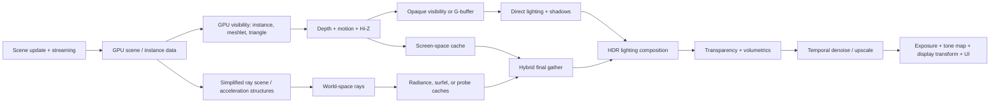

# Production-engine rendering research for Luminex

**Status:** Frozen — non-normative  
Research date: 2026-08-09  
Scope: production or production-integrated techniques from Unreal Engine 5, Frostbite, Decima,
Snowdrop, RE Engine, id Tech, Call of Duty's IW technology, Naughty Dog, and Insomniac/Nixxes.
This is an evidence notebook for the future pipeline report, not the final Luminex roadmap.

## Evidence policy

This note deliberately separates three kinds of statements:

- **Confirmed** means an engine owner, studio engineer, official manual, or primary conference
  presentation describes the implementation. Where a technique is known to have shipped, the
  title is named.
- **Production-integrated, shipping status not established** means the source presents code and
  performance from a studio renderer, but does not identify a released title that uses it.
- **Luminex inference** means a recommendation derived from several sources. It is not a claim
  that any cited engine uses exactly the proposed design.

Marketing pages are used only to establish product/platform context. Architectural claims come
from technical documentation or talks. Experimental UE features such as MegaLights and Substrate
are not treated as safe baseline dependencies merely because they are available in the engine.

## Luminex baseline relevant to this research

At M3, Luminex has an explicit, manually ordered three-pass frame:

1. one 2048 x 2048 directional shadow map;
2. a forward-ish scene pass into `BGRA8Unorm + D32`, using Blinn-Phong, normal mapping, three
   directional lights, one shadowed light, and a cubemap reflection term;
3. an ImGui pass that samples the offscreen color buffer.

It already has three frames in flight, bindless vertex pulling, per-frame uniform rings, and an
offscreen test path. It does not yet have HDR scene color, a post stack, temporal history, PBR,
a render graph, a depth/Hi-Z prepass, a GPU scene, GPU culling, virtualized geometry, a ray-tracing
scene, or indirect lighting. This matters because production engines did not arrive at their
current architectures in one jump: the dependency order is a stronger lesson than any individual
algorithm.

## Executive synthesis

The strongest pattern across the sources is not "use ray tracing." It is **separate visibility,
material evaluation, lighting caches, and reconstruction so that each can evolve independently**.
The most reusable production ideas are:

1. **A render/dependency graph becomes infrastructure before the pass count explodes.** UE's RDG
   compiles pass/resource declarations into barriers, transient allocation, async-compute fences,
   pass culling, and parallel command recording. Frostbite's FrameGraph is an earlier production
   form of the same dependency model. This is the architectural prerequisite for experimenting
   safely with multiple GI, shadow, and denoising branches.
2. **Visibility is increasingly GPU-owned.** id Tech 7 performs compute triangle culling and GPU
   geometry merging; RE Engine ships meshlets plus two-phase occlusion and a visibility buffer;
   Decima performs open-world visibility on async compute and later moved foliage-heavy shading
   toward deferred texturing; Nanite goes further with hierarchical clusters, streaming, software
   and hardware rasterization. A classic CPU draw path remains important as a correctness fallback.
3. **Temporal reconstruction is a first-class frame contract, not a final post-process toggle.**
   UE TSR, Decima's temporal/checkerboard work, Snowdrop's recurrent denoisers, and id Tech 8's
   half/quarter-resolution final gather all depend on reliable motion vectors, depth conventions,
   jitter, history invalidation, reactive/disocclusion logic, and stable material output.
4. **Modern real-time GI is cache-centric and hybrid.** Frostbite GIBS caches lighting on surfels
   and probes; Snowdrop combines screen-space hits, simplified world rays, and cascaded probes;
   id Tech 8 combines a screen cache, world-radiance cache, irradiance volumes, and one final-gather
   ray; Lumen combines screen traces with a Surface Cache and software or hardware rays. Full
   per-pixel brute-force path tracing is a high-end reference or tier, not the cross-platform base.
5. **A deliberately simplified secondary-visibility scene is normal.** Frostbite excludes
   alpha-tested geometry and stores one diffuse color per mesh-material subset for GI rays;
   Snowdrop uses low-detail RT geometry and average materials; UE uses Nanite fallback meshes in
   hardware-RT paths; id Tech 8 relies on coarser caches and separately restores directional
   detail. The engineering task is controlling the error, not pretending the secondary scene is
   identical to the raster scene.
6. **Direct lighting and shadows remain a ladder of options.** Conventional shadow maps remain
   predictable and portable. UE Virtual Shadow Maps virtualize high-resolution pages. Ray-traced
   shadows improve area-light correctness but require acceleration structures and have platform
   limits. UE MegaLights demonstrates stochastic many-light direct lighting, but its maturity and
   hardware assumptions make it a research branch, not Luminex's first direct-lighting baseline.
7. **Fixed-resolution native rendering is no longer a safe design assumption.** Production titles
   budget costly effects at half or quarter resolution, use dynamic resolution, and reconstruct.
   All screen-sized resources and sample footprints should therefore be resolution-aware from the
   start.



The diagram is a **Luminex inference** synthesized from the engines below; it is not a claim that
any one engine executes precisely this order.

## Production reference matrix

| Engine / studio | Strongest confirmed production evidence | Architectural lesson for Luminex |
| --- | --- | --- |
| Unreal Engine 5 | Lumen, Nanite, Virtual Shadow Maps, TSR, and RDG in a broadly deployed engine | Modular render graph; hybrid GI; virtualized geometry/shadows; temporal reconstruction |
| Frostbite | GIBS shipped in *EA Sports College Football 25* at 60 fps on current consoles | Surface/probe caches amortize RT; strict ray budgets; probes cover unsupported surfaces |
| Decima | GPU visibility in *Horizon Zero Dawn*; deferred texturing presentation for Decima | Decouple visibility from material shading; overlap analysis/shading with graphics work |
| Snowdrop | RT GI/reflections/far shadows shipped in *Avatar: Frontiers of Pandora*, including 60 fps console modes | Screen trace -> simplified world trace -> probe fallback; adaptive resolution and denoising |
| RE Engine | Meshlets, visibility buffer, software rasterization shipped in *Dragon's Dogma 2* and *Monster Hunter Wilds* | Practical meshlet migration; two-phase occlusion; compressed geometry; bindless materials |
| id Tech | GPU-driven forward rendering in *Doom Eternal*; cache-based dynamic GI in *Indiana Jones* / *Doom: The Dark Ages* generations | GPU culling can coexist with forward shading; cache hierarchy replaces huge baked-light data |
| Call of Duty | Software VRS shipped in *Modern Warfare*; long-running production lighting research | Software techniques can span hardware tiers; visibility/material-rate reduction is worth profiling |
| Naughty Dog | Production talks for TLOU Part II lighting, volumetric fog, GPU VFX | Platform-budget discipline; ambient/baked fallback and correct transparency/volumetric composition |
| Insomniac / Nixxes | PC releases with RT reflections/shadows and multiple reconstruction vendors; GDC PC postmortem | RHI must tolerate PSO, memory, RT, device, and reconstruction differences across PC GPUs |

## Unreal Engine 5

### Render Dependency Graph: infrastructure before effects

**Confirmed.** Unreal's Render Dependency Graph records passes and logical resources in an
immediate-style setup phase, then compiles and executes the graph. Its documented responsibilities
include transient-resource lifetime allocation/aliasing, async-compute fence scheduling,
subresource-aware barriers, parallel command-list recording, removal of unused passes, validation,
and RDG Insights debugging. This is materially more than a convenient pass list.

Source: [Epic, Render Dependency Graph](https://dev.epicgames.com/documentation/en-us/unreal-engine/render-dependency-graph-in-unreal-engine)

**Luminex inference.** A small graph should appear as soon as HDR/post and multiple shadow
resources are introduced. The initial version need only model texture/buffer reads and writes,
lifetimes, queue choice, and debug names. Automatic aliasing and async scheduling can follow. The
important decision is that techniques describe dependencies instead of manually inserting Metal
barriers inside `Renderer::render`.

### Lumen: hybrid tracing plus a surface cache

**Confirmed.** Lumen provides dynamic diffuse GI and reflections, supports effectively infinite
diffuse bounces, and is designed to work with Nanite, World Partition, and Virtual Shadow Maps.
It starts with screen traces, then falls back to software or hardware ray tracing for geometry not
resolved on screen. Software tracing uses signed-distance-field representations. Hardware tracing
can use skinned meshes and intersect triangles, but has higher scene-update cost.

Lumen's **Surface Cache** stores material properties captured from multiple viewpoints. Offline
"Cards" parameterize those captures per mesh (12 cards by default), and direct/indirect lighting
in the cache is updated over multiple frames. Nanite accelerates capture updates. Pink uncovered
regions in Lumen's diagnostic view cannot contribute reliable bounce/reflection data; artists may
need to split complex interiors or raise card density.

Epic documents approximately an 8 ms GI-and-reflections budget at 1080p internal resolution for
the 60 fps High scalability target on consoles, with TSR reconstructing near-4K output. That is a
useful scale reference, not a portable benchmark for Luminex.

Sources:

- [Epic, Lumen Global Illumination and Reflections](https://dev.epicgames.com/documentation/en-us/unreal-engine/lumen-global-illumination-and-reflections-in-unreal-engine)
- [Epic, Lumen Technical Details](https://dev.epicgames.com/documentation/en-us/unreal-engine/lumen-technical-details-in-unreal-engine)
- [Epic, Hardware Ray Tracing](https://dev.epicgames.com/documentation/unreal-engine/hardware-ray-tracing-in-unreal-engine)

**Tradeoffs confirmed by Epic.** Screen traces are cheap and match the main view but inherit
off-screen and history limitations. Surface caches amortize material/lighting work but need a
usable parameterization. Software distance fields are portable to more GPUs but lose geometric
detail and impose material/mesh constraints. Hardware RT is more accurate but makes acceleration
structure build/update, fallback geometry, and material divergence visible costs.

**Luminex inference.** Do not begin by cloning Lumen. First build the common substrates its design
assumes: HDR PBR, stable depth/motion, temporal history, a render graph, a GPU scene, diagnostic
views, and a probe or radiance cache. A later hybrid-GI experiment can then use screen-space data
first, a low-cost world representation second, and probes as a last-resort coverage layer.

### Nanite: hierarchical clusters and a separate geometry pipeline

**Confirmed.** Nanite imports meshes into hierarchical clusters, chooses appropriate clusters
without cracks, streams visible detail, and uses its own rendering path rather than issuing one
traditional draw call per object. Epic's SIGGRAPH 2021 presentation treats build, streaming,
decompression, culling, rasterization, and shading as one end-to-end system. This breadth is why
"add mesh shaders" is not equivalent to "add Nanite."

Sources:

- [Epic, Nanite Virtualized Geometry](https://dev.epicgames.com/documentation/en-us/unreal-engine/nanite-virtualized-geometry-in-unreal-engine)
- [Brian Karis, Nanite: A Deep Dive, SIGGRAPH 2021](https://advances.realtimerendering.com/s2021/Karis_Nanite_SIGGRAPH_Advances_2021_final.pdf)

**Luminex inference.** Treat meshlets as a bounded research milestone, not as a promise of fully
virtualized geometry. A useful first target is offline cluster generation, GPU instance/cluster
culling against the previous-frame Hi-Z buffer, and indirect draw/mesh dispatch, while retaining
the existing indexed path. Streaming, automatic LOD construction, software rasterization, and
visibility-buffer shading should be separate later experiments with their own measurements.

### Virtual Shadow Maps: virtual pages and clipmaps

**Confirmed.** UE Virtual Shadow Maps present a 16K virtual shadow map per light but allocate
physical 128 x 128 pages only where visible pixels request them. Directional lights use a stack
of clipmap levels; defaults span levels 6 through 22, with world coverage doubling at each level.
Pages can be cached until light, geometry, or material deformation invalidates them. Nanite is the
preferred geometry path because rendering large amounts of non-Nanite geometry into many pages is
more expensive. Page-pool overflow and excessive invalidation are explicit failure modes.

Source: [Epic, Virtual Shadow Maps](https://dev.epicgames.com/documentation/en-us/unreal-engine/virtual-shadow-maps-in-unreal-engine)

**Luminex inference.** A correct cascaded shadow-map implementation with stable cascade fitting,
receiver-plane-aware bias, filtering, and debug views is the right intermediate baseline. It
teaches the required coordinate, cache, and resolution tradeoffs without immediately introducing
virtual-page allocation. VSM then becomes a later project once Luminex has a page allocator,
feedback/marking pass, residency telemetry, and a geometry path able to fill requested pages
cheaply.

### TSR: temporal reconstruction as a system contract

**Confirmed.** Temporal Super Resolution renders at a lower internal resolution and maintains
display-resolution history. Its documented machinery includes motion vectors, depth-based
disocclusion, shading rejection, flicker analysis, and history resurrection. History update is a
major cost. Epic explicitly frames quality as a balance between sharpness, stability, ghosting,
and rejected-history flicker, rather than a generic blend with the previous frame.

Sources:

- [Epic, Temporal Super Resolution](https://dev.epicgames.com/documentation/en-us/unreal-engine/temporal-super-resolution-in-unreal-engine)
- [Epic, TSR Frequently Asked Questions](https://dev.epicgames.com/documentation/en-us/unreal-engine/temporal-super-resolution-frequently-asked-questions-for-unreal-engine)

**Luminex inference.** Motion vectors, jittered and unjittered matrices, previous transforms,
exposure-normalized history, responsive masks, camera-cut detection, and history-reset hooks
should be treated as shared renderer data. Starting with native-resolution TAA before temporal
upscaling is useful because it exposes the same correctness failures with fewer variables.

### Substrate and MegaLights: valuable direction, unsafe baseline

**Confirmed, experimental/beta status.** Substrate replaces fixed material shading models with
composable "slabs" representing BSDF closures. Cost and storage scale with closure complexity;
parameter blending can collapse multiple slabs. Epic documents an example falling from 108 bytes
per pixel to 28 bytes with blending and a default 80-byte-per-pixel budget with automatic
simplification. The feature remains labeled Beta in current documentation.

Sources:

- [Epic, Substrate Materials](https://dev.epicgames.com/documentation/unreal-engine/substrate-materials-in-unreal-engine?lang=en-US)
- [Epic, Substrate Overview](https://dev.epicgames.com/documentation/en-us/unreal-engine/overview-of-substrate-materials-in-unreal-engine)

**Confirmed, experimental direction.** MegaLights uses a fixed stochastic sample/ray budget per
pixel, importance-samples many lights, performs a short screen-space trace followed by a hardware
or software world trace or Virtual Shadow Map lookup, guides rays, and denoises the result. It can
replace multiple conventional direct-light/shadow passes with one stochastic direct-lighting
path. Its cost is bounded, but signal quality falls as more important lights compete for the same
samples. Hardware capability, simplified RT geometry, denoising, and compatibility constraints
remain central.

Sources:

- [Epic, MegaLights](https://dev.epicgames.com/documentation/en-us/unreal-engine/megalights-in-unreal-engine)
- [Epic Games, MegaLights: Stochastic Direct Lighting, SIGGRAPH 2025](https://advances.realtimerendering.com/s2025/content/MegaLights_Stochastic_Direct_Lighting_2025.pdf)

**Luminex inference.** Begin materials with a disciplined metallic-roughness GGX baseline but
define shader interfaces in BSDF terms, so clear coat, sheen, transmission, and layering can be
added without corrupting the base path. Keep stochastic many-light sampling as a research branch
after deterministic tiled/clustered direct lighting and temporal denoising exist.

### macOS implications

**Confirmed for Unreal's implementation, not a statement about Metal's general capability.**
Epic's UE 5.8 macOS requirements list software Lumen and TSR on Apple Silicon, Nanite and VSM as
beta on M2 or newer, and no macOS support for hardware-RT Lumen or MegaLights. Thus a Metal-first
renderer cannot make the current UE hardware-RT feature set its only architectural path.

Source: [Epic, macOS Development Requirements](https://dev.epicgames.com/documentation/unreal-engine/macos-development-requirements-for-unreal-engine?lang=en-US)

**Luminex inference.** Feature capability tests must be granular: argument-buffer/bindless tier,
mesh-shader/object-shader availability, sparse residency, ray-query/acceleration-structure support,
and temporal-upscaler availability should not collapse into a single "modern GPU" switch.

## Frostbite

### GIBS: surfels plus probes, shipped at 60 fps

**Confirmed shipped.** EA's Global Illumination Based on Surfels (GIBS) shipped in *EA Sports
College Football 25* on PlayStation 5 and Xbox Series X/S at 60 fps. The 2021 prototype averaged
approximately 6-7 ms; the 2024 shipping talk reports roughly 3.2 ms average with a 4 ms peak in its
captured run. *Skate* uses Enlighten on lower-end configurations and GIBS on higher-end hardware,
demonstrating that Frostbite keeps more than one GI tier.

Sources:

- [EA, Lighting EA Sports College Football 25 with GIBS](https://www.ea.com/technology/news/gibs-lighting-ea-sports-college-football-25?isLocalized=true)
- [EA Frostbite, Dynamic Diffuse Global Illumination with Ray-Traced Irradiance Fields, SIGGRAPH 2021](https://advances.realtimerendering.com/s2021/SIGGRAPH%20Advances%202021%20-%20Surfel%20GI.pdf)
- [EA Frostbite, Shipping Dynamic Global Illumination in Frostbite, SIGGRAPH 2024](https://advances.realtimerendering.com/s2024/content/EA-GIBS2/Apers_Advances-s2024_Shipping-Dynamic-GI.pdf)

**Confirmed pipeline.** The shipping presentation describes this ordering:

1. render the G-buffer and spawn/update surfels from visible surfaces;
2. build/update the ray-tracing top-level acceleration structure;
3. ray trace and update irradiance for persistent/new surfels and probes;
4. apply surfel or probe lighting into an indirect-light buffer;
5. consume that buffer in Deferred Tiled Lighting;
6. let transparent or otherwise non-deferred surfaces sample the probe clipmap.

The key split is deliberate. Surfels capture view-relevant surface lighting at a useful density;
probes provide stable fallback coverage for arbitrary geometry and surfaces not represented in the
deferred path.

**Confirmed resource and scheduling details.** The probe system uses octahedrally encoded
irradiance and variance depth, up to three clip levels, and as many as roughly 100,000 probes. The
talk reports about 100 MB, approximately 1 KB per probe. At a 100,000-ray frame budget, only about
6,000 probes can receive the minimum 16 rays in a frame, so update priority and temporal estimators
are fundamental rather than optional polish. More than 50 compute shaders participate in a frame;
only six issue intersections. GPU-driven indirect dispatch, compaction, binning, tile
classification, and scalar-path tuning for RDNA are important to the final cost.

**Confirmed simplifications.** The GI ray scene contains opaque, non-alpha-tested geometry and
stores one diffuse-albedo color per mesh/material subset. Rays are bounded to about 20 m before a
volume fallback. Frostbite found it useful to export vertex-interpolated geometric normals into
the G-buffer to avoid spawning too many incorrect surfels, and stores per-surfel reconstruction
error to choose a safe ray bias. Areas with inadequate surfel coverage fall back to probes.

**Luminex inference.** GIBS is compelling as a long-term research target because it exposes the
right interfaces: surface sample cache, probe clipmaps, update scheduler, simplified ray material,
bounded ray distance, and a common indirect-light buffer. But it is not a sensible M4 feature.
A lower-risk progression is first irradiance probes, then screen-space diffuse tracing, then a
small world-radiance/surfel cache, and only then hardware ray updates. Each stage should preserve
the probe fallback and a non-RT lighting tier.

### FrameGraph heritage

**Confirmed historical production architecture.** Frostbite's 2017 FrameGraph presentation
describes data-oriented render-pass and resource declarations used to derive execution and
lifetime information rather than hard-coding all transitions and allocations in feature code.
Although older than the user's preferred five-year window, it remains relevant because later
Frostbite systems such as GIBS rely heavily on many compute passes and queue overlap.

Source: [Frostbite, FrameGraph: Extensible Rendering Architecture in Frostbite, GDC 2017](https://www.gdcvault.com/play/1024045/Data-Oriented-Design-Explained)

**Luminex inference.** A future technique should be able to contribute passes and resources
without owning the whole frame. This is the practical boundary between a renderer playground and
a renderer whose experiments can coexist.

## Decima / Guerrilla

### GPU visibility for a streaming open world

**Confirmed shipped in *Horizon Zero Dawn*.** Guerrilla moved large-scale visibility work onto
the GPU and async compute. The public presentation describes collecting instances into batches,
using GPU visibility to reduce work through the rendering pipeline, and designing the solution
around a large streaming open world rather than a small isolated culling benchmark.

Source: [Guerrilla, Decima Engine: Visibility in Horizon Zero Dawn](https://www.guerrilla-games.com/read/decima-engine-visibility-in-horizon-zero-dawn)

**Luminex inference.** Luminex's current 103-draw Sponza scene does not need an elaborate GPU scene
for speed, but it is an excellent correctness fixture. Introduce a packed instance buffer, GPU
frustum/occlusion results, and indirect commands while retaining a CPU reference result; compare
visible IDs and rendered images in tests. This creates the substrate for meshlets without tying
culling to a particular primitive representation.

### Deferred texturing and software VRS

**Confirmed shipped in *Horizon Forbidden West*.** Guerrilla's 2022 deferred-texturing
presentation uses a visibility-buffer prepass,
then performs surface analysis and shading in compute. The work specifically targets foliage and
alpha-tested geometry, where repeatedly evaluating expensive material opacity/shading is wasteful.
It also describes software variable-rate shading and overlaps compute analysis/shading with
G-buffer and cascaded-shadow rendering on async compute. The presenter reports that this overlap
usually makes the path low-overhead.

Sources:

- [Guerrilla, Adventures with Deferred Texturing in Horizon Forbidden West](https://www.guerrilla-games.com/read/adventures-with-deferred-texturing-in-horizon-forbidden-west)
- [GDC Vault, Adventures with Deferred Texturing in Decima](https://www.gdcvault.com/play/1028035/Adventures-with-Deferred-Texturing-in)

**Why this matters.** A visibility buffer reduces the raster output to primitive/instance identity
and reconstructs attributes later. That can reduce overdraw-related shading and let compute choose
material rates, but it introduces difficult requirements: stable primitive IDs, access to indexed
vertex data in compute/pixel shading, derivative reconstruction, material sorting or divergence
control, alpha-test handling, MSAA semantics, and extra transformed-vertex storage or work.

**Luminex inference.** The existing bindless vertex-pulling layout is unusually compatible with a
visibility-buffer experiment. Nonetheless, first build a conventional PBR G-buffer or clustered
forward baseline so results have a simple oracle. Then implement visibility-buffer shading as an
alternate opaque path for the same materials. Measure bandwidth, material divergence, derivative
quality, and alpha-tested foliage separately; do not assume it is universally faster.

### Temporal AA, checkerboard reconstruction, and image-space discipline

**Confirmed shipped in *Horizon Zero Dawn*.** Decima's SIGGRAPH 2017 lighting/AA talk describes a
two-frame temporal AA method at 1080p and an optimized 2160p checkerboard/tangram reconstruction
for PlayStation 4 Pro, alongside production atmosphere and area-light approximations. It is older
than the main research window but important historical evidence that reconstruction was already a
core renderer design constraint, not a recent response to RT cost.

Sources:

- [Guerrilla, Decima Engine: Advances in Lighting and AA](https://www.guerrilla-games.com/read/decima-engine-advances-in-lighting-and-aa)
- [Guerrilla, SIGGRAPH 2017 presentation PDF](https://www.guerrilla-games.com/media/News/Files/DecimaSiggraph2017.pdf)

### Specialist systems: water and clouds

**Confirmed production techniques.** *Horizon Forbidden West* builds ocean wavefronts from
localized, art-directed surface deformations derived from Houdini simulations rather than relying
on one universal procedural ocean model. Decima's earlier real-time cloud system was explicitly
designed around a roughly 2 ms budget. These are reminders that SOTA image quality often comes
from bounded, art-directable specialist systems after the shared pipeline is sound.

Sources:

- [Guerrilla, Water Rendering in Horizon Forbidden West, SIGGRAPH 2022](https://advances.realtimerendering.com/s2022/SIGGRAPH2022-Advances-Water-Malan.pdf)
- [Guerrilla, The Real-time Volumetric Cloudscapes of Horizon Zero Dawn](https://www.guerrilla-games.com/read/the-real-time-volumetric-cloudscapes-of-horizon-zero-dawn)

**Luminex inference.** Water, hair, clouds, skin, and foliage should become technique modules that
consume shared lighting, depth, motion, and history contracts. They should not be allowed to
define those contracts ad hoc.

## Snowdrop / Massive Entertainment

### The strongest cross-platform hybrid-RT reference

**Confirmed shipped in *Avatar: Frontiers of Pandora*.** Snowdrop ships ray-traced diffuse GI,
reflections, and far shadows in both 30 and 60 fps console modes. The same system can run through
DXR inline ray queries on capable PCs or a custom software BVH on consoles/non-RT PCs. Snowdrop
does not trace the full raster scene: it maintains a low-detail RT representation with average
materials and combines screen-space, world-space, and probe information.

Sources:

- [GDC Vault, Raytracing in Snowdrop: Optimized Lighting for Avatar](https://www.gdcvault.com/play/1034763/Advanced-Graphics-Summit-Raytracing-in)
- [Quentin Kuenlin, Raytracing in Snowdrop PDF](https://media.gdcvault.com/gdc2024/Slides/GDC+slide+presentations/Kuenlib_Quentin_Raytracing_In_Snowdrop.pdf)
- [GDC Vault, Ray Tracing in Snowdrop: Scene Representation and Custom BVH](https://www.gdcvault.com/play/1034404/Ray-Tracing-in-Snowdrop-Scene)
- [Oleksandr Koshlo, Snowdrop Custom BVH PDF](https://media.gdcvault.com/gdc2024/Slides/GDC+slide+presentations/Koshlo_Oleksandr_Snowdrop_Custom_BVH.pdf)

### Cascaded probe cache

**Confirmed.** Snowdrop uses four cascades of 32 x 32 x 8 probes. The reported spacings and extents
are:

| Cascade | Probe spacing | Approximate covered volume |
| --- | ---: | ---: |
| 0 | 2 m | 64 x 64 x 16 m |
| 1 | 8 m | 256 x 256 x 64 m |
| 2 | 64 m | 2,048 x 2,048 x 512 m |
| 3 | 1,024 m | 32 x 32 x 8 km |

The per-frame budget is 1,024 probes: roughly 15% receive full trace-and-light updates, while the
remaining 85% can be relit from cached hit information. A full update uses about 400 rays per
probe. Rays are bounded relative to the next cascade spacing, and misses use sky or coarser-cache
information. Lighting at hits uses a simplified Lambert/GGX model, sun visibility, an analytic
light BVH, and indirect light from other probes. Irradiance and depth are stored in octahedral
maps; variance depth supports Chebyshev-style visibility weighting.

**Production lesson.** "Relight cached hits" is as important as tracing: scene visibility changes
less frequently than lighting. Separating hit discovery from hit shading allows many more probes
to react to a changing sun or local light than could be retraced in the same frame.

### Diffuse GI and reflection ordering

**Confirmed.** Snowdrop's view-ray hierarchy is:

1. trace in screen space;
2. if unresolved, trace the simplified world scene;
3. if still unresolved or beyond range, sample the cascaded probe cache.

Avatar uses quarter-resolution diffuse GI on consoles. Hits are encoded into spherical harmonics,
passed through a recurrent denoiser, and upscaled. The presentation shows an example in which only
29% of rays need world-space tracing after screen-space reuse. Hit lighting can reuse the previous
frame's shaded hit when valid; otherwise it evaluates sun, probes, and point lights. Separate
hit/miss passes improve coherence.

Reflections follow the same hierarchy but sample a GGX lobe and vary ray length/resolution with
roughness. A per-16 x 16-tile classifier selects 1/16, 1/4, 1/2, or full-rate reflection tracing
using luminance, variance, hit distance, roughness, specularity, and temporal stability. Avatar's
console path is quarter resolution; a second reflection layer for water/clear coat is reserved for
the maximum PC setting because it roughly doubles the reflection cost.

**Confirmed performance examples, not portable benchmarks.** On Xbox Series X at 1440p and
quarter resolution, the cited scene costs approximately 3.273 ms for RTGI and 2.895 ms for
reflections. Xbox Series S at 960p uses simplified world-hit shading and reports approximately
3.33 ms and 3.048 ms. An RTX 4080 at 4K reports approximately 2.568 ms and 2.132 ms. Denoising
accounts for roughly 47-79% of total cost in the shown cases. Snowdrop reports reducing combined
GI/reflection cost from about 15 ms to 7 ms through the described optimizations.

**Luminex inference.** Denoiser/upscaler time belongs in the feature budget from day one. A ray
tracer that appears cheap before reconstruction can be a misleading prototype. Luminex profiling
should report trace, hit shading, cache update, denoise, upscale, and composite separately, along
with the fraction resolved by screen, world, and cache.

### Simplified ray scene and custom BVH

**Confirmed.** Snowdrop gathers relevant instances within roughly 4 km, caches ray-tracing instance
lists in a quadtree, creates sector lists as the world streams, prunes procedural instances,
ray-marches terrain height fields, uses low-resolution octahedral sky data including clouds, and
represents distant trees with depth impostors. Static BLAS data is built offline with SAH and
triangle splitting; a fast builder handles fallback background work. Skinned geometry may update
positions and refit, while selected assets use cheaper approximations or limited update cadence.

Average ray materials are generated from material-graph metadata. Texture and vertex-color
averages stand in for full sampling; alpha test can be approximated by a constant opacity and
blue-noise hit rejection. The talk is candid that this is suitable for GI and most rough
reflections, not perfect mirrors.

**Confirmed limitations.** Low-detail ray geometry creates visible mismatch for highly specular,
stable surfaces. Uniform probe grids constrain room, corridor, wall-thickness, and interior-height
design. Proposed future work includes GPU-placed octree probes, dynamic spacing, portal BVHs for
indoor/outdoor classification, and adaptive ray directions; these are future proposals, not
shipped facts.

**Luminex inference.** Define `RayScene` and `RayMaterial` as explicit reduced representations,
with diagnostic overlays that compare raster and ray geometry. This makes simplification an
observable policy. A software BVH is intellectually valuable for a playground and gives a Mac/PC
fallback, but should follow—not precede—a minimal hardware acceleration-structure path or a CPU
reference tracer, because building, refitting, compacting, and traversing a competitive custom BVH
is an entire project by itself.

## RE Engine / Capcom

### A pragmatic, shipped meshlet migration

**Confirmed shipped in *Dragon's Dogma 2* and *Monster Hunter Wilds*.** Capcom's REAC 2025
presentation describes moving from multi-draw-indirect plus GPU occlusion to a meshlet pipeline
with two-phase occlusion, hardware and software rasterization, and a visibility buffer. It is one
of the best public references for adopting these techniques incrementally rather than designing a
fully virtualized system at once.

Sources:

- [Capcom, Optimization of Meshlet Rendering in RE Engine, REAC 2025 PDF](https://enginearchitecture.org/downloads/REAC_2025_Capcom.pdf)
- [Capcom, REAC 2025 Q&A PDF](https://enginearchitecture.org/downloads/REAC_2025_Capcom_QA.pdf)
- [REAC 2025 program](https://enginearchitecture.org/2025.htm)
- [CEDEC 2025 session description](https://cedec.cesa.or.jp/2025/timetable/detail/s67ad88bd2d5b0)

**Confirmed representation.** Meshlets contain at most 128 vertices and 128 triangles. Offline
data is stored in byte-address buffers; headers are approximately 32 bytes, while attributes and
indices are quantized/compacted. LOD data is ordered from least to most detailed and can live in
reserved/tiled resources. One example shrinks a 75.8 MB source mesh to 56.3 MB after meshlet
conversion and 40.3 MB with compact storage. Automatic LOD generation was not yet part of the
described system, which is an important boundary: meshlet execution and geometry simplification
are separate problems.

**Confirmed visibility path.** The first phase performs instance culling, cluster culling, then
software or hardware rasterization. It builds a Hi-Z result. A second phase revisits occluded
instances and then clusters to recover geometry that became visible relative to the first phase.
Large meshlets use mesh shaders or vertex shaders; small projected meshlets can use software
rasterization. Work subdivision is tuned to avoid long-tail waves; one shown PS5 optimization
reduces instance-culling time from 1.578 ms to 1.159 ms and cluster culling from 0.543 ms to
0.051 ms in the cited case.

**Confirmed shading path.** The 64-bit visibility-buffer entry encodes instance and triangle
identity/signature. Materials are bindless. Special rasterizers handle cases such as alpha test
and decals by bucketing/sorting work by shader ID and issuing indirect work. The Q&A clarifies the
deferred path: render the visibility buffer, run compute to pre-transform vertices referenced by
visible primitive IDs, then run a G-buffer pixel pass that reads the visibility buffer and
transformed vertices. Temporary transformed-vertex memory can be large, so it is aliased over the
part of the frame that needs it. Capcom had not simply switched all opaque lighting to direct
compute shading from the visibility buffer.

**Additional confirmed detail.** Shadows beyond the final traditional cascade can use signed
distance fields. A forward special-material path can still use mesh-shader rasterization and shade
directly. This is evidence for coexistence rather than one universal shading path.

**Luminex inference.** RE Engine supplies a realistic sequence for Luminex:

1. GPU instance culling and indirect indexed draws;
2. offline meshlet conversion with a clear compressed on-disk/in-memory format;
3. cluster frustum/cone/occlusion culling;
4. a conventional hardware raster path;
5. two-phase occlusion;
6. visibility-buffer shading;
7. software rasterization only for demonstrably subpixel clusters.

Each step has an independently measurable output and can preserve the current draw path as a
reference.

### Path tracing as reference, premium tier, and development tool

**Confirmed current Capcom direction.** Capcom describes supporting probe, earlier ray-traced, and
path-traced lighting paths across device tiers. Its 2026 NVIDIA engineering interview says the
team first built a reference path tracer validated against common DCC output, then spent roughly
two years adapting a game-oriented path-tracing path around DLSS Ray Reconstruction and RTX
features for *Resident Evil Requiem* and *Pragmata*. Direct and indirect lighting can be
path-traced, removing conventional shadow maps in that tier; strand-hair transmission receives
special handling.

Sources:

- [Capcom, RE Engine overview in the 2025 annual report](https://www.capcom.co.jp/ir/english/data/oar/2025/re-engine.html)
- [NVIDIA Developer, Q&A: How Capcom Brought Path Tracing to RE Engine](https://developer.nvidia.com/blog/qa-how-capcom-brought-path-tracing-to-re-engine-across-pragmata-and-resident-evil-requiem/)

The NVIDIA article is a vendor-hosted interview rather than neutral documentation; it is useful
for the stated Capcom workflow, but performance/quality conclusions involving proprietary
upscaling should be treated accordingly.

**Luminex inference.** A simple offline/reference path tracer is valuable before a real-time path
tracing tier. It can validate BRDF energy, light units, IBL, exposure, and eventually GI. The
real-time tier should stay optional and should not force the base material/lighting API to assume
one denoiser vendor or one hardware architecture.

## id Tech / id Software and MachineGames

### id Tech 7: GPU-driven geometry with forward shading

**Confirmed shipped in *Doom Eternal*.** id Tech 7 is a useful counterexample to the idea that
GPU-driven rendering requires deferred shading. It uses a fully forward material/lighting path
with a small number of ubershader variants and a hybrid clustered-plus-tiled light/decal
classification: the fragment can choose the shorter applicable list.

Before rasterization, compute shaders perform back-face, frustum, micro-triangle, and occlusion
culling. The SIGGRAPH 2020 talk shows a representative reduction from about three million
triangles after CPU submission to about one million rasterized triangles. Surviving triangles are
merged into GPU-generated geometry, sharing bindless resources and compatible pipeline state.
Culling/merging can run on async compute before shadows, while geometry-set granularity allows
graphics work to begin before all compute work finishes. The indirect index result is reused for
depth and opaque passes. The presenters report up to about 5 ms of GPU savings in dense scenes,
plus CPU savings, on the tested configurations.

Source: [id Software, Rendering Doom Eternal, SIGGRAPH 2020](https://advances.realtimerendering.com/s2020/RenderingDoomEternal.pdf)

**Luminex inference.** Clustered forward+ is a credible near-term route for Luminex because it
preserves straightforward MSAA and transparent-material integration while removing per-light draw
scaling. A separate G-buffer can still serve SSR/SSAO/GI research, or Luminex can later compare
forward+, deferred, and visibility-buffer shading using the same GPU-visible geometry lists.

### id Tech 8: replace huge baked data with a hierarchy of dynamic caches

**Confirmed across the *Indiana Jones and the Great Circle* / *Doom: The Dark Ages* engine
generation.** id's SIGGRAPH 2025 presentation says an earlier form of the technology shipped in
*Indiana Jones*, while the newest described implementation belongs to *Doom: The Dark Ages*. The
design targets 60 Hz or more on all supported platforms, including hardware around Xbox Series S
capability.

The motivation is unusually concrete. id Tech 7's path-traced lightmap workflow took roughly
4-10 hours for a final bake per *Doom Eternal* map, used around 500 MB compressed per level, and
generated around 1.4 TB of network data. Larger future worlds made that pipeline untenable.

Source: [id Software, Dynamic Global Illumination in id Tech 8, SIGGRAPH 2025](https://advances.realtimerendering.com/s2025/content/SOUSA_SIGGRAPH_2025_Final.pdf)

**Confirmed frame structure.** The presentation describes this logical order:

1. update a cascaded world-space light grid;
2. sample world visibility into irradiance-volume data;
3. cache and shade hits in a world-radiance cache;
4. update irradiance volumes from cached results;
5. run a final gather that indexes the caches but performs no full hit-material shading;
6. spatially and temporally denoise, then upscale;
7. sample separate froxel irradiance for transparent media/surfaces.

The caches divide work by frequency and location:

- The light grid is 16 cubed cells across eight cascades. The first covers about 32 m with 2 m
  cells; each cell can reference up to 64 lights/reflection probes/decals. It costs around 30 MB
  and is hierarchically culled on async compute at roughly 0.2 ms on the cited consoles.
- Irradiance volumes use six 16 cubed cascades plus local 10 cubed volumes. Only one cascade and
  one local volume are updated per frame. Probes receive 64, 32, or 16 visibility rays according
  to specular need. Each hit stores a compact, V-buffer-like 128-bit record containing identity,
  barycentrics, and distance.
- The world-radiance cache is a spatial hash of roughly 25 cm cubed cells with LOD levels. It uses
  about 14 MB. Active cells are shaded indirectly and can run on async compute, with work grouped
  by shader/material.
- Final gather uses one ray per output sample at half-by-half or quarter-by-quarter resolution.
  It first tests an in-frustum/unoccluded screen cache, then the world-radiance cache, then the
  irradiance-volume fallback. Direction is stored as two-band spherical harmonics.
- A spatial bilateral Gaussian at final-gather resolution, four-tap bilateral upscale, and
  temporal accumulation reconstruct the result. The implementation prefers compact RGB9E5 where
  precision permits.

**Confirmed feature-tier decisions.** Indirect specular uses an SSR -> ray trace -> reflection
probe hierarchy based on smoothness. Console ray-traced reflections were disabled in the
described shipping context because the roughly 2 ms cost and production schedule did not justify
them. Reflection probes are updated/refit with current irradiance. Transparency receives
two-band-SH froxel irradiance, with a reported 50 MB high-quality / 25 MB lower-quality footprint.
Directional occlusion or parallax-style hemisphere ray marching adds high-frequency detail that
the simplified acceleration data misses.

The reported hotspot costs are approximately 1.7-2.11 ms when serialized and 1.4-1.82 ms with
console async overlap, saving around 0.4-0.5 ms. These are scene/platform-specific measurements,
but they show how much of the result comes from scheduling rather than algorithm names.

**Luminex inference.** id Tech 8 gives Luminex perhaps the most attainable long-term GI research
shape: add one bounded cache at a time and ensure every expensive query falls through to a cheaper
representation. It also shows that zero baked-light data can be a workflow objective independent
of full path-traced quality. For a playground, the first cache could be a small camera-centered
irradiance volume updated round-robin, validated against a reference tracer.

### Budget realism from MachineGames

**Confirmed shipping practice.** The *Indiana Jones* 60 Hz talk allows dynamic resolution down to
roughly 44% of native pixel count in difficult cases (for example, 2160p output around 1440p
internal dimensions) and adjusts details such as anisotropic filtering with resolution. This is
not a recommendation to accept low resolution; it is evidence that a production pipeline exposes
scalable, coherent knobs rather than counting on one fixed workload.

Source: [MachineGames, Achieving a 60Hz Cross-Platform Renderer for Indiana Jones, REAC 2025](https://enginearchitecture.org/downloads/REAC_2025_Indy.pdf)

## Call of Duty / Activision research

### Software variable-rate shading

**Confirmed shipped in *Call of Duty: Modern Warfare* (2020-era production renderer).** Activision
implemented VRS in software so it could run on a wider hardware base than then-current fixed-rate
GPU features. The described sequence performs a prepass, estimates shading rates, packs pixels in
compute, and consumes the packed work in the Forward+ final pass. Because it is software, the
rate logic is customizable and not tied to one vendor's VRS image semantics.

Source: [Activision Research, Software-Based Variable Rate Shading in Call of Duty: Modern Warfare](https://research.activision.com/publications/2020-09/software-based-variable-rate-shading-in-call-of-duty--modern-war)

**Luminex inference.** Do not implement VRS before reliable profiling shows shading-rate
redundancy. Once a visibility-buffer or compute-shading path exists, a simple 2 x 2 software
classifier is a good experiment because it works across Metal and DirectX and exposes temporal
stability issues directly. Hardware VRS can later be another backend for the same rate policy.

### Precomputed and neural lighting as viable lower tiers

**Confirmed production research; deployment varies by presentation.** Call of Duty's public talks
continue to invest in compact probe/light-grid representations, spherical-harmonic compression,
visibility-aware reconstruction, and runtime updates for changed lights or geometry. The 2020
work presents production precomputed lighting for static models and dynamic changes. The 2021
large-scale GI work focuses on compression/reconstruction and visibility sampling. The 2024
Neural Light Grid presentation shows learned reconstruction intended to reduce leaking and improve
quality under constrained budgets; the public session page does not establish that every neural
variant shipped in a named title.

Sources:

- [Advances in Real-Time Rendering 2020 index, Call of Duty precomputed lighting session](https://advances.realtimerendering.com/s2020/index.html)
- [Advances in Real-Time Rendering 2021 index, Call of Duty large-scale GI session](https://advances.realtimerendering.com/s2021/index.html)
- [Activision, Large Scale Global Illumination presentation](https://advances.realtimerendering.com/s2021/Silvennoinen%20-%20SIGGRAPH%202021%20Advances_slim.pptx)
- [Advances in Real-Time Rendering 2024 index, Neural Light Grid and hemispherical lighting sessions](https://www.advances.realtimerendering.com/s2024/index.html)
- [Activision, Hemispherical Lighting presentation notes](https://advances.realtimerendering.com/s2024/content/Roughton/SIGGRAPH%20Advances%202024%20-%20Hemispheres%20Presentation%20Notes.pdf)

**Luminex inference.** Dynamic GI should not eliminate baked/probe baselines from the playground.
A tiny CPU or offline baker plus runtime probe sampling gives a quality oracle and a low-end tier,
while also teaching representation, visibility, leakage, and interpolation problems needed by
dynamic probes.

### Order-independent transparency

**Production-integrated, named shipping title not established by the public talk.** Activision's
2025 Adaptive Volumetric Buffer OIT (AVBOIT) fits transparency into depth slices, splats a
low-resolution extinction volume, integrates visibility along view rays, and lets later
transparent draws sample the accumulated extinction in arbitrary order. Adaptive sparse physical
slices reduce work when depth occupancy is low. The talk reports competitive PlayStation 5 and
PlayStation 4 timings versus weighted and moment-based OIT in its test scenes, with the practical
benefit of reducing manual sort authoring.

Source: [Activision, Adaptive Volumetric Buffer Order-Independent Transparency, SIGGRAPH 2025](https://advances.realtimerendering.com/s2025/content/AVBOIT_SIG2025_MDROBOT-final.pdf)

**Luminex inference.** Use sorted premultiplied alpha blending initially. Add no approximate OIT
baseline until a representative fixture demonstrates need and a mature implementation provides an
integration reference. AVBOIT is an excellent advanced module after Luminex has representative
hair/particles/glass stress scenes and memory instrumentation. OIT quality cannot be evaluated using
Sponza alone.

## Naughty Dog

### Production lighting, volumetrics, and VFX under a fixed console budget

**Confirmed shipped techniques in *The Last of Us Part II*.** Naughty Dog's official SIGGRAPH 2020
program groups several renderer lessons:

- baked ambient lighting remained essential to fit PlayStation 4 frame and memory budgets;
- volumetric fog used a view-space froxel grid and addressed correct composition with glass and
  particle systems rather than treating fog as an isolated full-screen effect;
- GPU-driven VFX work focused on expensive interactions across a frame, with production case
  studies rather than an unconstrained particle sandbox;
- technical-art systems included wetness, deformable snow, eye rendering, fake cubemap interiors,
  and height-map-driven material effects.

Sources:

- [Naughty Dog, Naughty Dog at SIGGRAPH 2020](https://www.naughtydog.com/blog/naughty_dog_at_siggraph_2020)
- [Naughty Dog, Lighting Technology of The Last of Us Part II PDF](https://history.siggraph.org/wp-content/uploads/2022/08/2020-Talks-Doghramachi_Lighting-Technology-of-The-Last-of-Us-Part-II.pdf)
- [GDC Vault, Creative and Experimental VFX in The Last of Us Part II](https://www.gdcvault.com/play/1027072/Creative-and-Experimental-VFX-in)

**Luminex inference.** A basic froxel fog module is more strategically useful than a screen-space
"fog color" post effect because it creates the 3D grid infrastructure later used by clustered
lighting, volumetric shadows, and transparent-surface lighting. Define composition order with
sky, opaque, emissive, particles, glass, and tone mapping explicitly.

### PC porting is an architectural workload

**Confirmed studio account.** Naughty Dog explains that an engine optimized around PlayStation 5
required substantial GPU and systems rethinking for *The Last of Us Part I* on PC. This is not a
detailed pipeline paper, but it is direct evidence against treating a future PC backend as simple
API syntax translation.

Source: [Naughty Dog, Celebrating the Release of The Last of Us Part I on PC](https://www.naughtydog.com/blog/celebrating_the_release_of_the_last_of_us_part_i_on_pc)

**Luminex inference.** Preserve the thin RHI, but design performance decisions around capability
profiles and measured memory/queue behavior. Metal unified memory, Apple tile GPUs, discrete PC
VRAM, D3D12 descriptor heaps, pipeline compilation, and device removal need different policy even
when they expose equivalent high-level resources.

## Insomniac Games / Nixxes

### PC rendering feature tiers rather than one canonical path

**Confirmed in shipped PC releases.** *Ratchet & Clank: Rift Apart* exposes ray-traced reflections
and exterior shadows plus DLSS, FSR, XeSS, and Insomniac Temporal Injection. *Marvel's Spider-Man
Remastered* similarly combines ray-traced reflections/shadows with scalable quality and temporal
reconstruction choices. These pages establish deployment, not internal algorithms.

Sources:

- [PlayStation, Ratchet & Clank: Rift Apart PC specifications and features](https://blog.playstation.com/2023/07/18/ratchet-clank-rift-apart-pc-specs-and-new-features-revealed/)
- [PlayStation, Marvel's Spider-Man Remastered for PC](https://www.playstation.com/en-us/games/marvels-spider-man-remastered/pc/)

**Confirmed engineering topics.** The GDC 2023 *Marvel's Spider-Man Remastered* PC postmortem
covers Direct3D 12 pipeline-state creation/management, discrete GPU memory, ray tracing, device
removal, and ultrawide support. The value of this source is the set of production problems around
an effect, not a claim that it defines a new rendering algorithm.

Source: [GDC Vault, Marvel's Spider-Man Remastered: A PC Postmortem](https://www.gdcvault.com/play/1028914/Advanced-Graphics-Summit-Marvel-s)

**Luminex inference.** The renderer should separate its own temporal interface from vendor
upscaler integrations. A single input contract—jitter, motion, linear depth, exposure, reactive/
transparency masks, reset flags, input/output rectangles—can feed native TAA/TAAU and future
MetalFX, DLSS, FSR, or XeSS adapters without letting a vendor SDK own frame structure.

## Cross-engine design conclusions for Luminex

### 1. The durable base is conventional and measurable

**High-confidence inference.** Before SOTA research branches, implement:

- scene-referred HDR color;
- glTF metallic-roughness GGX with image-based lighting and a reference BRDF test suite;
- automatic exposure plus a documented tone mapper/output transform;
- stable depth, linear-depth utilities, camera jitter, motion vectors, and history invalidation;
- native-resolution TAA, then temporal upscaling/dynamic resolution;
- a render graph with resource lifetime/barrier validation and pass timing;
- GPU timestamps, per-pass bandwidth/allocation counters, and debug visualization modes.

Every surveyed advanced technique assumes most of this foundation. Building RT before it would
produce an impressive isolated demo but a weak experimental platform.

### 2. Prefer a GPU scene, not a mesh-shader-shaped scene

**High-confidence inference.** Define stable GPU records for transforms (current and previous),
bounds, mesh/material IDs, flags, and LOD state. Visibility should output compact IDs or indirect
work that more than one raster backend can consume. The classic indexed, meshlet hardware-raster,
and future software-raster paths should all read the same logical scene.

This follows the common part of Decima visibility, id Tech 7 GPU culling, RE Engine meshlets, and
Nanite. It avoids confusing the API mechanism (mesh shaders) with the architecture (GPU ownership
of visibility and geometry work).

### 3. Keep at least two opaque shading experiments alive

**Medium/high-confidence inference.** A playground benefits from a conventional baseline and a
research path:

- **Clustered forward+** is comparatively simple, works naturally with MSAA/transparency, and is
  validated by id Tech 7-style architecture.
- **G-buffer deferred** gives predictable material cost and straightforward screen-space effects.
- **Visibility-buffer/deferred texturing** is the advanced branch for reducing redundant material
  shading and studying software VRS, as demonstrated by Decima and RE Engine.

Luminex should not permanently commit to all three in every build. Share BRDF/material functions,
GPU scene data, light lists, shadows, and image-space outputs, then compile selectable paths for
experiments.

### 4. Use a shadow ladder

**High-confidence inference.** The likely progression is:

1. stable four-cascade directional shadows plus atlas support for local lights;
2. cached/static pages or update throttling;
3. virtual shadow maps as a dedicated residency experiment;
4. optional ray-traced area shadows where hardware and scene representation permit;
5. stochastic many-light shadows/direct lighting only after temporal denoising is mature.

This retains a predictable cross-platform path while leaving room for VSM and MegaLights
research. It also prevents GI work from being blocked on the most ambitious direct-light system.

### 5. Make GI a replaceable hierarchy of queries

**High-confidence inference.** Define an indirect-light interface whose implementation can query:

```text
screen history / screen trace
    -> local surface or world-radiance cache
    -> simplified hardware/software world trace
    -> cascaded irradiance probes
    -> environment fallback
```

The exact order may differ by roughness and diffuse/specular use, but Frostbite, Snowdrop, id Tech
8, and Lumen all validate the core idea: resolve cheap, coherent information first and keep a
lower-frequency fallback. Track coverage and error per layer in debug views.

### 6. Separate geometry visibility from hit lighting

**High-confidence inference.** Snowdrop relights cached probe hits; id Tech 8 stores compact hit
records and shades active radiance-cache cells; Lumen lights Surface Cache cards; Frostbite updates
surfel irradiance separately. Luminex should use stable compact hit records where possible so a
lighting change does not require rediscovering all visibility, and a geometry change invalidates
only relevant cache entries.

### 7. Plan transparents and volumetrics as lighting consumers

**High-confidence inference.** Opaque-only GI is insufficient for a mature pipeline. Frostbite
uses probes for transparent/non-deferred surfaces; id Tech 8 has froxel irradiance; Naughty Dog
explicitly solves fog/glass/particle composition. Luminex's lighting architecture should therefore
expose a low-frequency probe/froxel representation even if opaque surfaces use a richer cache.

### 8. Treat async compute as a schedule generated from dependencies

**High-confidence inference.** Decima overlaps deferred texturing with G-buffer/shadows; Frostbite
GIBS is dozens of compute passes; id Tech 7 overlaps geometry preparation; id Tech 8 saves a
fraction of a millisecond with async overlap; Snowdrop updates probes alongside depth work. None of
this implies "mark every compute pass async." Measure queue overlap, memory pressure, cache
contention, and synchronization bubbles. Let the render graph express eligibility and derive the
actual schedule per platform.

### 9. Put explicit budgets beside every research feature

**High-confidence inference.** Each module should declare and report:

- maximum GPU time target and actual time by stage;
- persistent and transient memory;
- ray/sample/update counts;
- resolution scale and history size;
- worst-case overflow behavior;
- invalidation/coverage percentage;
- quality tier and platform requirements.

UE VSM page-pool overflow, GIBS probe update limits, Snowdrop's fixed 1,024-probe budget, id Tech
8's staggered volume updates, and MegaLights' fixed samples all show why explicit bounded work is
part of algorithm design.

## Suggested adoption order derived from the production evidence

This is a **Luminex inference**, included so the final report can connect research to dependencies.
It is intentionally a sequence of foundations and experiments rather than a five-year feature
promise.

### Foundation A: physically based HDR frame

1. HDR scene color, correct color-management boundaries, metallic-roughness GGX, IBL.
2. Exposure, bloom, tone/output mapping, screenshot/reference-image tests.
3. Depth convention cleanup, motion vectors, jitter, native TAA.
4. Render graph version 1 with validation, timings, and resize/history ownership.

### Foundation B: scalable lighting and visibility

1. Depth prepass and Hi-Z.
2. GPU scene, instance culling, indirect draw generation, CPU oracle.
3. Clustered/tiled light lists and Forward+ or deferred direct lighting.
4. Cascaded directional shadows and local-light atlas; cache/update scheduling.
5. Dynamic resolution and temporal upscaling through a vendor-neutral interface.

### Research branch C: modern geometry

1. Offline meshlets and debug visualization.
2. GPU instance/cluster culling and hardware raster.
3. Two-phase occlusion.
4. Visibility buffer plus reconstructed attributes and material sorting.
5. Software rasterization for tiny clusters; streaming/LOD only after measured need.

### Research branch D: hybrid lighting

1. Probe baker and runtime irradiance volumes as reference/fallback.
2. SSAO/GTAO, SSR, then screen-space diffuse experiments.
3. Simplified ray scene with diagnostic mismatch views.
4. Hardware ray queries where available; optional software traversal exercise.
5. Cascaded probes plus bounded update scheduler.
6. Surface/radiance cache with compact hit records and relighting.
7. Hybrid diffuse final gather, denoise, and reconstruction.
8. Rough-reflection hierarchy; premium path tracing as reference/high-end tier.

### Research branch E: specialist rendering

1. Froxel fog and volumetric lighting.
2. Sorted transparency, then a separately gated AVBOIT experiment if representative content proves
   the need.
3. Water, hair, foliage, skin, and layered-material modules.
4. Virtual shadow maps and stochastic many-light direct lighting after the cache and temporal
   infrastructure can support them.

## Techniques to watch without making them foundational yet

- **UE MegaLights:** strong direction for many-light scenes, but experimental, denoiser-heavy, and
  dependent on robust secondary visibility.
- **UE Substrate:** compelling BSDF composition model, but still beta and potentially expensive in
  per-pixel closure storage.
- **Full Nanite-style virtualized geometry:** valuable research, but cluster streaming, hierarchy
  construction, rasterization, material shading, and shadow integration are a multi-year system.
- **Neural radiance/probe reconstruction:** useful when a classical cache and representative
  training/evaluation scenes exist; otherwise learned error is hard to diagnose.
- **Real-time path tracing as the default:** appropriate as a premium PC tier and reference, but
  conflicts with the Metal-first/cross-platform goal if made the only lighting architecture.
- **Custom software BVH:** excellent educational/research work and a possible compatibility path,
  but not a prerequisite for the first useful hybrid-lighting prototype.

## Final production-derived principles

1. Keep the simple reference path; sophisticated GPU-driven paths need an oracle.
2. Make visibility output reusable across shading strategies.
3. Make temporal data and reset semantics part of every feature contract.
4. Bound work explicitly and expose overflow/fallback behavior.
5. Design a simplified ray scene intentionally and visualize its mismatch.
6. Cache visibility separately from lighting whenever change rates differ.
7. Give transparent and volumetric surfaces a low-frequency lighting representation.
8. Let capabilities select a tier; do not let the highest-end tier define portability.
9. Measure reconstruction and denoising as part of the effect, never as free post work.
10. Prefer several composable, inspectable research modules over one monolithic imitation of a
    commercial engine.
