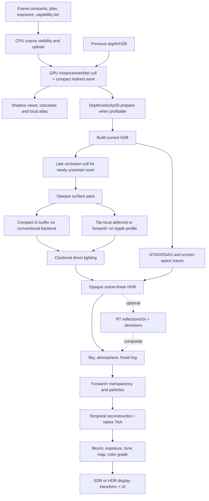
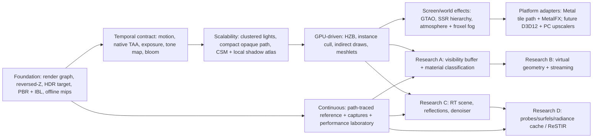

# Validated real-time rendering techniques for Luminex

**Status:** Frozen — non-normative  
**Research date:** 2026-08-09

These notes are evidence for the renderer roadmap, not the final
roadmap itself. They start from the frame described in [`docs/frame-pipeline.md`](../frame-pipeline.md)
and deliberately separate a durable modern baseline from attractive but expensive research
systems.

## How to read the evidence

The word **modern** is not enough to justify a renderer feature. The recommendations below use
four evidence labels:

- **Shipped**: the technique is described in a named, released game or other large production.
- **Mature engine**: it is an official, maintained feature of an established engine, although the
  source may not identify a particular title.
- **Platform/reference**: an official platform sample, SDK, or widely used open-source renderer
  demonstrates implementation feasibility. This is useful evidence, but weaker than a shipped
  title for production cost and failure modes.
- **Research**: a paper or prototype without convincing production evidence. Research can be an
  excellent playground target, but should not silently become a baseline dependency.

The placement test is stricter than “does it make a good screenshot?” A baseline feature should
also have understandable failure behavior, a portable fallback, inspectable intermediate data,
and costs that can be budgeted across content. A technique may be state of the art and still be a
poor first implementation.

### Luminex's starting point

At the M3 close, Luminex has a clean small renderer rather than a partially built modern one:

- one fixed 2048-square directional shadow map;
- one forward scene pass into `BGRA8Unorm` plus `D32`;
- Blinn-Phong, scalar roughness/Fresnel, normal maps, one cubemap reflection, and three directional
  lights;
- manual per-fragment sRGB encoding, with no scene-referred HDR, exposure, tone mapping, temporal
  history, motion vectors, post-processing, or local-light binning;
- CPU-issued per-material draws, bindless vertex pulling, three frames in flight, and no render
  graph;
- Metal 4 first, with a future PC backend, and Slang as the shader language.

That is a good point from which to establish contracts. The most valuable near-term work is not a
Nanite or ReSTIR clone. It is the infrastructure that lets those experiments be added, measured,
and removed without rewriting the renderer: explicit resource dependencies, a physically based
surface contract, HDR and temporal conventions, GPU visibility buffers, capability tiers, and
instrumentation.

## Classification summary

| Area | Recommended placement | Why |
|---|---|---|
| Render graph, transient resources, validation | **Baseline now** | Every later technique multiplies passes and histories; Unreal's RDG demonstrates that scheduling, lifetime, validation, async fences, and aliasing belong in one system. |
| Reversed-Z, depth prepass policy, HZB | **Baseline now** | Improves precision and supplies a shared visibility hierarchy for culling, SSR, and later GI. |
| GPU instance culling, indirect draws, draw compaction | **Baseline soon** | Official Metal support exists and this removes the CPU draw bottleneck without requiring a new shading model. |
| Meshlet preprocessing and cluster culling | **Baseline-later foundation** | Useful independently of virtual geometry and creates the right content representation. |
| Full virtualized geometry | **Research track** | Nanite proves the result; it also proves this is a streaming, LOD, visibility, material, and offline-build system—not one feature. |
| Compact deferred + clustered lighting, with forward+ escape path | **Baseline** | Scales local lights and screen-space effects; keep a common `SurfaceData` so Apple tile-deferred, conventional deferred, and forward+ can coexist. |
| Visibility-buffer shading | **Research track** | Nanite ships it and Hable demonstrates shading-rate advantages, but material sorting, derivatives, transparency, and low-end performance make it a poor first shading path. |
| Metallic-roughness PBR + IBL | **Baseline now** | Established in glTF, Filament, Unreal, and *Real-Time Rendering*; fixes the largest current image/content mismatch. |
| Arbitrary layered closure/material system | **Later research** | Unreal Substrate shows the long-term direction, but a general closure compiler and simplifier would bury the immediate learning goals. |
| Cascaded sun shadows + local-light atlas/cache | **Baseline** | Predictable, portable, debuggable, and still useful as fallback even when ray tracing is available. |
| Virtual shadow maps | **Research track** | Shipped in Unreal and pairs well with virtual geometry, but page allocation, invalidation, caching, and filtering are a major subsystem. |
| IBL/probes + GTAO/SSAO + SSR/fallback hierarchy | **Baseline** | Produces coherent indirect light and reflections on all target hardware. |
| Fully dynamic RT GI/radiance cache | **Research track** | Lumen, Frostbite GIBS, and idTech8 validate multiple production architectures, but each needs scene proxies/caches, update budgets, denoising, and robust fallbacks. |
| ReSTIR DI/GI/path tracing | **High-end research** | Strong papers, SDKs, and some named integration; reservoir validity, visibility, denoising, and cross-platform cost are not baseline-sized problems. |
| Froxel fog and atmosphere | **Baseline-later** | Mature engines use it; shares clustered lighting and temporal infrastructure. Full volumetric clouds are a separate content/system milestone. |
| Native TAA + pluggable temporal-upscaler contract | **Baseline** | Modern effects depend on correct motion/history. MetalFX, TSR, FSR, XeSS, and DLSS all reinforce a common integration contract. |
| Scene-linear HDR, exposure, tone mapping, SDR/HDR output | **Baseline now** | Required before bloom, physically meaningful lights, temporal stability, and display HDR. |
| Render-graph async compute | **Baseline capability, opt-in execution** | Shipping engines show real gains, but only when timings and dependencies reveal overlap. Never assume “compute” means “free.” |
| Frame generation / neural rendering as a core dependency | **Premature** | Optional vendor adapters are reasonable; making simulation, UI, or correctness depend on them is not. |

## Proposed durable frame architecture

This is a logical graph. A backend may fuse passes—for example, an Apple GPU can consume a
G-buffer in tile memory—or split them. The renderer should express dataflow, not force identical
command-buffer structure on every GPU.



The graph intentionally does not prescribe that every stage run every frame. Depth prepass,
occlusion refinement, reflection mode, GI updates, cloud updates, and expensive histories should
be controlled by a quality policy and observable budgets.

## Baseline foundations

### 1. A render graph before the pass count explodes

**Choice.** Replace the hand-ordered `Renderer::render` sequence with a small explicit render
graph. Each pass declares reads, writes, attachment usage, queue preference, and side effects.
Resources are logical handles until graph compilation. Imported/persistent resources such as the
swapchain, history buffers, shadow caches, and scene assets remain explicitly distinct from
transient frame resources.

Minimum first version:

1. typed texture/buffer descriptions and imported resources;
2. explicit read/write/attachment states, subresource ranges, and pass dependencies;
3. topological ordering, dead-pass culling, and deterministic graph dumps;
4. barrier generation and validation for read-before-write, incompatible simultaneous access,
   and accidental use after transient lifetime;
5. debug labels and timestamp scopes generated from pass names;
6. resize/history invalidation rules;
7. a serialized execution path that is always correct.

Second version: transient heap allocation and lifetime aliasing; parallel command recording; queue
assignment; split barriers; pass fusion hints. These should arrive after the graph's diagnostics
are trusted.

**Why.** Unreal's official [Render Dependency Graph documentation](https://dev.epicgames.com/documentation/en-us/unreal-engine/render-dependency-graph-in-unreal-engine)
describes a production system that records work into a graph, derives transitions and async
compute fences, allocates/aliases transient resources, splits barriers, records in parallel,
culls unused passes, validates correctness, and exposes RDG Insights. Luminex does not need all of
RDG, but it needs the same ownership boundary. Adding temporal AA, cascades, an HZB, clustered
lists, AO, bloom, and a tone mapper directly to hand sequencing would immediately create hidden
lifetime and transition rules.

**RHI implication.** Keep logical resource states portable. Backend-specific lowering should
translate them to Metal barriers/encoders/heaps now and D3D12 barriers/queues/heaps later. A graph
pass may express `graphics`, `compute-candidate`, or `copy`; only the compiler/timing policy should
choose an asynchronous queue. A Metal tiled pass can be a fused implementation of logical
G-buffer and lighting stages without making the high-level renderer Metal-specific.

### 2. Capability tiers, not a single “modern GPU” boolean

Define capabilities from queried features and required limits, then assign tested renderer tiers.
Useful independent flags include:

- argument/bindless resource tier and descriptor count;
- indirect draw/dispatch and GPU command generation;
- barycentrics and primitive ID;
- mesh shaders and indirect mesh draws;
- programmable blending, raster-order groups, tile memory/imageblocks;
- sparse resources;
- acceleration structures, inline/ray-pipeline tracing, and motion geometry;
- temporal/spatial/denoised MetalFX;
- timestamp/counter availability and queue concurrency;
- HDR surface formats and current display headroom.

Apple's current [Metal capability tables](https://developer.apple.com/metal/capabilities/) make the
reason concrete: features such as mesh shading, ray tracing, barycentrics, temporal MetalFX,
programmable blending, and indirect mesh commands vary by GPU family and sometimes by Mac. A
Metal 4 API target does not imply that every Mac has every fast path. Future D3D12 support will add
another capability matrix.

Recommended policy tiers:

- **Portable baseline:** raster, compute, indirect arguments, bindless-enough resource access,
  HDR, native TAA; no ray tracing or mesh shader required.
- **Apple optimized:** tile-local G-buffer/lighting or tile forward+, unified-memory-aware
  allocation, MetalFX adapter, optional mesh/RT paths when queried.
- **PC high:** D3D12 bindless/indirect, vendor-neutral upscaler option, optional mesh shader and
  inline RT.
- **Research/ultra:** RT GI/reflections, reservoirs, path-traced reference, neural/denoised
  reconstruction.

Never let a quality label silently select an unsupported architecture. Record the resolved tier in
captures and benchmark output.

### 3. Standardize coordinate, depth, exposure, and temporal conventions

These conventions are cheap only before many effects exist.

- Use a floating-point **reversed-Z** main depth buffer: near maps to 1, far toward 0, clear to 0,
  and comparisons become greater/greater-equal. Prefer an infinite far plane where it simplifies
  projection. Nathan Reed's NVIDIA analysis, [Visualizing Depth Precision](https://developer.nvidia.com/blog/visualizing-depth-precision/),
  demonstrates why reversed floating-point Z counteracts the `1/z` distribution and strongly
  improves precision.
- Store enough matrices to reconstruct both current and previous positions: jittered and
  unjittered current/previous view-projection, their inverses, previous object transform, camera
  origin, render/display sizes, jitter, and frame/history identifiers.
- Define motion vectors once: units (prefer output pixels or normalized screen UV with an explicit
  scale), sign (`previous - current` or the reverse), whether camera jitter is included, valid
  depth convention, and how skinned/deformed geometry provides previous positions.
- Treat camera cuts, teleports, FOV/aspect changes, resolution changes, scene switches, and large
  exposure jumps as first-class history-reset events.
- Use world units consistently (meters is the easiest choice) and keep a documented handedness,
  front-face convention, cubemap convention, normal-map Y convention, and UV origin at the RHI
  boundary.
- Adopt pre-exposure once the HDR path exists: shade frame values around a stable numerical range,
  carry current/previous exposure, and correct history samples when exposure changes.

Incorrect motion and history invalidation can make every temporal effect look algorithmically
broken. Build a diagnostic scene with camera-only motion, independently moving rigid objects,
skinning, alpha-tested foliage, emissive animation, disocclusion, and a hard cut before integrating
an external upscaler.

### 4. Offline content processing is renderer infrastructure

**Immediate.** Fix the current point-sampled mip generation with an offline, deterministic
texture build:

- decode authored color spaces correctly;
- generate color mips with a high-quality low-pass filter in linear light;
- filter/renormalize tangent-space normals and preserve their variance for specular
  anti-aliasing;
- filter roughness in a way consistent with the chosen normal/specular AA method;
- preserve alpha coverage across mips for cutouts;
- emit platform payloads (BC formats for PC/Mac where supported, ASTC where appropriate) plus
  metadata and a content hash;
- support KTX2/Basis input/transcoding without making universal compressed data the only runtime
  representation.

Khronos's maintained [KTX-Software](https://github.com/KhronosGroup/KTX-Software) toolchain and
[KTX 2.0 overview](https://www.khronos.org/news/press/khronos-ktx-2-0-textures-enable-compact-visually-rich-gltf-3d-assets)
provide a portable container and Basis ETC1S/UASTC transcode path. Treat KTX2 as an interchange and
packaging option; benchmark the final native GPU formats.

**Soon.** Add mesh processing that produces bounds, material ranges, LODs, and meshlets/clusters
(for example, roughly 64–128 triangles, tuned by data rather than copied blindly). Persist stable
primitive IDs and per-cluster bounds/cones. This is useful for conventional indirect rendering
today and is the prerequisite for experimenting with visibility buffers or virtual geometry
later.

Do not start virtual texturing until captures show residency or I/O pressure that ordinary
streaming and compressed mips cannot solve. Unreal's [Virtual Texturing documentation](https://dev.epicgames.com/documentation/en-us/unreal-engine/virtual-texturing-in-unreal-engine)
is evidence that VT is mature; it is also evidence that page tables, feedback, borders, anisotropy,
cache policy, and unsupported material cases form their own subsystem.

## Visibility and geometry

### 5. Depth, HZB, GPU culling, and indirect work are the first GPU-driven step

Recommended sequence:

1. CPU coarse cull scene partitions/instances and upload a dense candidate list.
2. GPU instance cull against frustum and conservative previous-frame HZB; optionally apply a
   screen-size/LOD test.
3. Compact visible instances/draw records and build indirect arguments. Keep counters for input,
   frustum rejected, occlusion rejected, tiny rejected, and emitted work.
4. Render definitely visible/previously visible geometry. A depth+velocity prepass is useful when
   overdraw, alpha-tested depth, early-Z consistency, or multiple consumers justify it; do not make
   it dogma for every scene.
5. Build the current max-depth HZB for reversed-Z. Each level conservatively represents the
   nearest occluder under the chosen test.
6. Optionally re-test uncertain/newly visible instances or clusters and submit a small late batch.

Apple's [GPU-encoded indirect-command-buffer sample](https://developer.apple.com/documentation/metal/encoding-indirect-command-buffers-on-the-gpu)
demonstrates exactly the minimal architecture: compute removes invisible objects and emits render
commands without a CPU round trip. Nanite's **shipped** SIGGRAPH 2021 presentation,
[A Deep Dive into Nanite Virtualized Geometry](https://advances.realtimerendering.com/s2021/Karis_Nanite_SIGGRAPH_Advances_2021_final.pdf),
provides a stronger large-scale design: instance and cluster culling, screen-rectangle HZB tests,
indirect drawing, and a two-pass occlusion strategy that first draws last-frame visible work,
builds an HZB, then draws newly visible work.

Implementation cautions:

- Inflate temporal occlusion bounds for camera/object motion and never let a false occlusion
  persist forever. Periodic/recent visibility and a late refinement pass are safer than trusting
  stale depth absolutely.
- Make culling deterministic in a debug mode; capture candidate and emitted buffers.
- Keep stable draw/instance/material IDs through compaction. Picking, motion vectors, visibility
  debug, and later ray/denoiser guide buffers all need them.
- Support overflow counters and a safe fallback instead of corrupting an indirect buffer.
- A depth prepass may cost more than it saves on tile GPUs or simple scenes. Use graph variants and
  GPU timings.

### 6. Add meshlets before attempting virtual geometry

A meshlet/cluster representation supports:

- cluster frustum, cone/backface, occlusion, and projected-size culling;
- compact indirect work and mesh-shader experiments;
- cluster-level LOD and streaming statistics;
- better bounds for ray tracing proxy selection;
- a future visibility-buffer primitive ID layout.

Start with conventional indexed draws generated from visible meshlets or instance/LOD groups; add
a mesh-shader backend only when feature queries and benchmarks justify it. Apple's
[Transform your geometry with Metal mesh shaders](https://developer.apple.com/videos/play/wwdc2022/10162/)
shows a direct GPU work-generation path without an intermediate command buffer. This is a useful
optimized backend, not a reason to expose mesh-shader concepts throughout the renderer.

**Full virtual geometry is research, not the next milestone.** Nanite's official
[Virtualized Geometry documentation](https://dev.epicgames.com/documentation/en-us/unreal-engine/nanite-virtualized-geometry-in-unreal-engine)
and SIGGRAPH talk describe an offline hierarchical cluster DAG, projected-error selection,
GPU-driven visibility, demand streaming, special rasterization paths, a minimal visibility buffer,
and extensive fallback/compatibility handling. Tencent's 2024
[NanoMesh presentation](https://www.advances.realtimerendering.com/s2024/content/Cao-NanoMesh/AdavanceRealtimeRendering_NanoMesh0810.pdf)
shows that a related hierarchy/HZB/cluster/visibility-buffer architecture can be engineered under
mobile constraints, but it should be treated as a production-oriented engine presentation rather
than independent evidence of a named shipped title.

A sane Luminex progression is:

1. offline meshlets + bounds;
2. GPU cluster culling + ordinary static LODs;
3. cluster-level continuous LOD prototype with a resident data set;
4. crack-free hierarchy construction and error metrics;
5. only then, feedback-driven streaming, residency, and software/hardware raster special cases.

Each stage should remain useful if the following one is abandoned.

## Opaque shading and materials

### 7. Use one surface contract with several shading backends

**Recommended baseline.** Define a canonical `SurfaceData`/`MaterialInputs` contract, then begin
with a compact G-buffer plus clustered deferred lighting for opaque surfaces. Retain a clustered
forward+ path for transparency, alpha-blended particles, hair, special materials, MSAA experiments,
and hardware profiles where it wins.

Suggested logical G-buffer, to be tuned rather than frozen:

- depth: main `D32Float`, sampled later;
- normal: two-channel octahedral encoding, preferably enough precision for stable reflections;
- base color + material flags;
- perceptual roughness, metallic, and compact AO/specular data;
- emissive only when present or accumulated separately;
- motion vectors in a dedicated target;
- stable object/material/primitive ID only in editor/debug or where an effect requires it.

Avoid storing reconstructible world position. Keep channels semantic rather than tied to one BRDF
implementation, and version their packing so captures remain decipherable.

For Apple Silicon, do not assume a conventional multi-pass G-buffer is optimal. Apple's official
[deferred-lighting sample](https://developer.apple.com/documentation/metal/rendering-a-scene-with-deferred-lighting-in-swift)
explains how Apple TBDR GPUs can consume G-buffer data in tile memory in a single render pass,
avoiding system-memory round trips, and Apple's
[forward-plus tile-shader sample](https://developer.apple.com/documentation/metal/rendering-a-scene-with-forward-plus-lighting-using-tile-shaders)
demonstrates the alternative. The graph should permit a tile-local backend while a PC backend uses
ordinary textures/compute. Measure compact conventional deferred, tile deferred, and forward+ on
target Macs with the same material/light workload.

The durable choice is therefore not “deferred forever”; it is **decoupled surface evaluation,
shared clustered lighting, and a backend-neutral data contract**.

### 8. Clustered lighting is shared infrastructure

Build a screen-space tile grid with logarithmic or otherwise depth-adaptive slices. A reasonable
first experiment is 16×16-pixel tiles and 24–32 Z slices, but choose from occupancy/overflow and
timing data. The builder should:

- classify point, spot, and bounded area-light approximations;
- create compact per-cluster ranges plus a global light-index list;
- have explicit capacity, overflow telemetry, and a correctness fallback;
- expose heatmaps for lights per cluster, list memory, overflow, and shading iterations;
- reuse the lists for opaque shading, forward transparency, and froxel volumetrics when their
  grids are compatible;
- separate unbounded directional lights from local lists.

*Real-Time Rendering, Fourth Edition*, Chapter 20 (pp. 881–914) surveys deferred, tiled, clustered,
and deferred-texturing architectures and remains a useful conceptual reference. Google Filament,
a mature open-source real-time renderer, documents and implements clustered forward lighting in
its [repository](https://github.com/google/filament), validating clustered lists outside one
closed engine.

### 9. Replace Blinn-Phong with a small, disciplined PBR core

Implement the glTF metallic-roughness workflow first:

- base color, metallic, perceptual roughness, occlusion, tangent-space normal, and emissive;
- dielectric F0 near 0.04 by default, with metal F0 derived from base color;
- GGX/Trowbridge-Reitz normal distribution;
- height-correlated Smith visibility/masking-shadowing;
- Schlick Fresnel for the real-time baseline;
- Lambert or a deliberately chosen diffuse term with energy conservation against specular;
- roughness floor plus normal-map/specular anti-aliasing;
- multiple-scattering/energy compensation so rough conductors do not lose implausible energy;
- split-sum specular IBL (prefiltered environment + DFG LUT) and diffuse irradiance;
- physical light units and camera exposure, rather than art values baked around an LDR clamp.

The [glTF 2.0 specification](https://registry.khronos.org/glTF/specs/2.0/glTF-2.0.html) gives Luminex
a concrete interchange contract. Filament's excellent
[Materials guide](https://google.github.io/filament/Materials.md.html) and
[implementation notes](https://google.github.io/filament/Filament.md.html) give equations,
parameter semantics, IBL, energy handling, color management, and mobile/desktop tradeoffs from a
mature renderer. Unreal's [Physically Based Materials documentation](https://dev.epicgames.com/documentation/en-us/unreal-engine/physically-based-materials-in-unreal-engine)
is additional mature-engine evidence. The underlying model is covered in *Real-Time Rendering,
Fourth Edition*, Chapter 9 (pp. 293–374), especially BRDFs, Fresnel, microfacet theory, reflection
models, and layered materials; environment lighting is covered in Chapter 10 (pp. 375–436).

Correctness checklist before adding lobes:

- sRGB-decode color textures only; never decode data textures such as normal, roughness, metallic,
  or AO;
- use the inverse-transpose for normals under nonuniform transforms;
- establish MikkTSpace-compatible tangent generation/import and handedness;
- test furnace/white-environment energy behavior and canonical dielectric/conductor spheres;
- provide false-color views for normals, roughness, metallic, F0, diffuse/specular energy, and mip
  level;
- compare CPU reference evaluations and shader evaluations at edge cases (`N·V` near zero,
  roughness limits, zero/one metallic).

Then add clearcoat, sheen/cloth, anisotropy, and thin transmission one lobe at a time. Each lobe
needs content semantics, direct and image-based lighting, energy interaction, G-buffer/storage
policy, sorting/transparency behavior, and a fallback. Unreal's current
[Substrate overview](https://dev.epicgames.com/documentation/en-us/unreal-engine/overview-of-substrate-materials-in-unreal-engine)
and the 2023 [Substrate SIGGRAPH presentation](https://advances.realtimerendering.com/s2023/2023%20Siggraph%20-%20Substrate.pdf)
show a forward-looking closure/slab direction with layering and platform simplification. That is a
valuable long-term study, not justification for beginning with an arbitrary material graph.

### 10. Visibility-buffer shading is an experiment after the surface contract works

Nanite's shipped pipeline uses a compact visibility output (depth plus instance/triangle identity)
and resolves material attributes later. This reduces G-buffer geometry bandwidth and naturally
fits tiny, GPU-selected clusters. Stephen Hable's 2024
[Visibility Buffer Shading with Material Graphs and Variable Rate Shading](https://www.advances.realtimerendering.com/s2024/content/Hable/Advances_SIGGRAPH_2024_VisibilityVRS-SIGGRAPH_Advances_2024.pptx)
explains the attraction: geometry visibility rate can be decoupled from material shading rate, so
expensive materials can shade at a lower rate and reconstruct.

The same presentation gives the reason to defer adoption: a visibility buffer tends to win with
high triangle density, expensive materials, and powerful GPUs; conventional G-buffer/forward
paths can win with low triangle density, simple materials, or weaker hardware. It also leaves
transparency on a separate path. Production systems must additionally solve:

- barycentric/attribute and gradient reconstruction, including UV discontinuities;
- material classification/sorting or tiled material dispatch;
- alpha testing and masked depth consistency;
- MSAA/sample-frequency behavior;
- decals, derivatives, anisotropic filtering, motion vectors, picking, and debug capture;
- visibility ID bit allocation and overflow;
- shader permutation/function-pointer strategy across Metal and D3D12.

Guerrilla's [Adventures with Deferred Texturing in Horizon Forbidden West](https://www.guerrilla-games.com/read/adventures-with-deferred-texturing-in-horizon-forbidden-west)
is valuable shipped evidence for deferred material evaluation and its practical complications.
Activision's [Geometry Rendering Pipeline Architecture](https://research.activision.com/publications/2021/09/geometry-rendering-pipeline-architecture)
is another production-oriented reference. Luminex should preserve the option by keeping stable
primitive/material IDs and one `SurfaceData`, then implement the visibility path as an A/B backend,
not a one-way rewrite.

## Shadows and direct lighting

### 11. Build a portable shadow hierarchy first

For the sun:

- 3–4 cascades as the initial quality range;
- practical/logarithmic split control, stable light-space orientation, texel snapping, and cascade
  transition blending;
- scene/caster bounds that avoid the current whole-scene sphere waste;
- consistent linear units for blocker search and penumbra—fix the current PCSS space mismatch;
- receiver/slope/normal bias expressed and visualized separately;
- PCF as the robust baseline; PCSS as a tunable soft-shadow option;
- cascade update frequency/caching only after correctness.

For local lights:

- a shadow atlas with explicit allocation and per-light resolution policy;
- spot shadows first, then cube/dual-paraboloid/other point-light representation after measuring;
- static/stationary cache reuse with caster/light invalidation;
- per-light importance, distance, screen coverage, and update budget;
- unshadowed fallback rather than frame spikes or atlas corruption.

*Real-Time Rendering, Fourth Edition*, Chapter 7 (pp. 223–266) covers shadow maps, PCF, PCSS, bias,
and many robustness issues. These conventional maps remain useful as a low tier, as cacheable
visibility for secondary systems, and as a fallback when a ray path misses supported geometry.

### 12. Treat virtual shadows and stochastic many-light shadows as later systems

Unreal's official [Virtual Shadow Maps documentation](https://dev.epicgames.com/documentation/en-us/unreal-engine/virtual-shadow-maps-in-unreal-engine)
describes its high-resolution, paged, cached shadow system and its integration with Nanite. VSMs
are compelling when geometry detail and view distance make cascades/atlases visibly insufficient,
but require page tables, physical-page allocation, feedback, invalidation from moving lights and
casters, cache diagnostics, filtering across pages, and a memory/residency policy. Implement only
after ordinary shadow views and the graph/streaming telemetry are solid.

Epic's 2025 [MegaLights presentation](https://advances.realtimerendering.com/s2025/content/MegaLights_Stochastic_Direct_Lighting_2025.pdf)
is strong mature-engine evidence for stochastic, ray-traced direct lighting with many dynamic
shadowed area lights on current-generation consoles. It also calls out acceleration-structure
memory/build/traversal cost, proxy mismatch, and dynamic-geometry challenges. MegaLights is an
excellent research track once Luminex has a light-sampling abstraction, RT scene, denoiser inputs,
and stable temporal system; it is not a replacement for clustered lights and conventional shadow
fallbacks.

The shipped *Callisto Protocol* presentation,
[The Rendering of The Callisto Protocol](https://www.advances.realtimerendering.com/s2023/SIGGRAPH2023-Advances-The-Rendering-of-The-Callisto-Protocol-JimenezPetersen_SlidesOnly.pdf),
shows another pragmatic high-end route: extensive ray-traced shadows/reflections combined with
caching, variable rates, culling, and an Unreal-derived production renderer. The lesson is not
“trace every shadow”; it is to budget rays, cache stable results, and preserve fallbacks.

## Indirect lighting, reflections, and ray tracing

### 13. Establish a cross-platform indirect-lighting floor

Before dynamic GI, implement:

1. diffuse environment irradiance and prefiltered specular IBL with a BRDF integration LUT;
2. local reflection probes, with box/parallax correction and explicit blending/priority;
3. GTAO or a well-tested SSAO, temporally stabilized and applied without double-darkening baked
   or probe lighting;
4. optional baked/adaptive irradiance probes for diffuse interiors;
5. a reflection hierarchy: screen-space reflection first where valid, optional RT hit next, local
   probe/sky fallback last.

Every reflection result should carry validity/confidence. SSR fails outside the screen, behind
occluders, at disocclusions, and on very rough/undersampled surfaces; the fallback should be a
normal part of the algorithm, not a debug failure. Roughness should control trace budget,
resolution, ray cone/mip selection, and blending.

Unity's production [Adaptive Probe Volumes discussion](https://unity.com/blog/engine-platform/new-ways-of-applying-global-illumination-in-unity-6)
shows a mature scalable route for streamed, adaptively subdivided baked probe lighting. It is less
glamorous than fully dynamic GI, but useful as a portable quality tier and a reference for probe
placement, validity, leaking, and streaming tools.

### 14. Dynamic GI should be a pluggable research family, not one promised algorithm

Three recent production architectures are especially instructive.

#### Unreal Lumen — hybrid traces plus surface/radiance caches

Epic's **mature engine** [Lumen technical documentation](https://dev.epicgames.com/documentation/en-us/unreal-engine/lumen-technical-details-in-unreal-engine)
and 2022 [SIGGRAPH presentation](https://advances.realtimerendering.com/s2022/SIGGRAPH2022-Advances-Lumen-Wright%20et%20al.pdf)
describe a hybrid system: screen traces first, then software distance-field or hardware-ray
fallback; a Surface Cache represents material response at hits; a world-space radiance cache
amortizes diffuse lighting. Lumen targets current-generation consoles and large dynamic scenes;
the official documentation also makes its representation, content, and quality limitations
visible. It is evidence for **layered tracing and caches**, not for one universal trace method.

#### Frostbite GIBS — surfels plus probes under strict update budgets

EA's 2024 [Shipping Dynamic Global Illumination in Frostbite](https://www.advances.realtimerendering.com/s2024/content/EA-GIBS2/Apers_Advances-s2024_Shipping-Dynamic-GI.pdf)
is unusually valuable **shipped** evidence: GIBS supplies indirect diffuse in *College Football
25* and is used in *skate.* The frame creates/updates surfels from visible surfaces, traces and
updates a bounded probe set, and applies cached irradiance. The presentation reports real memory,
ray, dispatch, and millisecond budgets, plus failed experiments: ray binning stopped helping,
extreme one-ray probe updates cost too much memory, and a ReSTIR surfel-apply experiment was slower
than the simpler half-resolution path. It also uses simplified albedo, skips some alpha-tested
geometry, and overlaps acceleration-structure work with the G-buffer where profitable.

This is a central roadmap lesson: bounded work queues, prioritization, representation error
visualization, and measured fallbacks matter more than choosing the fashionable sampling paper.

#### idTech8 — radiance cache + irradiance volumes + one-ray final gather

The 2025 [idTech8 Global Illumination Architecture](https://advances.realtimerendering.com/s2025/content/SOUSA_SIGGRAPH_2025_Final.pdf)
is **shipped-engine** evidence from *DOOM: The Dark Ages* and early *Indiana Jones and the Great
Circle* work. Its architecture combines a world light grid, cascaded irradiance volumes, a
spatially hashed world radiance cache, roughly one ray per pixel for final gather, and
spatiotemporal reconstruction. Transparent/froxel lighting has a separate irradiance path.
Reflections remain pragmatic: SSR first, RT where enabled, then probe fallback; console builds can
prefer SSR/probes when RT reflections exceed budget. The talk also reports measured async gains,
not unconditional queue use.

#### What Luminex should abstract

A useful experiment boundary is:

```text
GI inputs:
    depth, normal, roughness, albedo/emissive, motion, direct-light data,
    scene-query interface, exposure, quality/update budget
GI outputs:
    diffuse indirect radiance + confidence/history metadata
    optional specular/reflection radiance + hit distance/confidence
```

Keep **scene query**, **sample generation**, **cache representation**, and **reconstruction**
separate. Then Luminex can compare a probe-only solution, screen-space GI, DDGI, a surfel/radiance
cache, and a one-ray final gather without replacing the rest of the frame.

NVIDIA's archived [RTXGI DDGI 1.x SDK](https://github.com/NVIDIAGameWorks/RTXGI-DDGI) and the
[production-oriented DDGI paper](https://arxiv.org/abs/2009.10796) are useful legacy reference
evidence, but they should be classified as SDK/research rather than as a maintained dependency, and
Luminex must independently validate behavior on its Metal and future PC targets.

### 15. Make hardware ray tracing a scene-query layer

Do not couple materials or GI directly to one ray API. Define:

- BLAS build/refit/compaction policy and memory telemetry;
- TLAS instance format, masks, stable IDs, and update budget;
- geometry classes: static opaque, dynamic rigid, skinned/deformed, alpha-tested, procedural;
- full-detail versus simplified ray proxy and a way to visualize mismatches;
- inline ray queries for coherent compute work and a ray-pipeline path only where needed;
- hit-material lookup through the same material/texture contract as raster;
- ray cone/texture LOD strategy;
- software/screen/probe fallback for every shipping-facing effect.

Apple's [Metal capability tables](https://developer.apple.com/metal/capabilities/) and
[ray-tracing performance session](https://developer.apple.com/videos/play/wwdc2022/10105/) should
guide feature checks and Metal-specific builds; RT is not uniform across all Macs. The local
*Ray Tracing Gems II* chapters “Ray Tracing in Control” (Chapter 46, pp. 739–763), “Ray Tracing in
Fortnite” (Chapter 48, pp. 791–819), and “Content Compatibility in Unreal Engine” (Chapter 50,
pp. 845–858) are useful production references for hybrid integration and content edge cases.

### 16. Denoising is infrastructure, not polish

Before an RT reflection/GI feature can be judged, provide correct guide buffers:

- world/view normal at defined precision;
- linear view depth and derivatives or equivalent geometry confidence;
- roughness and material classification;
- current-to-previous motion, including deformation;
- hit distance and sample validity;
- disocclusion, reactive/emissive/transparency, and optional confidence masks;
- current and previous exposure/pre-exposure;
- camera-cut/history-reset signals.

Build a small engine-native reference denoiser (temporal accumulation with clamping/validity,
variance estimate, edge-aware spatial filter) so every backend has a known path. Then integrate
platform/vendor implementations behind a signal-oriented interface. NVIDIA's maintained
[Real-time Denoisers (NRD)](https://github.com/NVIDIA-RTX/NRD) provides REBLUR, RELAX, and SIGMA and
documents guide-buffer requirements and performance from many AAA integrations. AMD's
[FidelityFX Denoiser](https://gpuopen.com/manuals/fidelityfx_sdk/techniques/denoiser/) is a second
vendor SDK/reference point. Neither removes the need for correct engine motion, normals,
history invalidation, and composition.

*Ray Tracing Gems II*, Chapter 49, “ReBLUR: A Hierarchical Recurrent Denoiser” (pp. 823–843), is a
local algorithmic reference. Separate noisy-signal capture from denoised output in tooling so a
sampling bug is not hidden by temporal filtering.

### 17. ReSTIR and path tracing belong in the lab/ultra tier

NVIDIA's open-source [RTXDI](https://github.com/NVIDIA-RTX/RTXDI) is a practical reference for
ReSTIR direct illumination and related techniques; the [ReSTIR GI paper](https://research.nvidia.com/publication/2021-06_restir-gi-path-resampling-real-time-path-tracing)
and [Generalized Resampled Importance Sampling](https://research.nvidia.com/labs/rtr/publication/lin2022generalized/)
extend the idea toward GI/path tracing. Recent official NVIDIA material reports named RE Engine
integration in [Resident Evil Requiem and PRAGMATA](https://developer.nvidia.com/blog/?p=119888),
which strengthens the production evidence, but it remains a high-end, vendor-associated path.

For Luminex, a low-sample path tracer is extremely valuable as:

- a material/lighting reference (“ground truth” for controlled scenes);
- a denoiser and motion-vector test source;
- a laboratory for reservoirs, guiding, radiance caches, ray sorting, and neural reconstruction;
- an offline screenshot/regression mode.

It should not become the only real-time renderer. Reservoir reuse requires careful target-PDF and
weight bookkeeping, visibility handling, spatial/temporal rejection, light evolution rules,
stable identity, and denoising. Bias and fireflies can look like “more realistic light” unless
validated against a reference. Start with a tiny DI experiment after the canonical light sampler
and RT scene exist; do not begin with ReSTIR GI plus a neural cache plus path-space filtering.

## Atmosphere, fog, and transparency

### 18. Build atmosphere and froxel fog in layers

Recommended progression:

1. analytic exponential height fog as a cheap, transparent correctness reference;
2. physically parameterized sky/atmosphere LUTs for Rayleigh and Mie scattering, sun disk, aerial
   perspective, and ground/space views;
3. camera-aligned froxel volume for heterogeneous fog and local lights;
4. temporal reprojection with extinction/transmittance-aware clamping;
5. separate cloud representation and weather authoring only after the atmosphere is stable.

The froxel pass should consume the same clustered local lights and shadow policy as opaque
shading. Store scattering and transmittance in a representation with a defined composition rule;
do not merely alpha-blend “fog color.” Choose the Z distribution to match useful view-space range,
and expose froxel resolution, lit froxel count, history weight, and ray/integration steps. Motion
and disocclusion are different from opaque surfaces, so a generic TAA history is not sufficient.

Unreal's [Sky Atmosphere documentation](https://dev.epicgames.com/documentation/en-us/unreal-engine/sky-atmosphere-component-in-unreal-engine)
is mature-engine evidence for a physically based Rayleigh/Mie system and LUT approach. Its
[Volumetric Fog documentation](https://dev.epicgames.com/documentation/unreal-engine/volumetric-fog-in-unreal-engine)
documents the view-frustum volume, temporal behavior, and the strong resolution/cost coupling.
Chapter 14 of *Real-Time Rendering, Fourth Edition* (pp. 589–650) provides the durable theory for
participating media and translucency.

Guerrilla's 2022 **shipped**
[Nubis Evolved presentation](https://advances.realtimerendering.com/s2022/SIGGRAPH2022-Advances-NubisEvolved-NoVideos.pdf)
shows the much larger engineering scope of fly-through volumetric clouds in *Horizon Forbidden
West*: evolving a sub-2 ms PS4 cloud heritage toward higher-quality PS5-scale traversal. Use this
as the cloud research track, not as the first fog implementation. Unreal's
[Volumetric Cloud documentation](https://dev.epicgames.com/documentation/unreal-engine/volumetric-cloud-component-in-unreal-engine)
is a complementary mature-engine reference for volume materials, multiple scattering
approximations, cloud shadowing, and scalable ray marching.

### 19. Keep ordinary transparency reliable before advanced OIT

Baseline transparency should be explicit:

- alpha-tested materials participate in depth, shadow, motion, HZB, and temporal validity with
  exactly consistent cutoff/dither rules;
- conventional alpha-blended surfaces use premultiplied alpha, back-to-front sorting at an
  appropriate granularity, clustered forward lighting, and fog/transmittance composition;
- emissive/additive particles have a separate, well-defined blend path;
- refraction samples a documented pre-transparent scene color and supplies a reactive mask to
  temporal reconstruction;
- transparent depth/velocity is represented only where it is meaningful, rather than pretending
  one layer describes all translucency.

Do not promote an approximate OIT path until a representative dense-particle test shows that sorted
blending is inadequate and a named mature implementation is available as an integration reference.
Per-pixel linked lists, adaptive visibility buffers, or deep compositing are research features with
memory, overflow, antialiasing, and denoising interactions. Apple's official
[order-independent-transparency imageblock sample](https://developer.apple.com/documentation/metal/implementing-order-independent-transparency-with-image-blocks)
is a good platform experiment, but its tile/imageblock requirements make it a backend-specific
fast path, not a portable baseline.

## Temporal reconstruction, anti-aliasing, and dynamic resolution

### 20. First implement a trustworthy native TAA

A native 1× TAA implementation is the best integration oracle for all future upscalers. Minimum
pipeline:

1. low-discrepancy projection jitter with a known sequence and scale;
2. opaque and relevant transparent/deformation motion vectors;
3. depth/normal/material rejection and explicit disocclusion detection;
4. exposure-correct history reprojection;
5. neighborhood clipping/clamping in a color space chosen for luminance/chroma behavior;
6. adaptive history weight for motion, reactive content, thin geometry, and newly revealed pixels;
7. a controlled sharpening stage, disabled in diagnostic comparisons;
8. resolution/camera-cut/history-format invalidation.

Provide side-by-side current/history/reprojected output, rejection reason masks, history age,
motion magnitude, clipped pixels, and reactive mask. Create automated camera tracks with subpixel
geometry, high-frequency textures, specular highlights, emissive signs, foliage, moving objects,
particles, and disocclusion.

Unreal's mature [Temporal Super Resolution documentation](https://dev.epicgames.com/documentation/en-us/unreal-engine/temporal-super-resolution-in-unreal-engine)
is valuable precisely because it exposes production problems beyond “reproject and blend”:
parallax/disocclusion, shading rejection, flicker, history resurrection, translucency, and debug
visualizations.

### 21. Design one temporal-upscaler contract, then add adapters

The renderer-facing contract should supply:

- jittered low-resolution scene-linear color before tone mapping;
- depth at the required convention and resolution;
- motion vectors with declared direction/scale/jitter treatment;
- current and previous exposure or pre-exposure;
- reactive/transparency/composition masks;
- render and output rectangles (not only texture dimensions);
- sharpness and quality preset;
- reset/camera-cut flag;
- optional UI exclusion and frame-generation metadata later.

The result is output-resolution scene color plus confidence/debug data where available. This
contract lets the same frame host native TAA/TAAU, MetalFX on Mac, and FSR/XeSS/DLSS adapters on PC
without each plugin redefining motion/exposure semantics.

Evidence:

- Apple's [MetalFX documentation](https://developer.apple.com/documentation/metalfx) and
  [WWDC22 session](https://developer.apple.com/videos/play/wwdc2022/10103/) specify color, depth,
  and motion inputs for temporal scaling and show production integrations. Current capabilities
  must be queried rather than assumed.
- AMD's maintained [FidelityFX Super Resolution integration guide](https://gpuopen.com/manuals/fidelityfx_sdk/techniques/super-resolution-upscaler/)
  documents depth, motion, exposure, jitter, reactive/transparency masks, and reset behavior in an
  open implementation.
- Intel's [XeSS SDK and integration documentation](https://github.com/intel/xess)
  is a useful PC adapter reference.
- Unreal's [common temporal-upscaler documentation](https://dev.epicgames.com/documentation/en-us/unreal-engine/temporal-upscalers-in-unreal-engine)
  demonstrates the value of placing TSR, TAAU, DLSS, FSR, and XeSS behind one engine integration
  location and debugging their shared inputs.

**Dynamic resolution** should be driven by measured GPU time with hysteresis and bounded scale
changes. Histories should understand active render rectangles and gradual scale changes; avoid
allocating/recreating every transient texture for every small adjustment.

**Frame generation is not baseline anti-aliasing.** It adds latency, pacing, optical-flow/motion
quality, UI composition, and generated-frame presentation problems. Keep it as an optional adapter
after real frame time, input latency, and temporal reconstruction are sound.

## Scene-linear HDR, post-processing, and display output

### 22. Replace `BGRA8Unorm` scene color and manual sRGB encoding immediately

The internal renderer should be scene-referred and linear. A practical first scene color is
`RGBA16Float`; narrower packed formats can be evaluated for passes that do not need alpha,
negative values, or high precision. The chain should have explicit stages:

1. shade into pre-exposed scene-linear HDR;
2. composite indirect light, atmosphere, transparency, and other scene-linear effects;
3. compute exposure from a luminance histogram or robust log-average with percentile clipping,
   adaptation speeds, compensation, and manual override;
4. apply bloom and other scene-linear post effects;
5. tone map/look transform and color grade;
6. apply output gamut/transfer transform for SDR or HDR;
7. composite UI at a defined display-referred paper white.

This removes the current special case where shader fragments manually encode sRGB but clears do
not. Render targets and texture views should explicitly state whether hardware transfer conversion
is active. Data and intermediate textures remain linear/unorm/float according to semantics.

### 23. Color management is more than choosing an ACES curve

Track at least:

- working-space primaries/white point;
- scene-linear versus display-linear versus encoded values;
- camera exposure and pre-exposure;
- display output mode and reference/paper white;
- current HDR headroom/peak assumptions;
- tone/look transform and grading LUT domain;
- gamut mapping and negative/out-of-gamut policy;
- screenshot/capture encoding metadata.

Provide an SDR sRGB output first. Then support Apple EDR through a float swapchain/output path and
current headroom query; future Windows can add scRGB and/or HDR10 with platform metadata. Apple's
[HDR content documentation](https://developer.apple.com/documentation/metal/hdr-content),
[own-tone-mapping guidance](https://developer.apple.com/documentation/metal/performing-your-own-tone-mapping),
and [EDR WWDC21 session](https://developer.apple.com/videos/play/wwdc2021/10161/) explain float
extended-range output and the fact that available headroom changes. Microsoft's official
[D3D12 HDR sample](https://learn.microsoft.com/en-us/samples/microsoft/directx-graphics-samples/d3d12-hdr-sample-win32/)
is the corresponding future-PC reference.

Filament's implementation is useful open-source evidence for a full linear HDR/color pipeline and
several tone mappers, including game-oriented and neutral looks. Luminex should include a simple
neutral/reference operator and one intentional creative look; it should not name a curve “ACES”
and assume the whole color-management problem is solved.

### 24. A sensible post stack order

Exact ordering is artistic and must be tested, but a defensible initial stack is:

```text
opaque/indirect/sky/fog/transparency in scene-linear HDR
    -> temporal reconstruction/upscale
    -> exposure update (using the intended pre/post-transparency signal)
    -> bloom
    -> optional depth of field / motion blur (with documented temporal relationship)
    -> tone map + grading + gamut mapping
    -> output transfer
    -> display-referred UI
```

Some effects may run before upscale for cost; the graph should make resolution domains explicit.
Label every texture with render/output/display size and pre-/post-exposure state in debug tools.
Bloom is not a substitute for correct HDR intensity. Avoid adding chromatic aberration, film grain,
and lens dirt before exposure, aliasing, and tone mapping are trustworthy.

*Real-Time Rendering, Fourth Edition*, Chapter 5 (pp. 103–166) covers antialiasing, transparency,
and display encoding; Chapter 8 (pp. 267–292) covers light and color; Chapter 12 (pp. 513–544)
covers image-space and reprojection techniques.

## Scheduling, memory, instrumentation, and performance

### 25. Measure every pass from the beginning

Required instrumentation:

- GPU timestamp range for each graph pass and major substage, with calibrated CPU/GPU frame
  markers where supported;
- CPU duration for scene update, culling, graph build/compile, pipeline lookup, encoding/submission,
  streaming, and present wait;
- pipeline statistics/counters where available: primitive/fragment/compute occupancy proxies,
  bandwidth/cache/stall data, RT builds/rays, and queue overlap;
- per-frame memory: persistent/transient peak, heap fragmentation, alias savings, upload/ring usage,
  residency, descriptor/argument table use, history resources, RT acceleration structures;
- workload counters: candidates/visible instances and meshlets, indirect draws, triangles,
  alpha-tested fragments, lights per cluster, shadow pages/atlas occupancy, probes/surfels/rays,
  denoiser history rejection, VT/geometry requests if those systems arrive;
- rolling p50/p95/p99 and worst-frame capture, not only one average;
- reproducible camera rails, warm-up, fixed timestep/random seed, quality tier, resolution, hardware,
  OS/driver, shader-cache state, and content revision in benchmark records.

Essential visualizations:

- all G-buffer channels and precision/NaN/Inf checks;
- overdraw, quad occupancy proxy, LOD and mip selection;
- HZB levels, occlusion bounds, culling reason, newly visible/late work;
- cluster cells and light-list occupancy/overflow;
- cascade/atlas selection, bias, cache invalidation, and shadow resolution;
- motion vectors, disocclusion, history age/rejection/clamping, reactive mask;
- reflection source (SSR/RT/probe/sky), hit distance, confidence, denoiser variance;
- probe/surfel/radiance-cache residency, update priority, age, and interpolation weights;
- HDR luminance heatmap, exposure, gamut clipping, output headroom;
- transient resource lifetimes and alias map.

Apple's [GPU counter analysis Tech Talk](https://developer.apple.com/videos/play/tech-talks/10001/)
and [Xcode GPU performance guidance](https://developer.apple.com/documentation/xcode/optimizing-gpu-performance/)
are the primary Mac references. *Real-Time Rendering, Fourth Edition*, Chapter 18 (pp. 783–816),
emphasizes finding the actual bottleneck and measuring stable workloads before optimization;
Chapter 19 (pp. 817–880) covers culling, LOD, and large-scene management.

### 26. Async compute is a measured graph optimization

The graph can mark passes such as HZB construction, light-list building, AO, some post effects,
BLAS/TLAS work, and cache updates as compute candidates. The scheduler must still know:

- producer/consumer dependencies and resource ownership;
- whether graphics and compute truly execute concurrently on the target;
- bandwidth/cache contention and register/occupancy pressure;
- semaphore/fence and command-buffer overhead;
- transient lifetime expansion caused by overlap;
- a deterministic serialized fallback.

The Frostbite GIBS presentation overlaps acceleration-structure work with G-buffer work where it
helps. The idTech8 2025 talk reports roughly 0.4–0.5 ms of measured console savings from async
work. These are good reasons to support scheduling, not evidence that every compute pass should be
put on another queue. Apple tools can show whether encoders/workloads overlap on a given GPU. A
unified-memory architecture can still saturate bandwidth.

### 27. Build quality policy around budgets, not feature booleans

Each scalable system should expose a bounded budget and degradation behavior:

- maximum shadow updates/pages/texels;
- maximum visible meshlets and indirect command bytes;
- local-light list capacity and overflow policy;
- GI probes/surfels/cache entries/rays updated per frame;
- reflection rays and resolution by roughness/importance;
- volumetric froxel resolution and integration steps;
- denoiser/upscaler resolution and history precision;
- streaming bytes, requests, and residency targets;
- transient memory peak.

The quality controller can map presets and dynamic resolution to these budgets. A debug capture
must record the resolved numbers. This makes a “High” preset reproducible and lets experiments
fail softly instead of producing unbounded spikes.

## Recommended implementation order

The ordering below minimizes throwaway work and creates meaningful visual results at each stage.
It is intentionally not tied to calendar dates.



### Foundation milestone acceptance criteria

- glTF Helmet/Sponza use authored metallic-roughness and normal data with correct color spaces;
- scene color is linear HDR; SDR output passes gradient/color test images; no manual fragment sRGB
  encode remains;
- exposure and a neutral tone mapper produce repeatable captures;
- texture mips are deterministic and visibly reduce minification aliasing;
- frame passes/resources can be dumped from the graph; validation catches an intentional illegal
  read;
- PBR spheres pass furnace and reference-image tests;
- GPU timings and transient memory appear per pass.

### Temporal milestone acceptance criteria

- camera, rigid, and deformed-object motion vectors are correct under jitter;
- camera cuts and viewport changes reset histories without ghosts;
- native TAA is stable on the diagnostic scene and can be bypassed for a raw reference;
- bloom/exposure/tone mapping have resolution-independent tests;
- the upscaler adapter interface can run native TAAU and a null/spatial reference before MetalFX.

### Lighting/shadow milestone acceptance criteria

- hundreds or thousands of synthetic local lights are bounded by clustered lists, with overflow
  visibly reported rather than corrupting output;
- opaque and transparent paths share light evaluation and match on an equivalent material;
- cascades are stable under camera translation/rotation and all bias terms have debug views;
- local shadow atlas allocation, eviction, cache invalidation, and degradation are deterministic;
- the same scene can compare conventional deferred, Apple tile-local, and forward+ paths where
  supported.

### GPU-driven milestone acceptance criteria

- CPU submission cost scales mainly with batches/passes rather than visible objects;
- HZB culling never permanently loses moving/newly visible geometry in stress tests;
- counters reconcile candidate, rejected, and emitted work; overflow has a safe fallback;
- indirect and CPU-reference visibility can be diffed;
- meshlet bounds/cones and LOD selection are inspectable;
- the conventional draw path remains a validation/fallback mode.

## Optional research tracks with entry gates

### A. Visibility buffer and decoupled shading rate

**Enter when:** compact deferred/forward+ share a canonical surface/material implementation;
meshlets and stable primitive IDs exist; derivative tests and alpha-test reference scenes exist.

**Prototype:** opaque-only visibility IDs at native geometry rate, classify tiles by material,
reconstruct attributes/gradients, shade at 1×, then test 2×/4× lower shading rates with
reconstruction. Keep the conventional G-buffer as an A/B oracle.

**Success:** lower total bandwidth/shading cost on high-triangle, expensive-material scenes with
no unacceptable derivative, thin-geometry, motion, or temporal artifacts. Measure minimum-spec
hardware, not only the fastest Mac.

### B. Virtual geometry

**Enter when:** meshlets, GPU cluster culling, ordinary LOD, streaming telemetry, and a visibility
or conventional cluster-raster path are stable.

**Prototype:** resident-data hierarchy first. Validate projected error, parent/child transition,
crack prevention, and deterministic DAG cuts before any demand streaming. Then add request
feedback, page residency, priority, decompression, and eviction.

**Success:** assets with orders-of-magnitude source triangle counts have bounded on-screen work and
memory, stable motion, no persistent holes, deterministic degradation under an I/O cap, and a
usable fallback/proxy for RT, shadows, collision/picking, and unsupported material paths.

### C. Virtual shadow maps

**Enter when:** shadow views/atlases, graph aliasing, camera/light/caster invalidation, and resource
residency debug exist. Virtual geometry is helpful but not strictly required for a prototype.

**Prototype:** directional paged shadow only, fixed physical cache, explicit page-miss fallback,
then caching/invalidation and filtering. Stress moving foliage, time-of-day changes, teleports, and
large dynamic occluders.

**Success:** quality/cost beats stabilized CSM on the target high-detail scene and cache
invalidation does not turn ordinary motion into unpredictable frame spikes.

### D. RT reflections plus a denoiser

**Enter when:** reflection fallback hierarchy, full temporal guides, material hit lookup,
acceleration-structure telemetry, and a path-traced reference exist.

**Prototype:** half-resolution or checkerboard one-ray reflection on low-roughness surfaces; SSR
first, inline RT miss/off-screen fallback, probe/sky miss fallback, engine-native denoiser. Compare
NRD/other backend adapters later.

**Success:** stable disocclusion and moving-object behavior, explicit unsupported-geometry
fallback, bounded AS update cost/memory, and net quality gain over SSR/probes within the high-tier
budget.

### E. Dynamic diffuse GI

**Enter when:** direct PBR, probes, scene query, temporal reconstruction, denoiser guides, quality
budgets, and debug capture are complete.

Compare architectures, do not combine them at first:

- cascaded DDGI/probe update;
- screen traces plus probe fallback;
- surfel cache plus probes (GIBS-like);
- world radiance cache plus sparse final gather (idTech8-like);
- simplified surface cache plus hybrid trace (Lumen-like).

Use identical dynamic-light, emissive, occluder, thin-wall, indoor/outdoor, and fast-camera tests.
Report light-leak rate/locations, cache age, updated elements, rays, memory, and milliseconds.

### F. Path-traced and ReSTIR laboratory

**Enter when:** canonical BSDF/light sampling, RT scene, deterministic capture, and reference tests
exist.

Start with a correct offline/low-rate unidirectional path tracer. Add next-event estimation and MIS,
then a small ReSTIR DI prototype with reservoir visualization and brute-force comparisons. Later
experiments may include GI reservoirs, radiance-cache guidance, neural denoising/upscaling, and
offline ground-truth generation. None should replace the raster/hybrid baseline until it passes
cross-vendor, motion, content, and latency tests.

## Premature or high-risk commitments

These are not “bad techniques.” They are poor commitments for Luminex before their prerequisites
exist.

1. **A complete Nanite clone next.** It would force simultaneous invention of asset hierarchy,
   LOD/error metrics, raster, visibility, material resolve, streaming, residency, shadows, RT
   proxies, and tools. Build reusable meshlet/indirect pieces first.
2. **Visibility buffer as the only opaque path.** Hable's results explicitly depend on triangle
   density, material cost, and GPU strength. A retained G-buffer/forward oracle is worth its
   maintenance during research.
3. **General arbitrary layered materials before a correct core BSDF.** Substrate's sophistication
   comes with a closure compiler, storage strategy, simplification, tooling, and years of content
   compatibility work.
4. **Path tracing as the cross-platform real-time baseline.** It is an excellent ultra mode and
   reference. Current Mac variability, future PC range, AS/content cost, denoising, latency, and
   transparent/particle handling make raster/hybrid fallbacks necessary for the next five years.
5. **“ReSTIR everywhere.”** Frostbite's shipped talk is a useful warning: a ReSTIR surfel apply
   experiment lost to a simple half-resolution method in its production workload.
6. **MegaLights before clustered lighting and an RT scene.** Stochastic many-light sampling still
   needs a canonical light sampler, AS, temporal reuse/denoising, proxies, and non-RT fallback.
7. **Virtual texturing before ordinary streaming pressure is measured.** It creates page feedback,
   cache, border, filtering, residency, and content-build obligations.
8. **Virtual shadow maps before correct ordinary shadows.** Paging does not solve bias,
   projection, caster classification, transparency, or filtering correctness.
9. **Neural GI/upscaling/denoising as an RHI-level dependency.** Put learned techniques behind
   adapters with deterministic native references. Model/runtime availability and artifact behavior
   will evolve faster than the renderer's semantic contracts.
10. **Frame generation as a performance substitute.** It cannot repair slow simulation, poor base
    latency, unstable motion vectors, temporal artifacts, or uneven presentation.
11. **Async compute by pass category.** Queue overlap can increase bandwidth contention, memory
    lifetime, and synchronization cost. Only promote measured candidates.
12. **One platform-specialized pass layout exposed to all renderer code.** Apple tile fusion is
    valuable, but the future PC backend needs the same logical graph to lower differently.

## Source ledger: what each source actually proves

### Recent Advances in Real-Time Rendering / studio sources

- [Nanite, SIGGRAPH 2021](https://advances.realtimerendering.com/s2021/Karis_Nanite_SIGGRAPH_Advances_2021_final.pdf)
  — **shipped/mature engine** evidence for hierarchical clusters, GPU instance/cluster culling,
  two-phase HZB occlusion, virtualized LOD/streaming, and visibility-buffer material resolution.
- [Lumen, SIGGRAPH 2022](https://advances.realtimerendering.com/s2022/SIGGRAPH2022-Advances-Lumen-Wright%20et%20al.pdf)
  — **mature engine/shipped demos and games** evidence for hybrid screen/software/HW traces,
  Surface Cache, and radiance cache design.
- [Nubis Evolved, SIGGRAPH 2022](https://advances.realtimerendering.com/s2022/SIGGRAPH2022-Advances-NubisEvolved-NoVideos.pdf)
  — **shipped** *Horizon Forbidden West* evidence for real-time cloud rendering and console
  budgets.
- [The Rendering of The Callisto Protocol, SIGGRAPH 2023](https://www.advances.realtimerendering.com/s2023/SIGGRAPH2023-Advances-The-Rendering-of-The-Callisto-Protocol-JimenezPetersen_SlidesOnly.pdf)
  — **shipped** evidence for a heavily ray-traced Unreal-derived game renderer with caching,
  variable rates, culling, shadows, and reflections.
- [Substrate, SIGGRAPH 2023](https://advances.realtimerendering.com/s2023/2023%20Siggraph%20-%20Substrate.pdf)
  — **mature engine** evidence for principled slab/closure materials, layering/mixing, and
  platform simplification; not evidence that a small renderer should start there.
- [Shipping Dynamic GI in Frostbite, SIGGRAPH 2024](https://www.advances.realtimerendering.com/s2024/content/EA-GIBS2/Apers_Advances-s2024_Shipping-Dynamic-GI.pdf)
  — **shipped** *College Football 25* and *skate.* evidence, including memory/ray/pass costs,
  surfel/probe architecture, prioritization, async overlap, correctness issues, and failed
  optimizations.
- [NanoMesh, SIGGRAPH 2024](https://www.advances.realtimerendering.com/s2024/content/Cao-NanoMesh/AdavanceRealtimeRendering_NanoMesh0810.pdf)
  — **production-engine presentation** for mobile hierarchical geometry, HZB/cluster culling,
  streaming, and compact visibility; a named shipped title was not established in this research.
- [Visibility Buffer Shading with Material Graphs and VRS, SIGGRAPH 2024](https://www.advances.realtimerendering.com/s2024/content/Hable/Advances_SIGGRAPH_2024_VisibilityVRS-SIGGRAPH_Advances_2024.pptx)
  — **prototype/industry analysis**, not a shipped-title claim; proves the shading-rate opportunity
  and clearly states workload/hardware tradeoffs and transparency cost.
- [idTech8 GI Architecture, SIGGRAPH 2025](https://advances.realtimerendering.com/s2025/content/SOUSA_SIGGRAPH_2025_Final.pdf)
  — **shipped engine** evidence for cascaded light grids/irradiance volumes, hashed radiance cache,
  sparse final gather, spatiotemporal reconstruction, pragmatic reflection fallbacks, and measured
  async gains.
- [MegaLights, SIGGRAPH 2025](https://advances.realtimerendering.com/s2025/content/MegaLights_Stochastic_Direct_Lighting_2025.pdf)
  — **mature engine** evidence for stochastic ray-traced many-light direct illumination on
  current consoles, plus candid AS/proxy/dynamic-geometry costs.
- [Guerrilla: deferred texturing in Horizon Forbidden West](https://www.guerrilla-games.com/read/adventures-with-deferred-texturing-in-horizon-forbidden-west)
  — **shipped** evidence for deferred material evaluation in a large game.
- [Activision geometry rendering pipeline architecture](https://research.activision.com/publications/2021/09/geometry-rendering-pipeline-architecture)
  — **production research** on modern geometry pipeline organization.

Course indexes, useful for adjacent talks and bibliographic metadata:
[2021](https://advances.realtimerendering.com/s2021/),
[2022](https://advances.realtimerendering.com/s2022/),
[2023](https://advances.realtimerendering.com/s2023/),
[2024](https://advances.realtimerendering.com/s2024/), and
[2025](https://advances.realtimerendering.com/s2025/).

### Official engine and platform documentation

- [Unreal Render Dependency Graph](https://dev.epicgames.com/documentation/en-us/unreal-engine/render-dependency-graph-in-unreal-engine)
  — graph scheduling, validation, transitions, async fences, transient aliasing, parallel
  recording, dead-pass culling, and tooling in a mature engine.
- [Unreal Nanite documentation](https://dev.epicgames.com/documentation/en-us/unreal-engine/nanite-virtualized-geometry-in-unreal-engine)
  and [technical details](https://dev.epicgames.com/documentation/en-us/unreal-engine/nanite-technical-details)
  — maintained feature behavior, integration constraints, and fallbacks.
- [Unreal Lumen overview](https://dev.epicgames.com/documentation/en-us/unreal-engine/lumen-global-illumination-and-reflections-in-unreal-engine),
  [technical details](https://dev.epicgames.com/documentation/en-us/unreal-engine/lumen-technical-details-in-unreal-engine),
  and [performance guide](https://dev.epicgames.com/documentation/en-us/unreal-engine/lumen-performance-guide-for-unreal-engine)
  — current architecture, supported paths, limits, targets, and scalability.
- [Unreal Virtual Shadow Maps](https://dev.epicgames.com/documentation/en-us/unreal-engine/virtual-shadow-maps-in-unreal-engine)
  — mature paged/cached high-resolution shadows and Nanite integration.
- [Unreal TSR](https://dev.epicgames.com/documentation/en-us/unreal-engine/temporal-super-resolution-in-unreal-engine)
  and [temporal upscaler integration](https://dev.epicgames.com/documentation/en-us/unreal-engine/temporal-upscalers-in-unreal-engine)
  — production temporal failure modes, shared inputs, and debugging.
- [Unreal Sky Atmosphere](https://dev.epicgames.com/documentation/en-us/unreal-engine/sky-atmosphere-component-in-unreal-engine),
  [Volumetric Fog](https://dev.epicgames.com/documentation/unreal-engine/volumetric-fog-in-unreal-engine),
  and [Volumetric Clouds](https://dev.epicgames.com/documentation/unreal-engine/volumetric-cloud-component-in-unreal-engine)
  — mature atmosphere/froxel/cloud feature decomposition and scalability.
- [Apple Metal capabilities](https://developer.apple.com/metal/capabilities/) — authoritative
  feature-family matrix; required for Mac tiering.
- [Apple GPU-encoded ICB sample](https://developer.apple.com/documentation/metal/encoding-indirect-command-buffers-on-the-gpu)
  — official GPU culling/command generation.
- [Apple deferred lighting sample](https://developer.apple.com/documentation/metal/rendering-a-scene-with-deferred-lighting-in-swift),
  [forward+ tile sample](https://developer.apple.com/documentation/metal/rendering-a-scene-with-forward-plus-lighting-using-tile-shaders),
  and [TBDR guidance](https://developer.apple.com/documentation/metal/tailor-your-apps-for-apple-gpus-and-tile-based-deferred-rendering)
  — authoritative basis for tile-local Apple backend choices.
- [Apple mesh-shader session](https://developer.apple.com/videos/play/wwdc2022/10162/) and
  [Metal ray-tracing performance session](https://developer.apple.com/videos/play/wwdc2022/10105/)
  — platform-specific optimized geometry and RT paths.
- [Apple MetalFX](https://developer.apple.com/documentation/metalfx) and
  [WWDC22 temporal scaling](https://developer.apple.com/videos/play/wwdc2022/10103/) — official Mac
  upscaler integration inputs and capabilities.
- [Apple HDR content](https://developer.apple.com/documentation/metal/hdr-content),
  [custom tone mapping](https://developer.apple.com/documentation/metal/performing-your-own-tone-mapping),
  and [EDR session](https://developer.apple.com/videos/play/wwdc2021/10161/) — authoritative Apple
  display path and dynamic-headroom behavior.
- [Apple GPU counter analysis](https://developer.apple.com/videos/play/tech-talks/10001/) and
  [Xcode GPU optimization](https://developer.apple.com/documentation/xcode/optimizing-gpu-performance/)
  — Mac performance measurement and diagnosis.
- [Microsoft D3D12 HDR sample](https://learn.microsoft.com/en-us/samples/microsoft/directx-graphics-samples/d3d12-hdr-sample-win32/)
  — future Windows HDR output reference.

### Open-source and specification references

- [Google Filament](https://github.com/google/filament),
  [material guide](https://google.github.io/filament/Materials.md.html), and
  [implementation guide](https://google.github.io/filament/Filament.md.html) — mature,
  cross-platform open-source PBR, clustered lighting, IBL, HDR/color, AA, fog, shadows, and post.
- [glTF 2.0 specification](https://registry.khronos.org/glTF/specs/2.0/glTF-2.0.html) and
  [Khronos PBR resources](https://www.khronos.org/gltf/pbr/) — material interchange semantics and
  reference assets.
- [KTX-Software](https://github.com/KhronosGroup/KTX-Software) — maintained texture container,
  compression, and transcode tooling.
- [RTXGI DDGI 1.x](https://github.com/NVIDIAGameWorks/RTXGI-DDGI) — archived legacy reference for
  probe-based dynamic GI, not a maintained dependency recommendation.
- [RTXDI](https://github.com/NVIDIA-RTX/RTXDI) — reference ReSTIR direct/GI/path-tracing sampling.
- [NVIDIA NRD](https://github.com/NVIDIA-RTX/NRD) and
  [AMD FidelityFX Denoiser](https://gpuopen.com/manuals/fidelityfx_sdk/techniques/denoiser/) —
  maintained denoiser references and integration contracts.
- [AMD FSR](https://gpuopen.com/manuals/fidelityfx_sdk/techniques/super-resolution-upscaler/)
  and [Intel XeSS](https://github.com/intel/xess)
  — maintained cross-vendor PC temporal-upscaling inputs and lifecycle.

## Local book references inspected

### *Real-Time Rendering, Fourth Edition*

Tomas Akenine-Möller, Eric Haines, Naty Hoffman, Angelo Pesce, Michal Iwanicki, and Sébastien
Hillaire, CRC Press, 2018. A local copy was consulted.

Relevant chapter/page ranges:

- Chapter 2, graphics rendering pipeline, pp. 11–28;
- Chapter 3, graphics processing units, pp. 29–56;
- Chapter 5, shading fundamentals, antialiasing, transparency, display encoding, pp. 103–166;
- Chapter 6, texturing, pp. 167–222;
- Chapter 7, shadows, pp. 223–266 (shadow maps around p. 234, PCF around p. 247, PCSS around
  p. 250);
- Chapter 8, light and color, pp. 267–292;
- Chapter 9, physically based shading, pp. 293–374 (BRDFs around p. 308, Fresnel around p. 316,
  microfacet theory around p. 331, reflection models around p. 336, layering/blending around
  pp. 363–365);
- Chapter 10, local illumination and environment lighting, pp. 375–436 (environment maps around
  p. 391, specular IBL around p. 414, irradiance around p. 424);
- Chapter 11, global illumination, pp. 437–512;
- Chapter 12, image-space/reprojection techniques, pp. 513–544;
- Chapter 14, volumetric and translucent rendering, pp. 589–650;
- Chapter 18, pipeline optimization and measurement, pp. 783–816;
- Chapter 19, culling, LOD, and large scenes, pp. 817–880;
- Chapter 20, deferred, tiled, clustered, and deferred-texturing rendering, pp. 881–914.

This 2018 book is outside the requested recent-talk window, so it is used for durable theory and
terminology rather than proof that an architecture is currently shipped.

### *Ray Tracing Gems II*

Adam Marrs, Peter Shirley, and Ingo Wald (editors), Apress, 2021. A local copy was consulted.

Relevant production and implementation chapters:

- Chapter 5, “Sampling Textures with Missing Derivatives” (Maksim Aizenshtein and Matt Pharr),
  Chapter 6, “Differential Barycentric Coordinates” (Tomas Akenine-Möller), Chapter 7, “Texture
  Coordinate Gradients Estimation for Ray Cones” (Wessam Bahnassi), and Chapter 10, “Refraction Ray
  Cones for Texture Level of Detail” (Jakub Boksansky, Cyril Crassin, and Tomas Akenine-Möller), for
  texture LOD at ray hits;
- Chapter 17, bindless resource design for DXR, pp. 257–278;
- Chapter 46, “Ray Tracing in Control,” pp. 739–763;
- Chapter 48, “Ray Tracing in Fortnite,” pp. 791–819;
- Chapter 49, “ReBLUR: A Hierarchical Recurrent Denoiser,” pp. 823–843;
- Chapter 50, Unreal Engine content compatibility, pp. 845–858.

The named-game chapters are useful evidence that hybrid RT is mostly an integration/content,
fallback, and reconstruction problem—not merely calling a trace instruction.

## Bottom line for the final roadmap

The five-year-forward design is a **hybrid renderer with stable contracts**, not a bet on one
headline algorithm:

- graph-scheduled and heavily instrumented;
- GPU-driven visibility with conventional, mesh-shader, and later virtual-geometry backends;
- one physically based surface/light representation usable by deferred, Apple tile-local,
  forward+, visibility-buffer, raster, and ray paths;
- scene-linear HDR and correct temporal data as core infrastructure;
- portable cascades/probes/SSR/fog/TAA fallbacks;
- optional hardware RT, denoisers, dynamic GI caches, stochastic lighting, and vendor upscalers;
- a path-traced reference and comparative test scenes to keep experiments honest.

That architecture is forward-looking because algorithms can change without invalidating content,
RHI semantics, captures, or all preceding milestones. It also matches the strongest lesson across
Nanite, Lumen, Frostbite GIBS, idTech8, Horizon, and modern platform documentation: production SOTA
comes from bounded work, layered fallbacks, temporal/data correctness, and tools as much as from
the core paper.
